# Activity Diagram
# Sistem Informasi Manajemen Rental Mobil Harkat Yogyakarta (Aplikasi Mobile Flutter + RESTful API Laravel)

> **Versi:** 1.0 | **Tanggal:** 7 Oktober 2026
> **Penulis:** Betrand Alfayedh
> **Sumber:** Use Case Diagram ([usecase.md](usecase.md)) dan perilaku sistem yang telah dibangun dan diuji ([PENGUJIAN.md](PENGUJIAN.md))
> **Dokumen pasangan:** [sequence-diagram-rental.md](sequence-diagram-rental.md) (SD-n)
> **Standar penempatan:** **fitur utama** ditampilkan di BAB III, **seluruh sisanya** dilampirkan di bagian Lampiran laporan.

---

## 1. Pendahuluan

Dokumen ini menyajikan **activity diagram untuk setiap use case** (28 diagram, AD-1 s/d AD-28 mengikuti nomor UC1 s/d UC28). Setiap diagram digambarkan menggunakan **swimlane dua kolom berdampingan** (kiri aktor, kanan Sistem, alur mengalir ke bawah):

- **Kolom aktor** berisi langkah-langkah yang dilakukan oleh **aktor manusia** (Pelanggan, Admin, atau Sopir).
- **Kolom Sistem** berisi langkah-langkah yang dilakukan oleh **Sistem** (aplikasi dan layanan di belakangnya).

Setiap diagram disajikan dalam tiga bentuk: **gambar** (`activity-diagram/AD-n.png` dan `.svg`, lajur aktor di kiri dan Sistem di kanan), **kode Mermaid** (lajur Sistem ditulis lebih dulu agar pada Mermaid 10.x aktor tampil di kiri dan Sistem di kanan; tata letak tergantung versi dan alat yang dipakai), dan **kode PlantUML** (`|Aktor|` dan `|Sistem|`, selalu berdampingan seperti contoh `activity-diagrams.md`). Bahasa yang digunakan adalah bahasa Indonesia formal tanpa istilah teknis berbasis kode. Nama status mengikuti yang tampil di aplikasi (mis. *Booked*, *Ongoing*, *Done*).

**Penomoran.** ID activity diagram **sama dengan nomor use case-nya** (AD-13 = activity untuk UC13) agar keterlusuran 1:1 terjaga.

**Penempatan pada laporan.** Setiap diagram diberi tanda:

- **📌 BAB III** — fitur utama, gambar ditampilkan di badan BAB III.
- **📎 Lampiran** — gambar ditempatkan di bagian Lampiran laporan.

**Dua use case yang dipakai bersama.** UC10 (Membatalkan Pesanan) dan UC19 (Melaporkan Kondisi Kendaraan) dipakai oleh dua aktor. Diagramnya digambarkan dengan satu kolom aktor bergabung; perbedaan aturan per aktor dinyatakan pada keputusan di kolom Sistem.

### 1.1 Daftar Activity Diagram

| ID | Nama Alur | Aktor | Penempatan |
|----|-----------|-------|------------|
| **Bagian A — Akun** | | | |
| AD-1 | Registrasi Akun | Pelanggan | 📎 Lampiran |
| AD-2 | Login | Pelanggan / Admin / Sopir | 📎 Lampiran |
| AD-3 | Mengelola Profil | Pelanggan / Admin / Sopir | 📎 Lampiran |
| AD-4 | Logout | Pelanggan / Admin / Sopir | 📎 Lampiran |
| **Bagian B — Pemesanan oleh Pelanggan** | | | |
| AD-5 | Melihat Katalog dan Detail Mobil | Pelanggan | 📎 Lampiran |
| AD-6 | Mengecek Ketersediaan dan Estimasi Biaya | Pelanggan | 📎 Lampiran |
| AD-7 | Memesan Mobil | Pelanggan | 📌 **BAB III** |
| AD-8 | Mengunggah Bukti Pembayaran | Pelanggan | 📎 Lampiran |
| AD-9 | Melihat Pesanan dan Riwayat | Pelanggan | 📎 Lampiran |
| AD-10 | Membatalkan Pesanan | Pelanggan / Admin | 📎 Lampiran |
| **Bagian C — Pengelolaan Pesanan dan Operasional (Admin)** | | | |
| AD-11 | Melihat Dashboard | Admin | 📎 Lampiran |
| AD-12 | Memantau Pesanan | Admin | 📎 Lampiran |
| AD-13 | Memverifikasi Pembayaran | Admin | 📌 **BAB III** |
| AD-14 | Menolak Bukti Pembayaran | Admin | 📎 Lampiran |
| AD-15 | Mencatat Pembayaran Langsung | Admin | 📎 Lampiran |
| AD-16 | Menugaskan Sopir | Admin | 📌 **BAB III** |
| AD-17 | Mengonfirmasi Jemput Kendaraan | Admin | 📎 Lampiran |
| AD-18 | Mencatat Pengembalian dan Denda | Admin | 📌 **BAB III** |
| AD-19 | Melaporkan Kondisi Kendaraan | Admin / Sopir | 📎 Lampiran |
| AD-20 | Mengelola Armada | Admin | 📎 Lampiran |
| AD-21 | Mengelola Sopir | Admin | 📎 Lampiran |
| AD-22 | Mengelola Penyewa | Admin | 📎 Lampiran |
| AD-23 | Melihat Rekap Bulanan | Admin | 📎 Lampiran |
| **Bagian D — Tugas Sopir** | | | |
| AD-24 | Mengatur Status Ketersediaan | Sopir | 📎 Lampiran |
| AD-25 | Melihat Tawaran Tugas | Sopir | 📎 Lampiran |
| AD-26 | Menerima Tugas | Sopir | 📌 **BAB III** |
| AD-27 | Menolak Tugas | Sopir | 📎 Lampiran |
| AD-28 | Melihat Tugas dan Riwayat | Sopir | 📎 Lampiran |

> **Fitur utama (BAB III) = 5 diagram:** AD-7, AD-13, AD-16, AD-18, AD-26. Kelimanya menghubungkan tiga aktor pada satu alur: pesanan dibuat pelanggan (AD-7), pembayarannya diverifikasi admin (AD-13), tugasnya ditawarkan admin (AD-16) dan diterima sopir (AD-26), lalu kendaraan yang kembali dicatat admin (AD-18).

### 1.2 Notasi Diagram

| Notasi pada diagram | Arti |
|---------------------|------|
| Jajar genjang berisi "Mulai" | Titik mulai |
| Jajar genjang berisi "Selesai" | Titik akhir |
| Persegi panjang | Aktivitas / langkah |
| Belah ketupat | Cabang keputusan (setiap cabang diberi label) |
| Panah | Aliran kontrol |
| Kotak 👤 | Swimlane aktor |
| Kotak 📱 | Swimlane Sistem |

---

# Bagian A — Akun

## AD-1 — Registrasi Akun (UC1) — 📎 Lampiran

**Aktor.** Pelanggan  
**Tujuan.** Pelanggan membuat akun baru agar dapat memesan mobil.

### Diagram

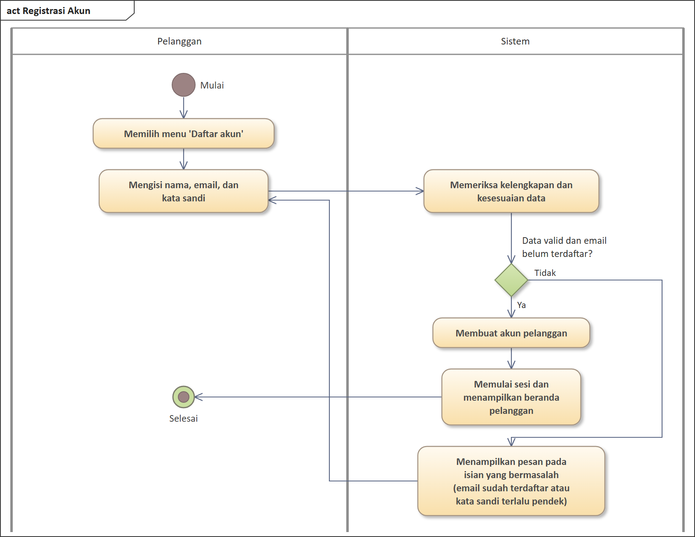

### Diagram (Mermaid)

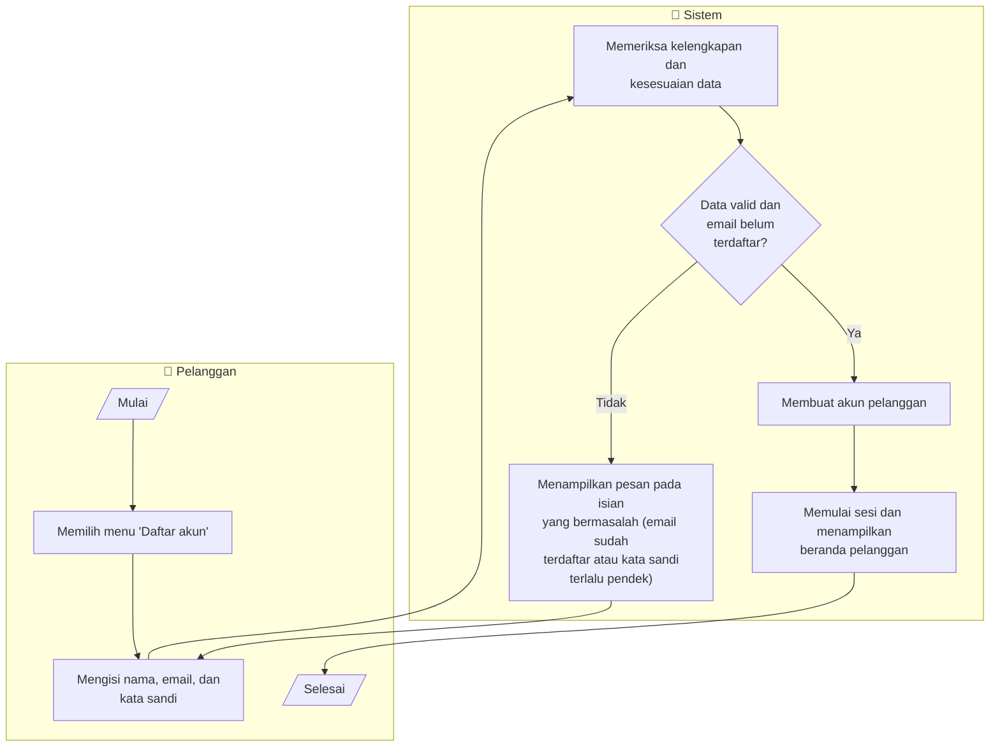
```mermaid
flowchart TB
    subgraph Sistem["📱 Sistem"]
        S1["Memeriksa kelengkapan dan<br/>kesesuaian data"]
        S2{"Data valid dan<br/>email belum<br/>terdaftar?"}
        S3["Membuat akun pelanggan"]
        S4["Memulai sesi dan menampilkan<br/>beranda pelanggan"]
        S5["Menampilkan pesan pada isian<br/>yang bermasalah (email sudah<br/>terdaftar atau kata sandi<br/>terlalu pendek)"]
    end

    subgraph Aktor["👤 Pelanggan"]
        A0[/"Mulai"/]
        A1["Memilih menu 'Daftar akun'"]
        A2["Mengisi nama, email, dan<br/>kata sandi"]
        AE[/"Selesai"/]
    end

    A0 --> A1
    A1 --> A2
    A2 --> S1
    S1 --> S2
    S2 -- Ya --> S3
    S3 --> S4
    S4 --> AE
    S2 -- Tidak --> S5
    S5 --> A2
```

### Diagram (PlantUML)

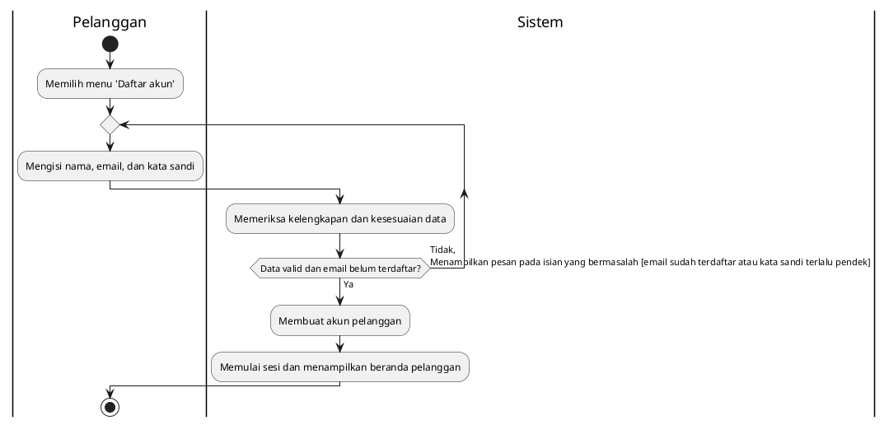
```plantuml
@startuml
|Pelanggan|
start
:Memilih menu 'Daftar akun';
repeat
  :Mengisi nama, email, dan kata sandi;
  |Sistem|
  :Memeriksa kelengkapan dan kesesuaian data;
repeat while (Data valid dan email belum terdaftar?) is (Tidak,\nMenampilkan pesan pada isian yang bermasalah [email sudah terdaftar atau kata sandi terlalu pendek]) not (Ya)
:Membuat akun pelanggan;
:Memulai sesi dan menampilkan beranda pelanggan;
|Pelanggan|
stop
@enduml
```

---

## AD-2 — Login (UC2) — 📎 Lampiran

**Aktor.** Pelanggan / Admin / Sopir  
**Tujuan.** Pengguna masuk ke aplikasi dan diarahkan ke layar sesuai perannya.

### Diagram

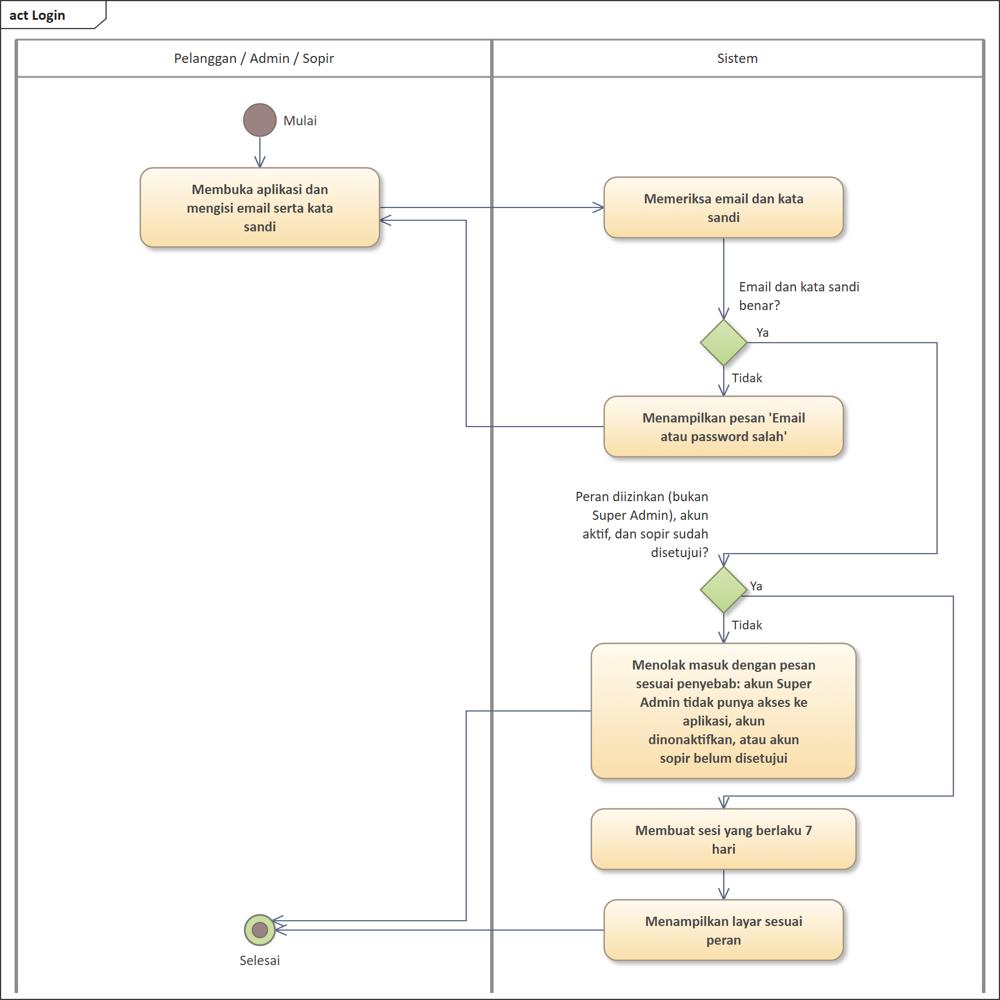

### Diagram (Mermaid)

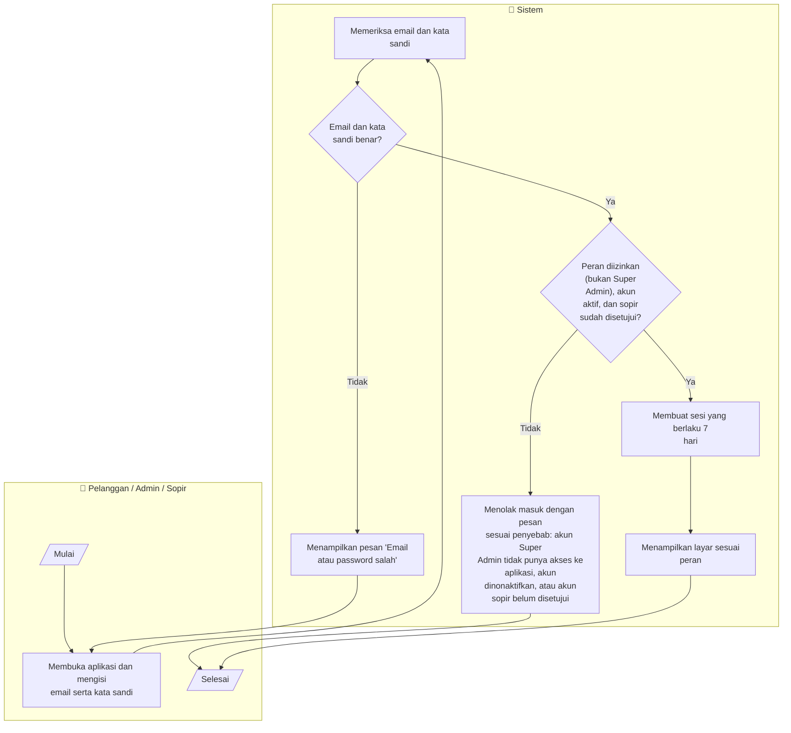
```mermaid
flowchart TB
    subgraph Sistem["📱 Sistem"]
        S1["Memeriksa email dan kata<br/>sandi"]
        S2{"Email dan kata<br/>sandi benar?"}
        S3["Menampilkan pesan 'Email<br/>atau password salah'"]
        S4{"Peran diizinkan<br/>(bukan Super<br/>Admin), akun<br/>aktif, dan sopir<br/>sudah disetujui?"}
        S5["Menolak masuk dengan pesan<br/>sesuai penyebab: akun Super<br/>Admin tidak punya akses ke<br/>aplikasi, akun<br/>dinonaktifkan, atau akun<br/>sopir belum disetujui"]
        S6["Membuat sesi yang berlaku 7<br/>hari"]
        S7["Menampilkan layar sesuai<br/>peran"]
    end

    subgraph Aktor["👤 Pelanggan / Admin / Sopir"]
        A0[/"Mulai"/]
        A1["Membuka aplikasi dan mengisi<br/>email serta kata sandi"]
        AE[/"Selesai"/]
    end

    A0 --> A1
    A1 --> S1
    S1 --> S2
    S2 -- Tidak --> S3
    S3 --> A1
    S2 -- Ya --> S4
    S4 -- Tidak --> S5
    S5 --> AE
    S4 -- Ya --> S6
    S6 --> S7
    S7 --> AE
```

### Diagram (PlantUML)

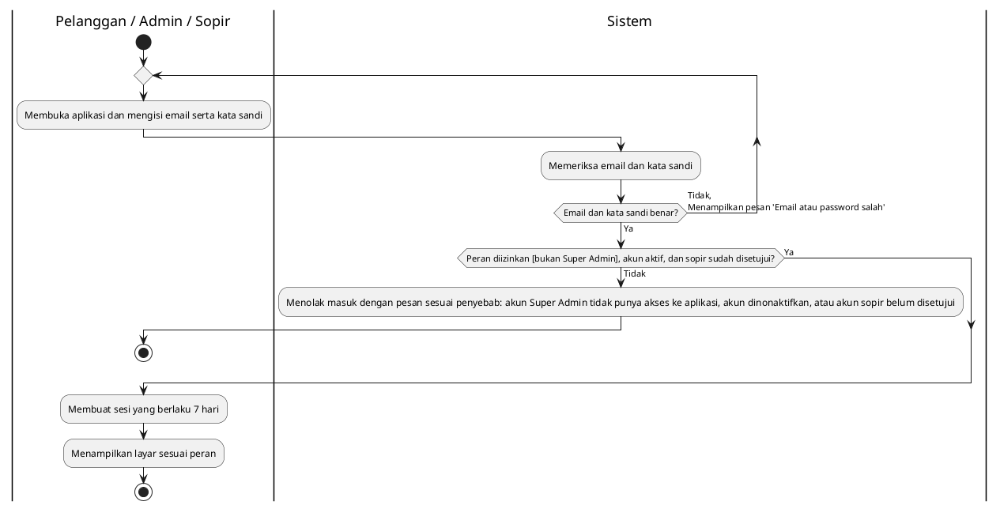
```plantuml
@startuml
|Pelanggan / Admin / Sopir|
start
repeat
  :Membuka aplikasi dan mengisi email serta kata sandi;
  |Sistem|
  :Memeriksa email dan kata sandi;
repeat while (Email dan kata sandi benar?) is (Tidak,\nMenampilkan pesan 'Email atau password salah') not (Ya)
if (Peran diizinkan [bukan Super Admin], akun aktif, dan sopir sudah disetujui?) then (Tidak)
  :Menolak masuk dengan pesan sesuai penyebab: akun Super Admin tidak punya akses ke aplikasi, akun dinonaktifkan, atau akun sopir belum disetujui;
  |Pelanggan / Admin / Sopir|
  stop
else (Ya)
endif
:Membuat sesi yang berlaku 7 hari;
:Menampilkan layar sesuai peran;
|Pelanggan / Admin / Sopir|
stop
@enduml
```

---

## AD-3 — Mengelola Profil (UC3) — 📎 Lampiran

**Aktor.** Pelanggan / Admin / Sopir  
**Tujuan.** Pengguna melihat dan mengubah data profil serta mengganti kata sandi.

### Diagram

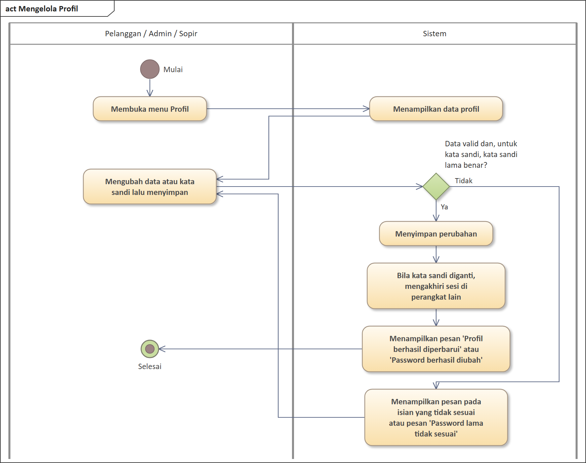

### Diagram (Mermaid)

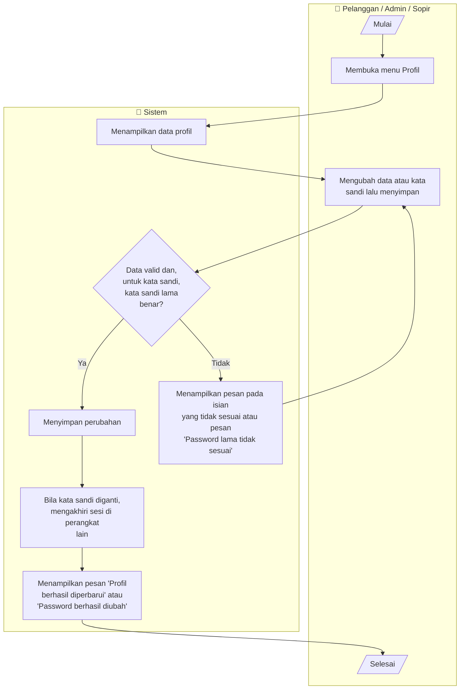
```mermaid
flowchart TB
    subgraph Sistem["📱 Sistem"]
        S1["Menampilkan data profil"]
        S2{"Data valid dan,<br/>untuk kata sandi,<br/>kata sandi lama<br/>benar?"}
        S3["Menyimpan perubahan"]
        S4["Bila kata sandi diganti,<br/>mengakhiri sesi di perangkat<br/>lain"]
        S5["Menampilkan pesan 'Profil<br/>berhasil diperbarui' atau<br/>'Password berhasil diubah'"]
        S6["Menampilkan pesan pada isian<br/>yang tidak sesuai atau pesan<br/>'Password lama tidak sesuai'"]
    end

    subgraph Aktor["👤 Pelanggan / Admin / Sopir"]
        A0[/"Mulai"/]
        A1["Membuka menu Profil"]
        A2["Mengubah data atau kata<br/>sandi lalu menyimpan"]
        AE[/"Selesai"/]
    end

    A0 --> A1
    A1 --> S1
    S1 --> A2
    A2 --> S2
    S2 -- Ya --> S3
    S3 --> S4
    S4 --> S5
    S5 --> AE
    S2 -- Tidak --> S6
    S6 --> A2
```

### Diagram (PlantUML)

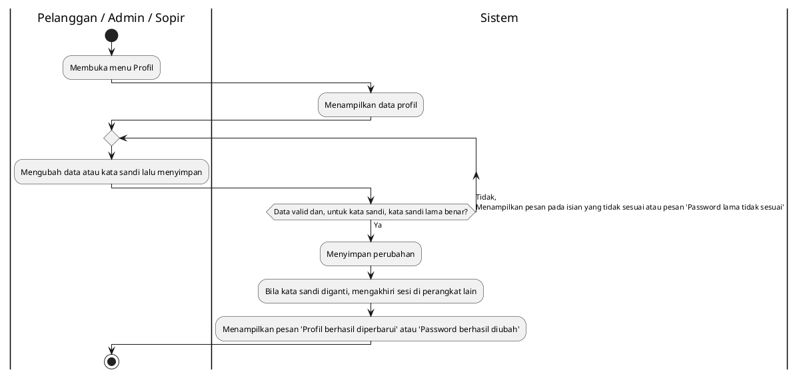
```plantuml
@startuml
|Pelanggan / Admin / Sopir|
start
:Membuka menu Profil;
|Sistem|
:Menampilkan data profil;
|Pelanggan / Admin / Sopir|
repeat
  :Mengubah data atau kata sandi lalu menyimpan;
|Sistem|
repeat while (Data valid dan, untuk kata sandi, kata sandi lama benar?) is (Tidak,\nMenampilkan pesan pada isian yang tidak sesuai atau pesan 'Password lama tidak sesuai') not (Ya)
:Menyimpan perubahan;
:Bila kata sandi diganti, mengakhiri sesi di perangkat lain;
:Menampilkan pesan 'Profil berhasil diperbarui' atau 'Password berhasil diubah';
|Pelanggan / Admin / Sopir|
stop
@enduml
```

---

## AD-4 — Logout (UC4) — 📎 Lampiran

**Aktor.** Pelanggan / Admin / Sopir  
**Tujuan.** Pengguna keluar dari aplikasi dan sesinya diakhiri.

### Diagram

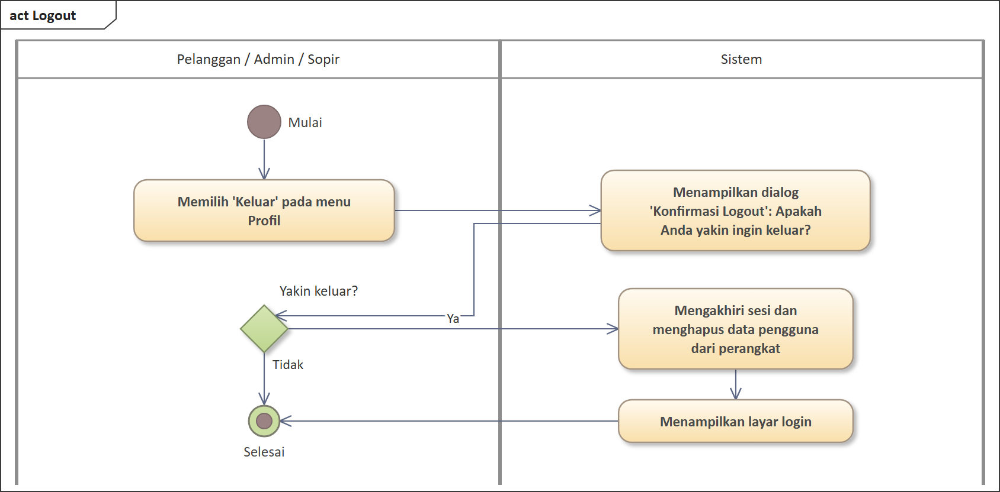

### Diagram (Mermaid)

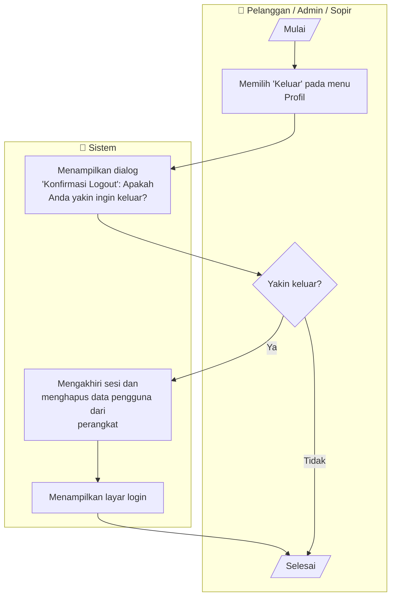
```mermaid
flowchart TB
    subgraph Sistem["📱 Sistem"]
        S1["Menampilkan dialog<br/>'Konfirmasi Logout': Apakah<br/>Anda yakin ingin keluar?"]
        S2["Mengakhiri sesi dan<br/>menghapus data pengguna dari<br/>perangkat"]
        S3["Menampilkan layar login"]
    end

    subgraph Aktor["👤 Pelanggan / Admin / Sopir"]
        A0[/"Mulai"/]
        A1["Memilih 'Keluar' pada menu<br/>Profil"]
        A2{"Yakin keluar?"}
        AE[/"Selesai"/]
    end

    A0 --> A1
    A1 --> S1
    S1 --> A2
    A2 -- Ya --> S2
    S2 --> S3
    S3 --> AE
    A2 -- Tidak --> AE
```

### Diagram (PlantUML)

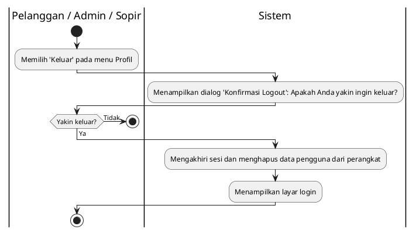
```plantuml
@startuml
|Pelanggan / Admin / Sopir|
start
:Memilih 'Keluar' pada menu Profil;
|Sistem|
:Menampilkan dialog 'Konfirmasi Logout': Apakah Anda yakin ingin keluar?;
|Pelanggan / Admin / Sopir|
if (Yakin keluar?) then (Tidak)
  stop
else (Ya)
endif
|Sistem|
:Mengakhiri sesi dan menghapus data pengguna dari perangkat;
:Menampilkan layar login;
|Pelanggan / Admin / Sopir|
stop
@enduml
```

---

# Bagian B — Pemesanan oleh Pelanggan

## AD-5 — Melihat Katalog dan Detail Mobil (UC5) — 📎 Lampiran

**Aktor.** Pelanggan  
**Tujuan.** Pelanggan menelusuri, mencari, dan melihat detail mobil yang dapat disewa.

### Diagram

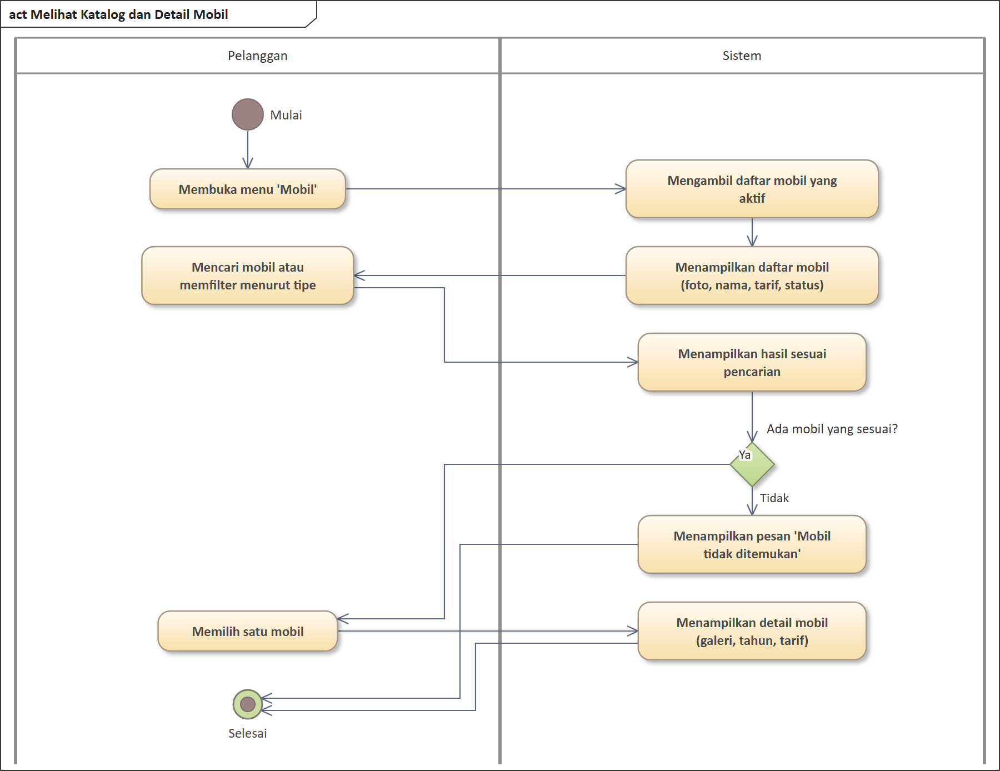

### Diagram (Mermaid)

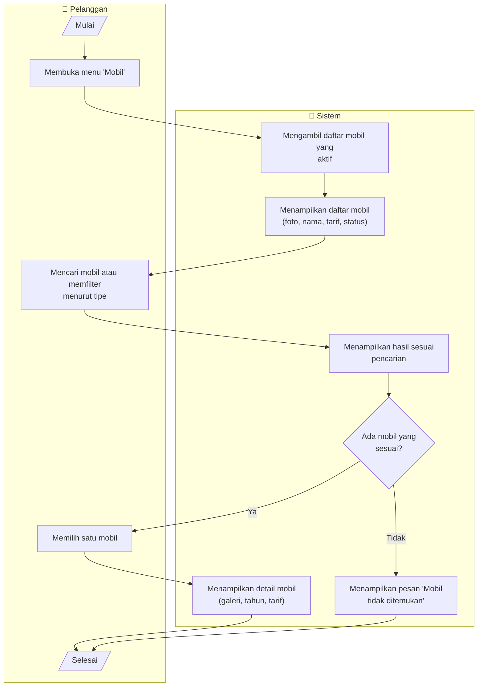
```mermaid
flowchart TB
    subgraph Sistem["📱 Sistem"]
        S1["Mengambil daftar mobil yang<br/>aktif"]
        S2["Menampilkan daftar mobil<br/>(foto, nama, tarif, status)"]
        S3["Menampilkan hasil sesuai<br/>pencarian"]
        S4{"Ada mobil yang<br/>sesuai?"}
        S5["Menampilkan pesan 'Mobil<br/>tidak ditemukan'"]
        S6["Menampilkan detail mobil<br/>(galeri, tahun, tarif)"]
    end

    subgraph Aktor["👤 Pelanggan"]
        A0[/"Mulai"/]
        A1["Membuka menu 'Mobil'"]
        A2["Mencari mobil atau memfilter<br/>menurut tipe"]
        A3["Memilih satu mobil"]
        AE[/"Selesai"/]
    end

    A0 --> A1
    A1 --> S1
    S1 --> S2
    S2 --> A2
    A2 --> S3
    S3 --> S4
    S4 -- Tidak --> S5
    S5 --> AE
    S4 -- Ya --> A3
    A3 --> S6
    S6 --> AE
```

### Diagram (PlantUML)

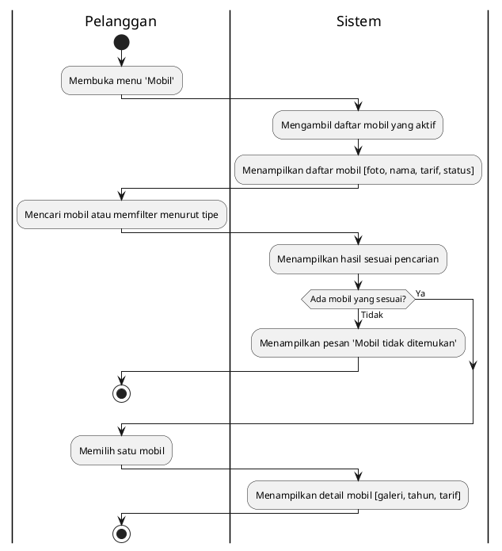
```plantuml
@startuml
|Pelanggan|
start
:Membuka menu 'Mobil';
|Sistem|
:Mengambil daftar mobil yang aktif;
:Menampilkan daftar mobil [foto, nama, tarif, status];
|Pelanggan|
:Mencari mobil atau memfilter menurut tipe;
|Sistem|
:Menampilkan hasil sesuai pencarian;
if (Ada mobil yang sesuai?) then (Tidak)
  :Menampilkan pesan 'Mobil tidak ditemukan';
  |Pelanggan|
  stop
else (Ya)
endif
|Pelanggan|
:Memilih satu mobil;
|Sistem|
:Menampilkan detail mobil [galeri, tahun, tarif];
|Pelanggan|
stop
@enduml
```

---

## AD-6 — Mengecek Ketersediaan dan Estimasi Biaya (UC6) — 📎 Lampiran

**Aktor.** Pelanggan  
**Tujuan.** Pelanggan mengetahui mobil yang tersedia pada tanggal pilihannya beserta perkiraan biaya dan uang muka.

### Diagram

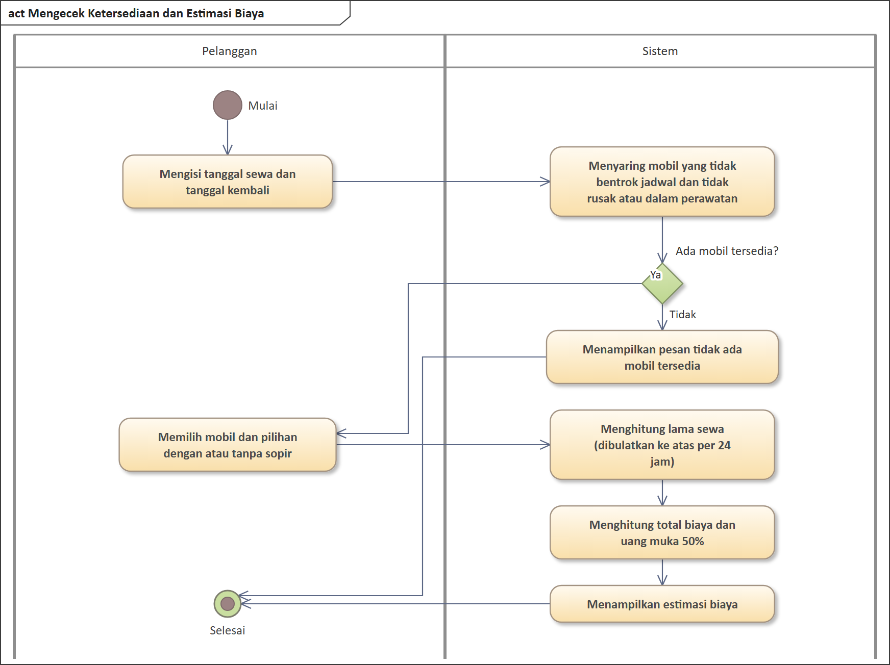

### Diagram (Mermaid)

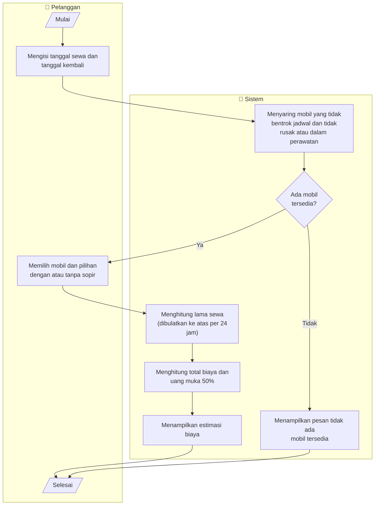
```mermaid
flowchart TB
    subgraph Sistem["📱 Sistem"]
        S1["Menyaring mobil yang tidak<br/>bentrok jadwal dan tidak<br/>rusak atau dalam perawatan"]
        S2{"Ada mobil<br/>tersedia?"}
        S3["Menampilkan pesan tidak ada<br/>mobil tersedia"]
        S4["Menghitung lama sewa<br/>(dibulatkan ke atas per 24<br/>jam)"]
        S5["Menghitung total biaya dan<br/>uang muka 50%"]
        S6["Menampilkan estimasi biaya"]
    end

    subgraph Aktor["👤 Pelanggan"]
        A0[/"Mulai"/]
        A1["Mengisi tanggal sewa dan<br/>tanggal kembali"]
        A2["Memilih mobil dan pilihan<br/>dengan atau tanpa sopir"]
        AE[/"Selesai"/]
    end

    A0 --> A1
    A1 --> S1
    S1 --> S2
    S2 -- Tidak --> S3
    S3 --> AE
    S2 -- Ya --> A2
    A2 --> S4
    S4 --> S5
    S5 --> S6
    S6 --> AE
```

### Diagram (PlantUML)

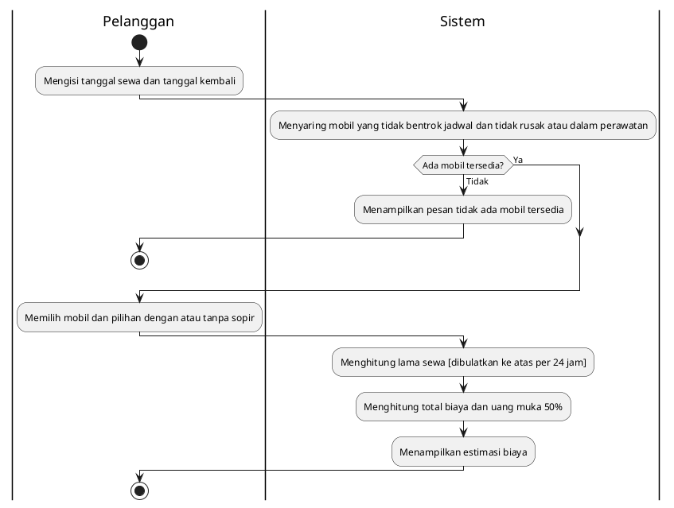
```plantuml
@startuml
|Pelanggan|
start
:Mengisi tanggal sewa dan tanggal kembali;
|Sistem|
:Menyaring mobil yang tidak bentrok jadwal dan tidak rusak atau dalam perawatan;
if (Ada mobil tersedia?) then (Tidak)
  :Menampilkan pesan tidak ada mobil tersedia;
  |Pelanggan|
  stop
else (Ya)
endif
|Pelanggan|
:Memilih mobil dan pilihan dengan atau tanpa sopir;
|Sistem|
:Menghitung lama sewa [dibulatkan ke atas per 24 jam];
:Menghitung total biaya dan uang muka 50%;
:Menampilkan estimasi biaya;
|Pelanggan|
stop
@enduml
```

---

## AD-7 — Memesan Mobil (UC7) — 📌 **BAB III**

**Aktor.** Pelanggan  
**Tujuan.** Pelanggan membuat pesanan sewa mobil, dengan atau tanpa sopir.

### Diagram

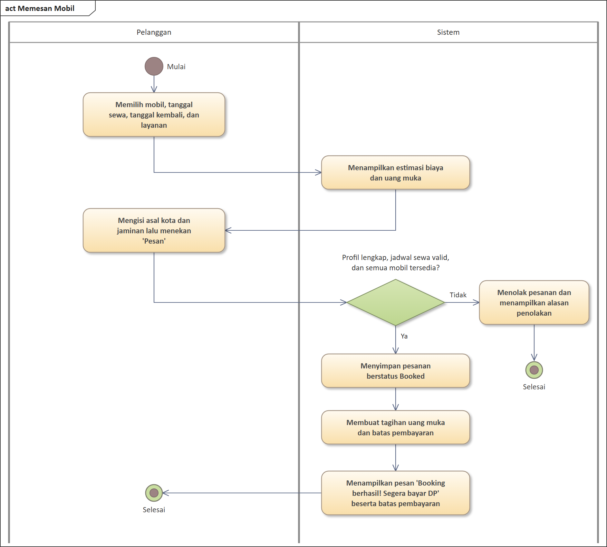

### Diagram (Mermaid)

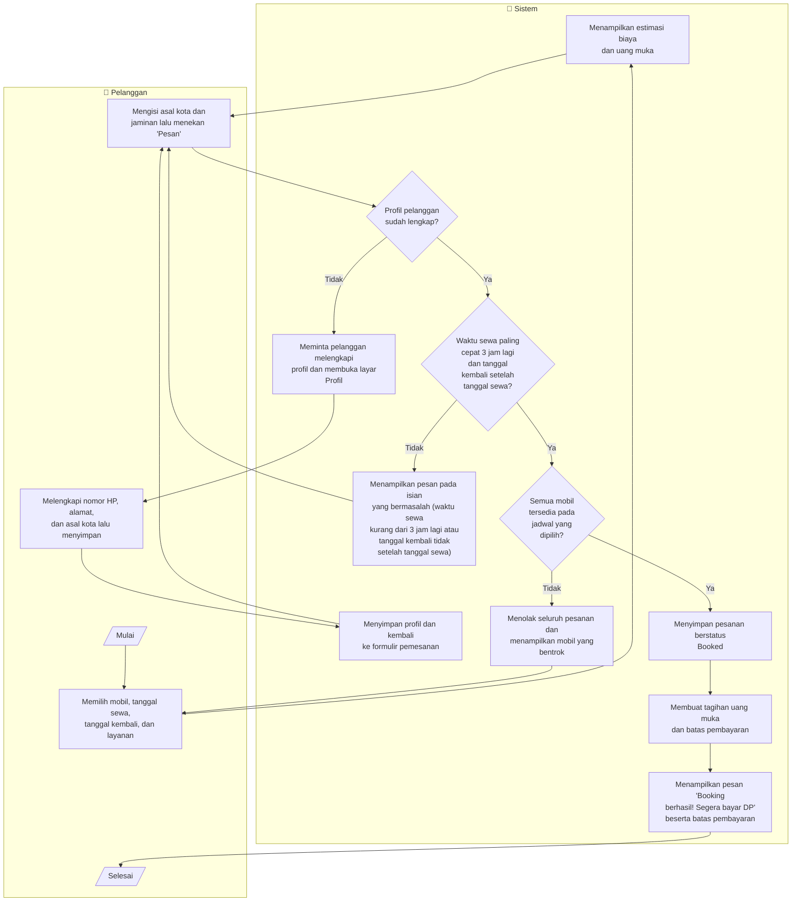
```mermaid
flowchart TB
    subgraph Sistem["📱 Sistem"]
        S1["Menampilkan estimasi biaya<br/>dan uang muka"]
        S2{"Profil pelanggan<br/>sudah lengkap?"}
        S3["Meminta pelanggan melengkapi<br/>profil dan membuka layar<br/>Profil"]
        S11["Menyimpan profil dan kembali<br/>ke formulir pemesanan"]
        S4{"Waktu sewa paling<br/>cepat 3 jam lagi<br/>dan tanggal<br/>kembali setelah<br/>tanggal sewa?"}
        S5["Menampilkan pesan pada isian<br/>yang bermasalah (waktu sewa<br/>kurang dari 3 jam lagi atau<br/>tanggal kembali tidak<br/>setelah tanggal sewa)"]
        S6{"Semua mobil<br/>tersedia pada<br/>jadwal yang<br/>dipilih?"}
        S7["Menolak seluruh pesanan dan<br/>menampilkan mobil yang<br/>bentrok"]
        S8["Menyimpan pesanan berstatus<br/>Booked"]
        S9["Membuat tagihan uang muka<br/>dan batas pembayaran"]
        S10["Menampilkan pesan 'Booking<br/>berhasil! Segera bayar DP'<br/>beserta batas pembayaran"]
    end

    subgraph Aktor["👤 Pelanggan"]
        A0[/"Mulai"/]
        A1["Memilih mobil, tanggal sewa,<br/>tanggal kembali, dan layanan"]
        A2["Mengisi asal kota dan<br/>jaminan lalu menekan 'Pesan'"]
        A3["Melengkapi nomor HP, alamat,<br/>dan asal kota lalu menyimpan"]
        AE[/"Selesai"/]
    end

    A0 --> A1
    A1 --> S1
    S1 --> A2
    A2 --> S2
    S2 -- Tidak --> S3
    S3 --> A3
    A3 --> S11
    S11 --> A2
    S2 -- Ya --> S4
    S4 -- Tidak --> S5
    S5 --> A2
    S4 -- Ya --> S6
    S6 -- Tidak --> S7
    S7 --> A1
    S6 -- Ya --> S8
    S8 --> S9
    S9 --> S10
    S10 --> AE
```

### Diagram (PlantUML)

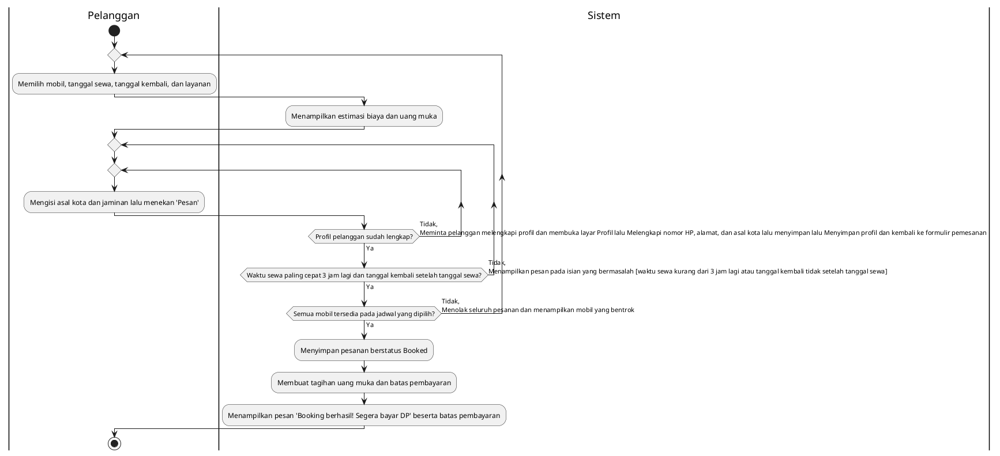
```plantuml
@startuml
|Pelanggan|
start
repeat
  :Memilih mobil, tanggal sewa, tanggal kembali, dan layanan;
  |Sistem|
  :Menampilkan estimasi biaya dan uang muka;
  |Pelanggan|
  repeat
    repeat
      :Mengisi asal kota dan jaminan lalu menekan 'Pesan';
    |Sistem|
    repeat while (Profil pelanggan sudah lengkap?) is (Tidak,\nMeminta pelanggan melengkapi profil dan membuka layar Profil lalu Melengkapi nomor HP, alamat, dan asal kota lalu menyimpan lalu Menyimpan profil dan kembali ke formulir pemesanan) not (Ya)
  repeat while (Waktu sewa paling cepat 3 jam lagi dan tanggal kembali setelah tanggal sewa?) is (Tidak,\nMenampilkan pesan pada isian yang bermasalah [waktu sewa kurang dari 3 jam lagi atau tanggal kembali tidak setelah tanggal sewa]) not (Ya)
repeat while (Semua mobil tersedia pada jadwal yang dipilih?) is (Tidak,\nMenolak seluruh pesanan dan menampilkan mobil yang bentrok) not (Ya)
:Menyimpan pesanan berstatus Booked;
:Membuat tagihan uang muka dan batas pembayaran;
:Menampilkan pesan 'Booking berhasil! Segera bayar DP' beserta batas pembayaran;
|Pelanggan|
stop
@enduml
```

---

## AD-8 — Mengunggah Bukti Pembayaran (UC8) — 📎 Lampiran

**Aktor.** Pelanggan  
**Tujuan.** Pelanggan mengunggah bukti pembayaran uang muka, pelunasan, atau denda.

### Diagram

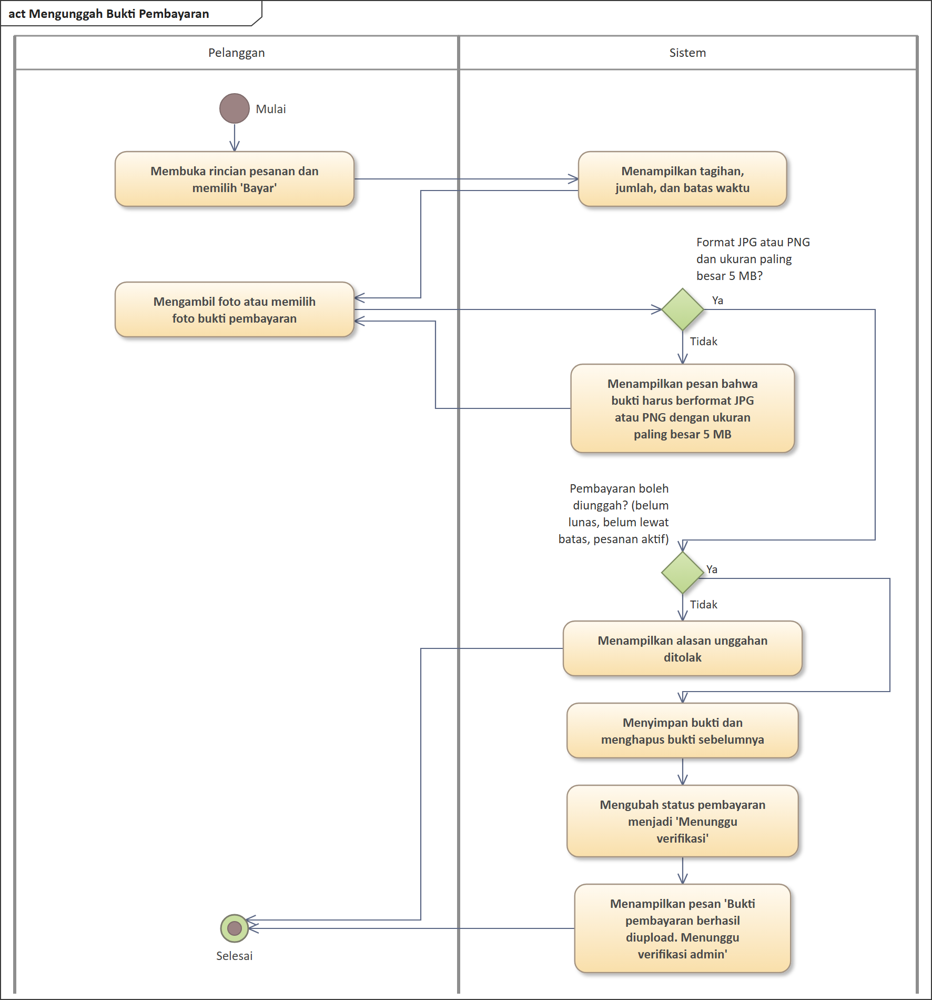

### Diagram (Mermaid)

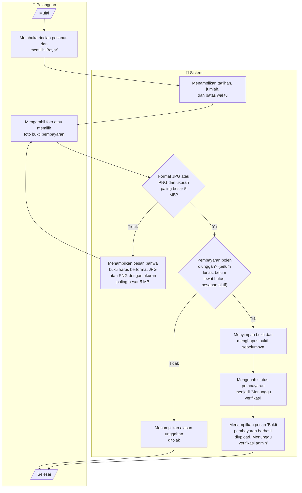
```mermaid
flowchart TB
    subgraph Sistem["📱 Sistem"]
        S1["Menampilkan tagihan, jumlah,<br/>dan batas waktu"]
        S2{"Format JPG atau<br/>PNG dan ukuran<br/>paling besar 5<br/>MB?"}
        S3["Menampilkan pesan bahwa<br/>bukti harus berformat JPG<br/>atau PNG dengan ukuran<br/>paling besar 5 MB"]
        S4{"Pembayaran boleh<br/>diunggah? (belum<br/>lunas, belum<br/>lewat batas,<br/>pesanan aktif)"}
        S5["Menampilkan alasan unggahan<br/>ditolak"]
        S6["Menyimpan bukti dan<br/>menghapus bukti sebelumnya"]
        S7["Mengubah status pembayaran<br/>menjadi 'Menunggu<br/>verifikasi'"]
        S8["Menampilkan pesan 'Bukti<br/>pembayaran berhasil<br/>diupload. Menunggu<br/>verifikasi admin'"]
    end

    subgraph Aktor["👤 Pelanggan"]
        A0[/"Mulai"/]
        A1["Membuka rincian pesanan dan<br/>memilih 'Bayar'"]
        A2["Mengambil foto atau memilih<br/>foto bukti pembayaran"]
        AE[/"Selesai"/]
    end

    A0 --> A1
    A1 --> S1
    S1 --> A2
    A2 --> S2
    S2 -- Tidak --> S3
    S3 --> A2
    S2 -- Ya --> S4
    S4 -- Tidak --> S5
    S5 --> AE
    S4 -- Ya --> S6
    S6 --> S7
    S7 --> S8
    S8 --> AE
```

### Diagram (PlantUML)

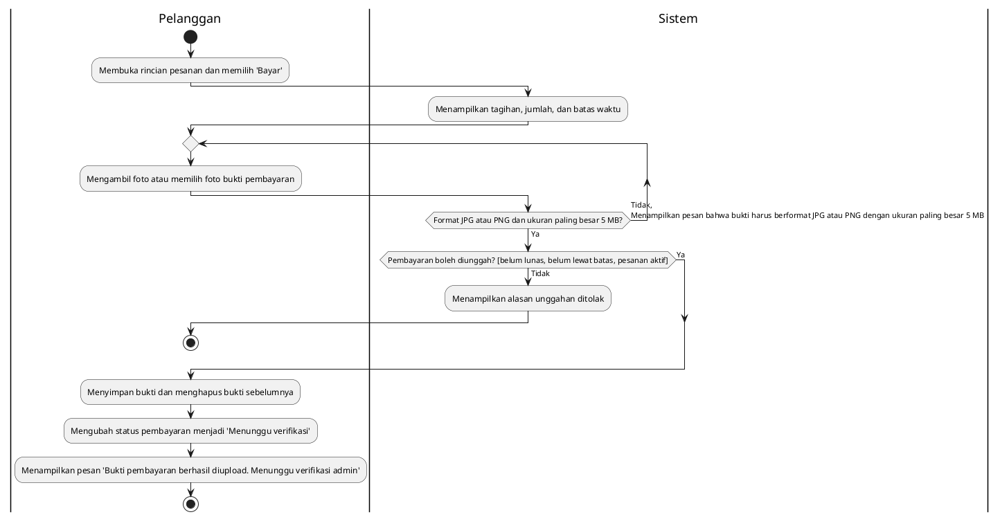
```plantuml
@startuml
|Pelanggan|
start
:Membuka rincian pesanan dan memilih 'Bayar';
|Sistem|
:Menampilkan tagihan, jumlah, dan batas waktu;
|Pelanggan|
repeat
  :Mengambil foto atau memilih foto bukti pembayaran;
|Sistem|
repeat while (Format JPG atau PNG dan ukuran paling besar 5 MB?) is (Tidak,\nMenampilkan pesan bahwa bukti harus berformat JPG atau PNG dengan ukuran paling besar 5 MB) not (Ya)
if (Pembayaran boleh diunggah? [belum lunas, belum lewat batas, pesanan aktif]) then (Tidak)
  :Menampilkan alasan unggahan ditolak;
  |Pelanggan|
  stop
else (Ya)
endif
:Menyimpan bukti dan menghapus bukti sebelumnya;
:Mengubah status pembayaran menjadi 'Menunggu verifikasi';
:Menampilkan pesan 'Bukti pembayaran berhasil diupload. Menunggu verifikasi admin';
|Pelanggan|
stop
@enduml
```

---

## AD-9 — Melihat Pesanan dan Riwayat (UC9) — 📎 Lampiran

**Aktor.** Pelanggan  
**Tujuan.** Pelanggan memantau status pesanan, tagihan, dan riwayat pesanannya.

### Diagram

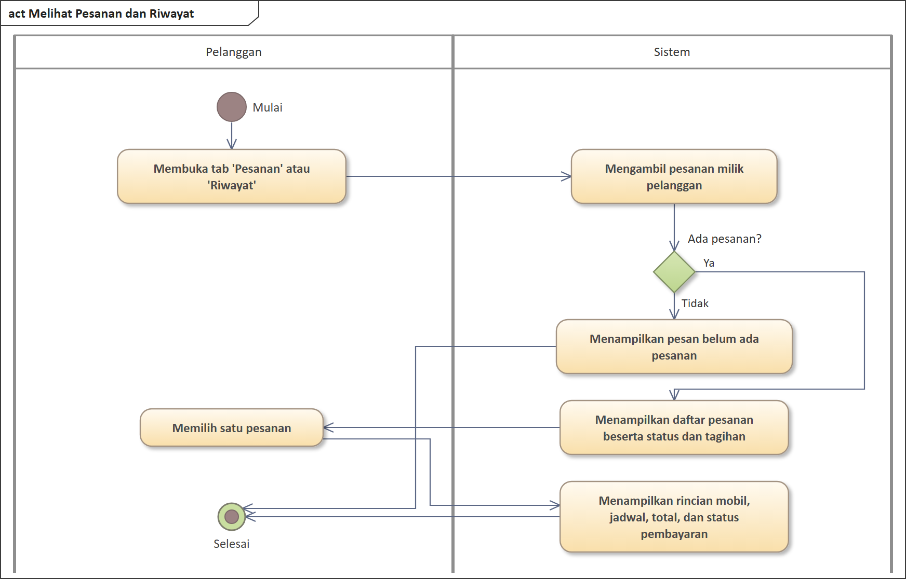

### Diagram (Mermaid)

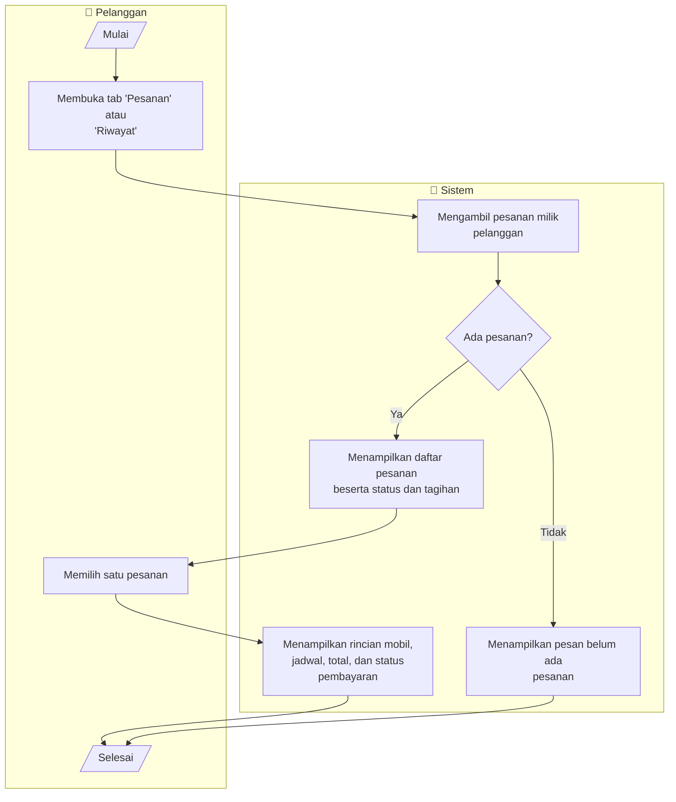
```mermaid
flowchart TB
    subgraph Sistem["📱 Sistem"]
        S1["Mengambil pesanan milik<br/>pelanggan"]
        S2{"Ada pesanan?"}
        S3["Menampilkan pesan belum ada<br/>pesanan"]
        S4["Menampilkan daftar pesanan<br/>beserta status dan tagihan"]
        S5["Menampilkan rincian mobil,<br/>jadwal, total, dan status<br/>pembayaran"]
    end

    subgraph Aktor["👤 Pelanggan"]
        A0[/"Mulai"/]
        A1["Membuka tab 'Pesanan' atau<br/>'Riwayat'"]
        A2["Memilih satu pesanan"]
        AE[/"Selesai"/]
    end

    A0 --> A1
    A1 --> S1
    S1 --> S2
    S2 -- Tidak --> S3
    S3 --> AE
    S2 -- Ya --> S4
    S4 --> A2
    A2 --> S5
    S5 --> AE
```

### Diagram (PlantUML)

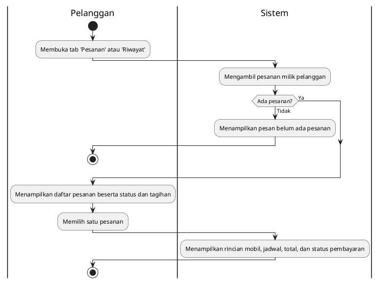
```plantuml
@startuml
|Pelanggan|
start
:Membuka tab 'Pesanan' atau 'Riwayat';
|Sistem|
:Mengambil pesanan milik pelanggan;
if (Ada pesanan?) then (Tidak)
  :Menampilkan pesan belum ada pesanan;
  |Pelanggan|
  stop
else (Ya)
endif
:Menampilkan daftar pesanan beserta status dan tagihan;
|Pelanggan|
:Memilih satu pesanan;
|Sistem|
:Menampilkan rincian mobil, jadwal, total, dan status pembayaran;
|Pelanggan|
stop
@enduml
```

---

## AD-10 — Membatalkan Pesanan (UC10) — 📎 Lampiran

**Aktor.** Pelanggan / Admin  
**Tujuan.** Pesanan berstatus Booked dibatalkan oleh pelanggan (selama uang muka belum terverifikasi) atau oleh admin.

### Diagram

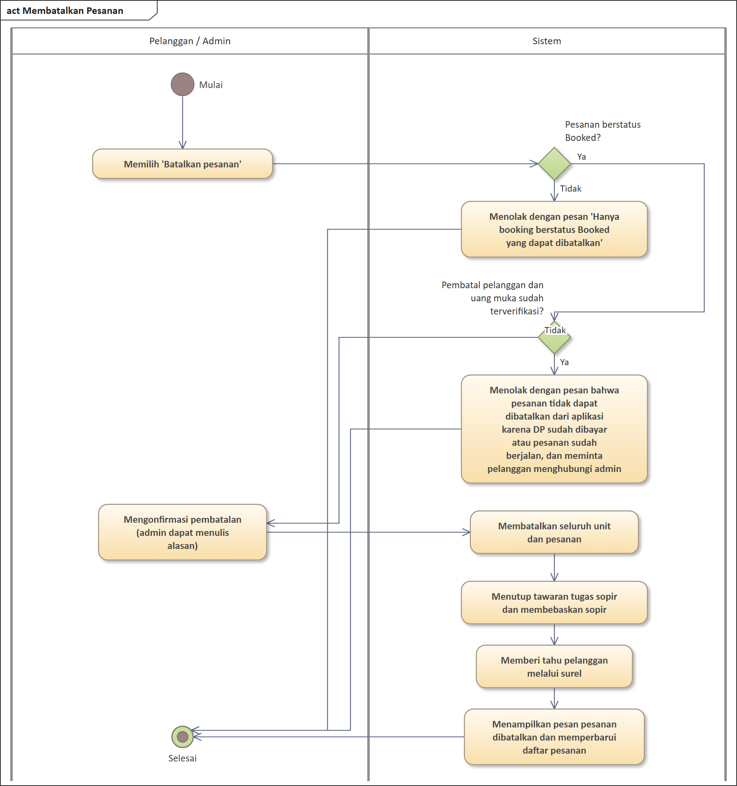

### Diagram (Mermaid)

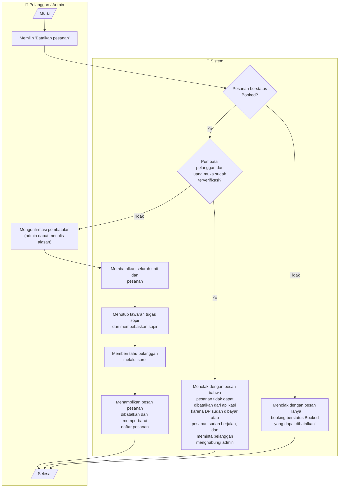
```mermaid
flowchart TB
    subgraph Sistem["📱 Sistem"]
        S1{"Pesanan berstatus<br/>Booked?"}
        S2["Menolak dengan pesan 'Hanya<br/>booking berstatus Booked<br/>yang dapat dibatalkan'"]
        S3{"Pembatal<br/>pelanggan dan<br/>uang muka sudah<br/>terverifikasi?"}
        S4["Menolak dengan pesan bahwa<br/>pesanan tidak dapat<br/>dibatalkan dari aplikasi<br/>karena DP sudah dibayar atau<br/>pesanan sudah berjalan, dan<br/>meminta pelanggan<br/>menghubungi admin"]
        S5["Membatalkan seluruh unit dan<br/>pesanan"]
        S6["Menutup tawaran tugas sopir<br/>dan membebaskan sopir"]
        S7["Memberi tahu pelanggan<br/>melalui surel"]
        S8["Menampilkan pesan pesanan<br/>dibatalkan dan memperbarui<br/>daftar pesanan"]
    end

    subgraph Aktor["👤 Pelanggan / Admin"]
        A0[/"Mulai"/]
        A1["Memilih 'Batalkan pesanan'"]
        A2["Mengonfirmasi pembatalan<br/>(admin dapat menulis alasan)"]
        AE[/"Selesai"/]
    end

    A0 --> A1
    A1 --> S1
    S1 -- Tidak --> S2
    S2 --> AE
    S1 -- Ya --> S3
    S3 -- Ya --> S4
    S4 --> AE
    S3 -- Tidak --> A2
    A2 --> S5
    S5 --> S6
    S6 --> S7
    S7 --> S8
    S8 --> AE
```

### Diagram (PlantUML)

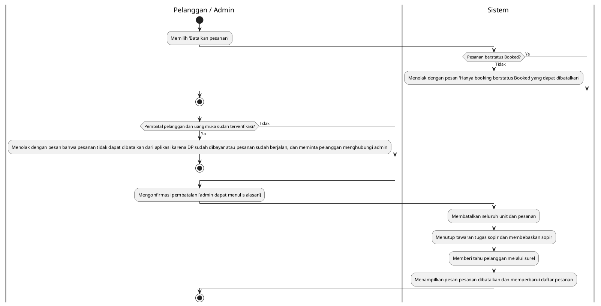
```plantuml
@startuml
|Pelanggan / Admin|
start
:Memilih 'Batalkan pesanan';
|Sistem|
if (Pesanan berstatus Booked?) then (Tidak)
  :Menolak dengan pesan 'Hanya booking berstatus Booked yang dapat dibatalkan';
  |Pelanggan / Admin|
  stop
else (Ya)
endif
if (Pembatal pelanggan dan uang muka sudah terverifikasi?) then (Ya)
  :Menolak dengan pesan bahwa pesanan tidak dapat dibatalkan dari aplikasi karena DP sudah dibayar atau pesanan sudah berjalan, dan meminta pelanggan menghubungi admin;
  |Pelanggan / Admin|
  stop
else (Tidak)
endif
|Pelanggan / Admin|
:Mengonfirmasi pembatalan [admin dapat menulis alasan];
|Sistem|
:Membatalkan seluruh unit dan pesanan;
:Menutup tawaran tugas sopir dan membebaskan sopir;
:Memberi tahu pelanggan melalui surel;
:Menampilkan pesan pesanan dibatalkan dan memperbarui daftar pesanan;
|Pelanggan / Admin|
stop
@enduml
```

---

# Bagian C — Pengelolaan Pesanan dan Operasional (Admin)

## AD-11 — Melihat Dashboard (UC11) — 📎 Lampiran

**Aktor.** Admin  
**Tujuan.** Admin melihat hal yang perlu ditindak dan ringkasan kondisi operasional.

### Diagram

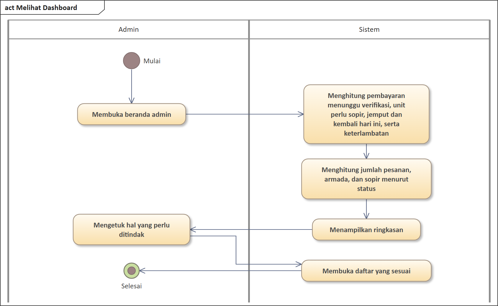

### Diagram (Mermaid)

```mermaid
flowchart TB
    subgraph Sistem["📱 Sistem"]
        S1["Menghitung pembayaran<br/>menunggu verifikasi, unit<br/>perlu sopir, jemput dan<br/>kembali hari ini, serta<br/>keterlambatan"]
        S2["Menghitung jumlah pesanan,<br/>armada, dan sopir menurut<br/>status"]
        S3["Menampilkan ringkasan"]
        S4["Membuka daftar yang sesuai"]
    end

    subgraph Aktor["👤 Admin"]
        A0[/"Mulai"/]
        A1["Membuka beranda admin"]
        A2["Mengetuk hal yang perlu<br/>ditindak"]
        AE[/"Selesai"/]
    end

    A0 --> A1
    A1 --> S1
    S1 --> S2
    S2 --> S3
    S3 --> A2
    A2 --> S4
    S4 --> AE
```

### Diagram (PlantUML)

```plantuml
@startuml
|Admin|
start
:Membuka beranda admin;
|Sistem|
:Menghitung pembayaran menunggu verifikasi, unit perlu sopir, jemput dan kembali hari ini, serta keterlambatan;
:Menghitung jumlah pesanan, armada, dan sopir menurut status;
:Menampilkan ringkasan;
|Admin|
:Mengetuk hal yang perlu ditindak;
|Sistem|
:Membuka daftar yang sesuai;
|Admin|
stop
@enduml
```

---

## AD-12 — Memantau Pesanan (UC12) — 📎 Lampiran

**Aktor.** Admin  
**Tujuan.** Admin mencari, memfilter, dan melihat rincian pesanan.

### Diagram

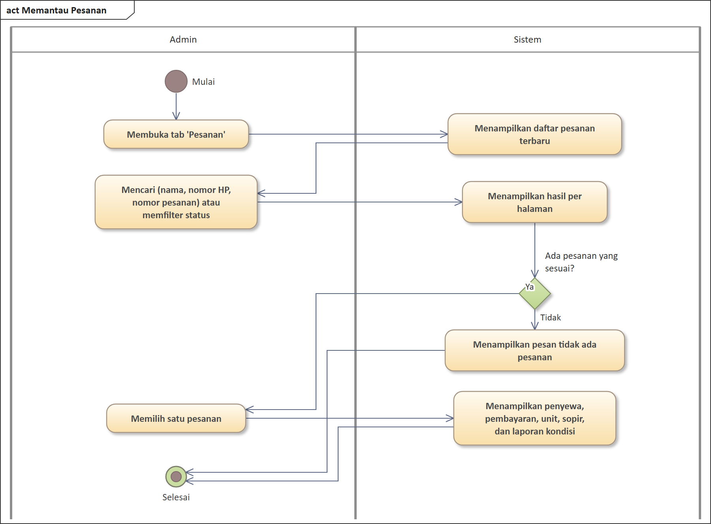

### Diagram (Mermaid)

```mermaid
flowchart TB
    subgraph Sistem["📱 Sistem"]
        S1["Menampilkan daftar pesanan<br/>terbaru"]
        S2["Menampilkan hasil per<br/>halaman"]
        S3{"Ada pesanan yang<br/>sesuai?"}
        S4["Menampilkan pesan tidak ada<br/>pesanan"]
        S5["Menampilkan penyewa,<br/>pembayaran, unit, sopir, dan<br/>laporan kondisi"]
    end

    subgraph Aktor["👤 Admin"]
        A0[/"Mulai"/]
        A1["Membuka tab 'Pesanan'"]
        A2["Mencari (nama, nomor HP,<br/>nomor pesanan) atau<br/>memfilter status"]
        A3["Memilih satu pesanan"]
        AE[/"Selesai"/]
    end

    A0 --> A1
    A1 --> S1
    S1 --> A2
    A2 --> S2
    S2 --> S3
    S3 -- Tidak --> S4
    S4 --> AE
    S3 -- Ya --> A3
    A3 --> S5
    S5 --> AE
```

### Diagram (PlantUML)

```plantuml
@startuml
|Admin|
start
:Membuka tab 'Pesanan';
|Sistem|
:Menampilkan daftar pesanan terbaru;
|Admin|
:Mencari [nama, nomor HP, nomor pesanan] atau memfilter status;
|Sistem|
:Menampilkan hasil per halaman;
if (Ada pesanan yang sesuai?) then (Tidak)
  :Menampilkan pesan tidak ada pesanan;
  |Admin|
  stop
else (Ya)
endif
|Admin|
:Memilih satu pesanan;
|Sistem|
:Menampilkan penyewa, pembayaran, unit, sopir, dan laporan kondisi;
|Admin|
stop
@enduml
```

---

## AD-13 — Memverifikasi Pembayaran (UC13) — 📌 **BAB III**

**Aktor.** Admin  
**Tujuan.** Admin memeriksa bukti pembayaran dari pelanggan lalu menyatakannya lunas.

### Diagram

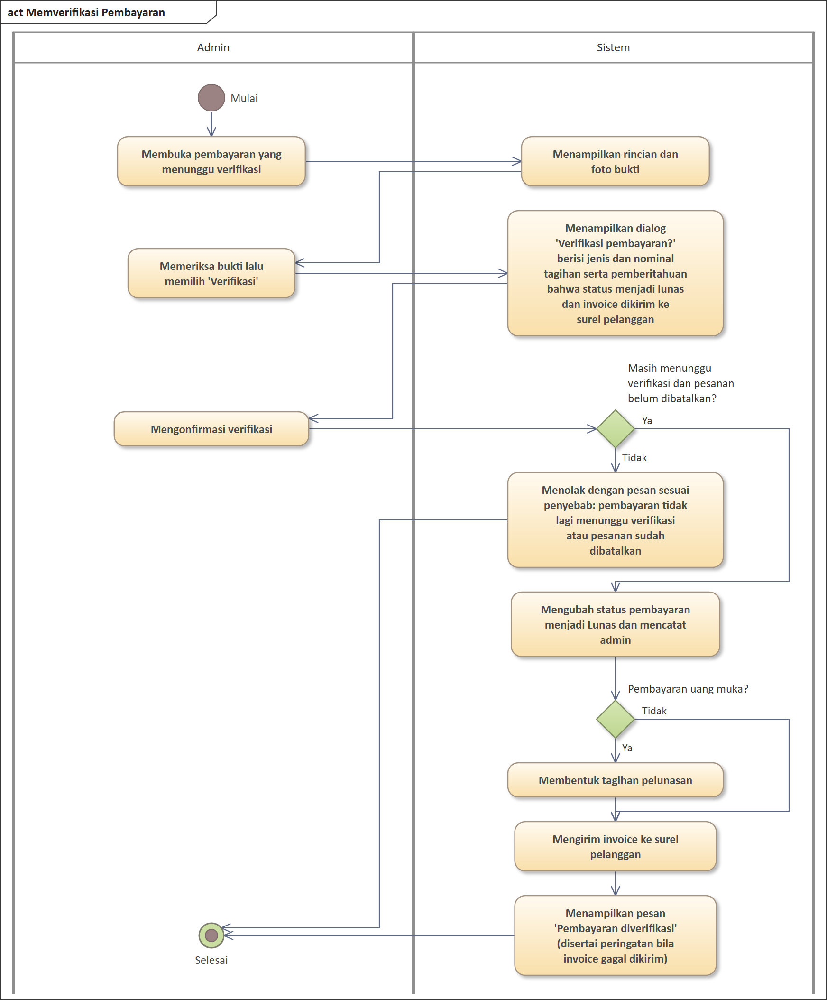

### Diagram (Mermaid)

```mermaid
flowchart TB
    subgraph Sistem["📱 Sistem"]
        S1["Menampilkan rincian dan foto<br/>bukti"]
        S2["Menampilkan dialog<br/>'Verifikasi pembayaran?'<br/>berisi jenis dan nominal<br/>tagihan serta pemberitahuan<br/>bahwa status menjadi lunas<br/>dan invoice dikirim ke surel<br/>pelanggan"]
        S3{"Masih menunggu<br/>verifikasi dan<br/>pesanan belum<br/>dibatalkan?"}
        S4["Menolak dengan pesan sesuai<br/>penyebab: pembayaran tidak<br/>lagi menunggu verifikasi<br/>atau pesanan sudah<br/>dibatalkan"]
        S5["Mengubah status pembayaran<br/>menjadi Lunas dan mencatat<br/>admin"]
        S6{"Pembayaran uang<br/>muka?"}
        S7["Membentuk tagihan pelunasan"]
        S8["Mengirim invoice ke surel<br/>pelanggan"]
        S9["Menampilkan pesan<br/>'Pembayaran diverifikasi'<br/>(disertai peringatan bila<br/>invoice gagal dikirim)"]
    end

    subgraph Aktor["👤 Admin"]
        A0[/"Mulai"/]
        A1["Membuka pembayaran yang<br/>menunggu verifikasi"]
        A2["Memeriksa bukti lalu memilih<br/>'Verifikasi'"]
        A3["Mengonfirmasi verifikasi"]
        AE[/"Selesai"/]
    end

    A0 --> A1
    A1 --> S1
    S1 --> A2
    A2 --> S2
    S2 --> A3
    A3 --> S3
    S3 -- Tidak --> S4
    S4 --> AE
    S3 -- Ya --> S5
    S5 --> S6
    S6 -- Ya --> S7
    S7 --> S8
    S6 -- Tidak --> S8
    S8 --> S9
    S9 --> AE
```

### Diagram (PlantUML)

```plantuml
@startuml
|Admin|
start
:Membuka pembayaran yang menunggu verifikasi;
|Sistem|
:Menampilkan rincian dan foto bukti;
|Admin|
:Memeriksa bukti lalu memilih 'Verifikasi';
|Sistem|
:Menampilkan dialog 'Verifikasi pembayaran?' berisi jenis dan nominal tagihan serta pemberitahuan bahwa status menjadi lunas dan invoice dikirim ke surel pelanggan;
|Admin|
:Mengonfirmasi verifikasi;
|Sistem|
if (Masih menunggu verifikasi dan pesanan belum dibatalkan?) then (Tidak)
  :Menolak dengan pesan sesuai penyebab: pembayaran tidak lagi menunggu verifikasi atau pesanan sudah dibatalkan;
  |Admin|
  stop
else (Ya)
endif
:Mengubah status pembayaran menjadi Lunas dan mencatat admin;
if (Pembayaran uang muka?) then (Ya)
  :Membentuk tagihan pelunasan;
else (Tidak)
endif
|Sistem|
:Mengirim invoice ke surel pelanggan;
:Menampilkan pesan 'Pembayaran diverifikasi' [disertai peringatan bila invoice gagal dikirim];
|Admin|
stop
@enduml
```

---

## AD-14 — Menolak Bukti Pembayaran (UC14) — 📎 Lampiran

**Aktor.** Admin  
**Tujuan.** Admin menolak bukti pembayaran yang tidak sesuai agar pelanggan mengunggah ulang.

### Diagram

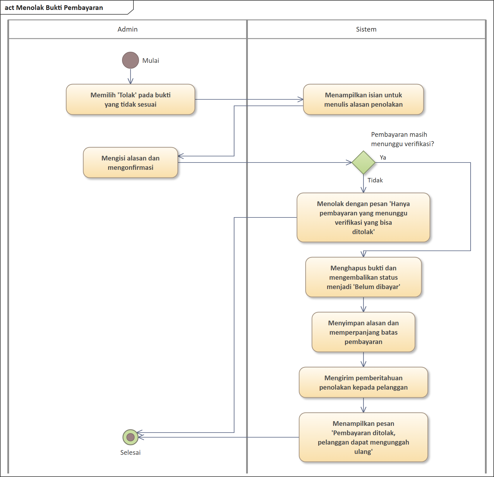

### Diagram (Mermaid)

```mermaid
flowchart TB
    subgraph Sistem["📱 Sistem"]
        S1["Menampilkan isian untuk<br/>menulis alasan penolakan"]
        S2{"Pembayaran masih<br/>menunggu<br/>verifikasi?"}
        S3["Menolak dengan pesan 'Hanya<br/>pembayaran yang menunggu<br/>verifikasi yang bisa<br/>ditolak'"]
        S4["Menghapus bukti dan<br/>mengembalikan status menjadi<br/>'Belum dibayar'"]
        S5["Menyimpan alasan dan<br/>memperpanjang batas<br/>pembayaran"]
        S6["Mengirim pemberitahuan<br/>penolakan kepada pelanggan"]
        S7["Menampilkan pesan<br/>'Pembayaran ditolak,<br/>pelanggan dapat mengunggah<br/>ulang'"]
    end

    subgraph Aktor["👤 Admin"]
        A0[/"Mulai"/]
        A1["Memilih 'Tolak' pada bukti<br/>yang tidak sesuai"]
        A2["Mengisi alasan dan<br/>mengonfirmasi"]
        AE[/"Selesai"/]
    end

    A0 --> A1
    A1 --> S1
    S1 --> A2
    A2 --> S2
    S2 -- Tidak --> S3
    S3 --> AE
    S2 -- Ya --> S4
    S4 --> S5
    S5 --> S6
    S6 --> S7
    S7 --> AE
```

### Diagram (PlantUML)

```plantuml
@startuml
|Admin|
start
:Memilih 'Tolak' pada bukti yang tidak sesuai;
|Sistem|
:Menampilkan isian untuk menulis alasan penolakan;
|Admin|
:Mengisi alasan dan mengonfirmasi;
|Sistem|
if (Pembayaran masih menunggu verifikasi?) then (Tidak)
  :Menolak dengan pesan 'Hanya pembayaran yang menunggu verifikasi yang bisa ditolak';
  |Admin|
  stop
else (Ya)
endif
:Menghapus bukti dan mengembalikan status menjadi 'Belum dibayar';
:Menyimpan alasan dan memperpanjang batas pembayaran;
:Mengirim pemberitahuan penolakan kepada pelanggan;
:Menampilkan pesan 'Pembayaran ditolak, pelanggan dapat mengunggah ulang';
|Admin|
stop
@enduml
```

---

## AD-15 — Mencatat Pembayaran Langsung (UC15) — 📎 Lampiran

**Aktor.** Admin  
**Tujuan.** Admin mencatat pembayaran yang diterima langsung tanpa bukti unggahan.

### Diagram

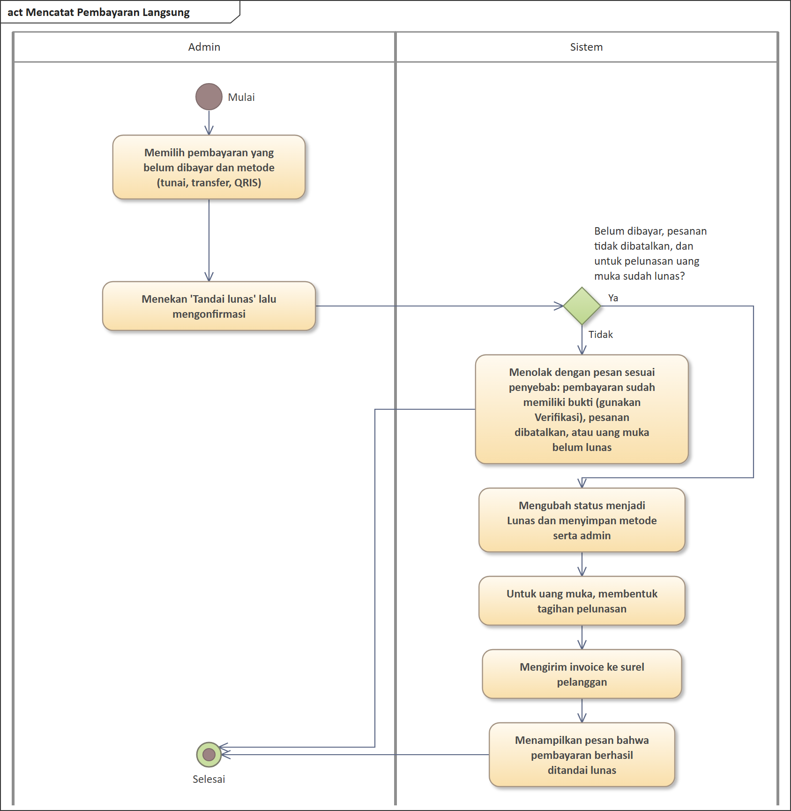

### Diagram (Mermaid)

```mermaid
flowchart TB
    subgraph Sistem["📱 Sistem"]
        S1{"Belum dibayar,<br/>pesanan tidak<br/>dibatalkan, dan<br/>untuk pelunasan<br/>uang muka sudah<br/>lunas?"}
        S2["Menolak dengan pesan sesuai<br/>penyebab: pembayaran sudah<br/>memiliki bukti (gunakan<br/>Verifikasi), pesanan<br/>dibatalkan, atau uang muka<br/>belum lunas"]
        S3["Mengubah status menjadi<br/>Lunas dan menyimpan metode<br/>serta admin"]
        S4["Untuk uang muka, membentuk<br/>tagihan pelunasan"]
        S5["Mengirim invoice ke surel<br/>pelanggan"]
        S6["Menampilkan pesan bahwa<br/>pembayaran berhasil ditandai<br/>lunas"]
    end

    subgraph Aktor["👤 Admin"]
        A0[/"Mulai"/]
        A1["Memilih pembayaran yang<br/>belum dibayar dan metode<br/>(tunai, transfer, QRIS)"]
        A2["Menekan 'Tandai lunas' lalu<br/>mengonfirmasi"]
        AE[/"Selesai"/]
    end

    A0 --> A1
    A1 --> A2
    A2 --> S1
    S1 -- Tidak --> S2
    S2 --> AE
    S1 -- Ya --> S3
    S3 --> S4
    S4 --> S5
    S5 --> S6
    S6 --> AE
```

### Diagram (PlantUML)

```plantuml
@startuml
|Admin|
start
:Memilih pembayaran yang belum dibayar dan metode [tunai, transfer, QRIS];
:Menekan 'Tandai lunas' lalu mengonfirmasi;
|Sistem|
if (Belum dibayar, pesanan tidak dibatalkan, dan untuk pelunasan uang muka sudah lunas?) then (Tidak)
  :Menolak dengan pesan sesuai penyebab: pembayaran sudah memiliki bukti [gunakan Verifikasi], pesanan dibatalkan, atau uang muka belum lunas;
  |Admin|
  stop
else (Ya)
endif
:Mengubah status menjadi Lunas dan menyimpan metode serta admin;
:Untuk uang muka, membentuk tagihan pelunasan;
:Mengirim invoice ke surel pelanggan;
:Menampilkan pesan bahwa pembayaran berhasil ditandai lunas;
|Admin|
stop
@enduml
```

---

## AD-16 — Menugaskan Sopir (UC16) — 📌 **BAB III**

**Aktor.** Admin  
**Tujuan.** Admin menawarkan tugas unit bersopir kepada sopir yang tersedia.

### Diagram

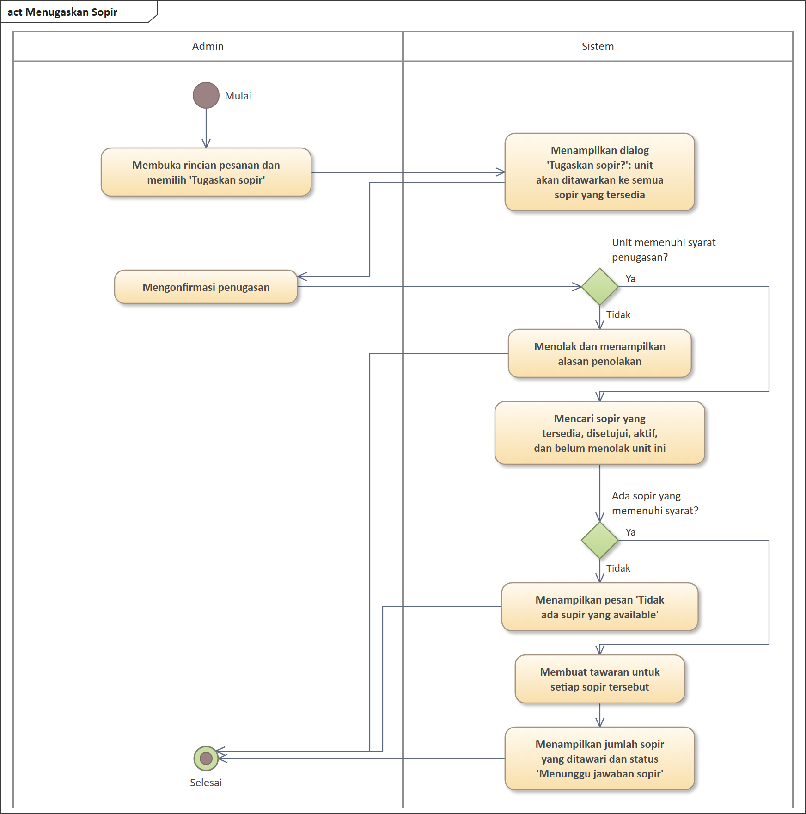

### Diagram (Mermaid)

```mermaid
flowchart TB
    subgraph Sistem["📱 Sistem"]
        S1["Menampilkan dialog 'Tugaskan<br/>sopir?': unit akan<br/>ditawarkan ke semua sopir<br/>yang tersedia"]
        S2{"Unit memenuhi<br/>syarat penugasan?"}
        S3["Menolak dan menampilkan<br/>alasan penolakan"]
        S4["Mencari sopir yang tersedia,<br/>disetujui, aktif, dan belum<br/>menolak unit ini"]
        S5{"Ada sopir yang<br/>memenuhi syarat?"}
        S6["Menampilkan pesan 'Tidak ada<br/>supir yang available'"]
        S7["Membuat tawaran untuk setiap<br/>sopir tersebut"]
        S8["Menampilkan jumlah sopir<br/>yang ditawari dan status<br/>'Menunggu jawaban sopir'"]
    end

    subgraph Aktor["👤 Admin"]
        A0[/"Mulai"/]
        A1["Membuka rincian pesanan dan<br/>memilih 'Tugaskan sopir'"]
        A2["Mengonfirmasi penugasan"]
        AE[/"Selesai"/]
    end

    A0 --> A1
    A1 --> S1
    S1 --> A2
    A2 --> S2
    S2 -- Tidak --> S3
    S3 --> AE
    S2 -- Ya --> S4
    S4 --> S5
    S5 -- Tidak --> S6
    S6 --> AE
    S5 -- Ya --> S7
    S7 --> S8
    S8 --> AE
```

### Diagram (PlantUML)

```plantuml
@startuml
|Admin|
start
:Membuka rincian pesanan dan memilih 'Tugaskan sopir';
|Sistem|
:Menampilkan dialog 'Tugaskan sopir?': unit akan ditawarkan ke semua sopir yang tersedia;
|Admin|
:Mengonfirmasi penugasan;
|Sistem|
if (Unit memenuhi syarat penugasan?) then (Tidak)
  :Menolak dan menampilkan alasan penolakan;
  |Admin|
  stop
else (Ya)
endif
:Mencari sopir yang tersedia, disetujui, aktif, dan belum menolak unit ini;
if (Ada sopir yang memenuhi syarat?) then (Tidak)
  :Menampilkan pesan 'Tidak ada supir yang available';
  |Admin|
  stop
else (Ya)
endif
:Membuat tawaran untuk setiap sopir tersebut;
:Menampilkan jumlah sopir yang ditawari dan status 'Menunggu jawaban sopir';
|Admin|
stop
@enduml
```

---

## AD-17 — Mengonfirmasi Jemput Kendaraan (UC17) — 📎 Lampiran

**Aktor.** Admin  
**Tujuan.** Admin mengonfirmasi kendaraan diserahkan kepada pelanggan setelah uang muka lunas.

### Diagram

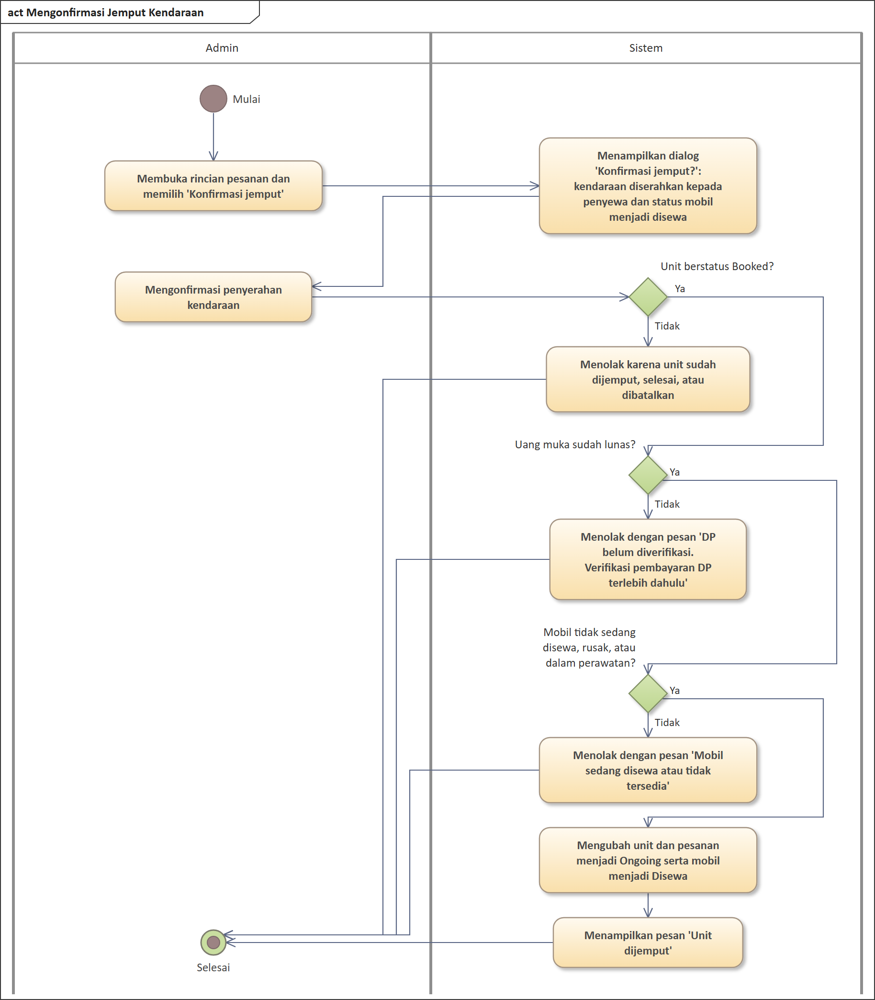

### Diagram (Mermaid)

```mermaid
flowchart TB
    subgraph Sistem["📱 Sistem"]
        S1["Menampilkan dialog<br/>'Konfirmasi jemput?':<br/>kendaraan diserahkan kepada<br/>penyewa dan status mobil<br/>menjadi disewa"]
        S2{"Unit berstatus<br/>Booked?"}
        S3["Menolak karena unit sudah<br/>dijemput, selesai, atau<br/>dibatalkan"]
        S4{"Uang muka sudah<br/>lunas?"}
        S5["Menolak dengan pesan 'DP<br/>belum diverifikasi.<br/>Verifikasi pembayaran DP<br/>terlebih dahulu'"]
        S6{"Mobil tidak<br/>sedang disewa,<br/>rusak, atau dalam<br/>perawatan?"}
        S7["Menolak dengan pesan 'Mobil<br/>sedang disewa atau tidak<br/>tersedia'"]
        S8["Mengubah unit dan pesanan<br/>menjadi Ongoing serta mobil<br/>menjadi Disewa"]
        S9["Menampilkan pesan 'Unit<br/>dijemput'"]
    end

    subgraph Aktor["👤 Admin"]
        A0[/"Mulai"/]
        A1["Membuka rincian pesanan dan<br/>memilih 'Konfirmasi jemput'"]
        A2["Mengonfirmasi penyerahan<br/>kendaraan"]
        AE[/"Selesai"/]
    end

    A0 --> A1
    A1 --> S1
    S1 --> A2
    A2 --> S2
    S2 -- Tidak --> S3
    S3 --> AE
    S2 -- Ya --> S4
    S4 -- Tidak --> S5
    S5 --> AE
    S4 -- Ya --> S6
    S6 -- Tidak --> S7
    S7 --> AE
    S6 -- Ya --> S8
    S8 --> S9
    S9 --> AE
```

### Diagram (PlantUML)

```plantuml
@startuml
|Admin|
start
:Membuka rincian pesanan dan memilih 'Konfirmasi jemput';
|Sistem|
:Menampilkan dialog 'Konfirmasi jemput?': kendaraan diserahkan kepada penyewa dan status mobil menjadi disewa;
|Admin|
:Mengonfirmasi penyerahan kendaraan;
|Sistem|
if (Unit berstatus Booked?) then (Tidak)
  :Menolak karena unit sudah dijemput, selesai, atau dibatalkan;
  |Admin|
  stop
else (Ya)
endif
if (Uang muka sudah lunas?) then (Tidak)
  :Menolak dengan pesan 'DP belum diverifikasi. Verifikasi pembayaran DP terlebih dahulu';
  |Admin|
  stop
else (Ya)
endif
if (Mobil tidak sedang disewa, rusak, atau dalam perawatan?) then (Tidak)
  :Menolak dengan pesan 'Mobil sedang disewa atau tidak tersedia';
  |Admin|
  stop
else (Ya)
endif
:Mengubah unit dan pesanan menjadi Ongoing serta mobil menjadi Disewa;
:Menampilkan pesan 'Unit dijemput';
|Admin|
stop
@enduml
```

---

## AD-18 — Mencatat Pengembalian dan Denda (UC18) — 📌 **BAB III**

**Aktor.** Admin  
**Tujuan.** Admin mencatat kendaraan yang kembali dan sistem menghitung denda keterlambatan.

### Diagram

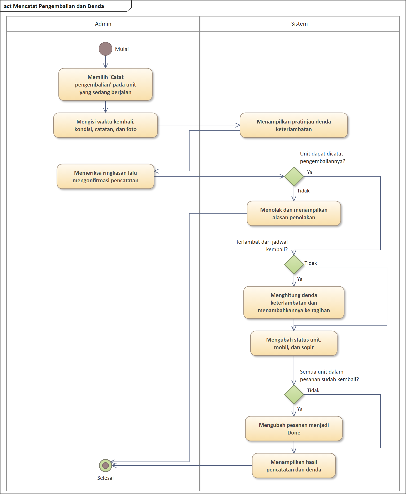

### Diagram (Mermaid)

```mermaid
flowchart TB
    subgraph Sistem["📱 Sistem"]
        S1["Menampilkan pratinjau denda<br/>keterlambatan"]
        S2{"Unit dapat<br/>dicatat<br/>pengembaliannya?"}
        S3["Menolak dan menampilkan<br/>alasan penolakan"]
        S4{"Terlambat dari<br/>jadwal kembali?"}
        S5["Menghitung denda<br/>keterlambatan dan<br/>menambahkannya ke tagihan"]
        S7["Mengubah status unit, mobil,<br/>dan sopir"]
        S10{"Semua unit dalam<br/>pesanan sudah<br/>kembali?"}
        S11["Mengubah pesanan menjadi<br/>Done"]
        S12["Menampilkan hasil pencatatan<br/>dan denda"]
    end

    subgraph Aktor["👤 Admin"]
        A0[/"Mulai"/]
        A1["Memilih 'Catat pengembalian'<br/>pada unit yang sedang<br/>berjalan"]
        A2["Mengisi waktu kembali,<br/>kondisi, catatan, dan foto"]
        A3["Memeriksa ringkasan lalu<br/>mengonfirmasi pencatatan"]
        AE[/"Selesai"/]
    end

    A0 --> A1
    A1 --> A2
    A2 --> S1
    S1 --> A3
    A3 --> S2
    S2 -- Tidak --> S3
    S3 --> AE
    S2 -- Ya --> S4
    S4 -- Ya --> S5
    S5 --> S7
    S4 -- Tidak --> S7
    S7 --> S10
    S10 -- Ya --> S11
    S11 --> S12
    S10 -- Tidak --> S12
    S12 --> AE
```

### Diagram (PlantUML)

```plantuml
@startuml
|Admin|
start
:Memilih 'Catat pengembalian' pada unit yang sedang berjalan;
:Mengisi waktu kembali, kondisi, catatan, dan foto;
|Sistem|
:Menampilkan pratinjau denda keterlambatan;
|Admin|
:Memeriksa ringkasan lalu mengonfirmasi pencatatan;
|Sistem|
if (Unit dapat dicatat pengembaliannya?) then (Tidak)
  :Menolak dan menampilkan alasan penolakan;
  |Admin|
  stop
else (Ya)
endif
if (Terlambat dari jadwal kembali?) then (Ya)
  :Menghitung denda keterlambatan dan menambahkannya ke tagihan;
else (Tidak)
endif
|Sistem|
:Mengubah status unit, mobil, dan sopir;
if (Semua unit dalam pesanan sudah kembali?) then (Ya)
  :Mengubah pesanan menjadi Done;
else (Tidak)
endif
|Sistem|
:Menampilkan hasil pencatatan dan denda;
|Admin|
stop
@enduml
```

---

## AD-19 — Melaporkan Kondisi Kendaraan (UC19) — 📎 Lampiran

**Aktor.** Admin / Sopir  
**Tujuan.** Admin atau sopir mencatat kondisi kendaraan sebelum dan sesudah sewa beserta foto.

### Diagram

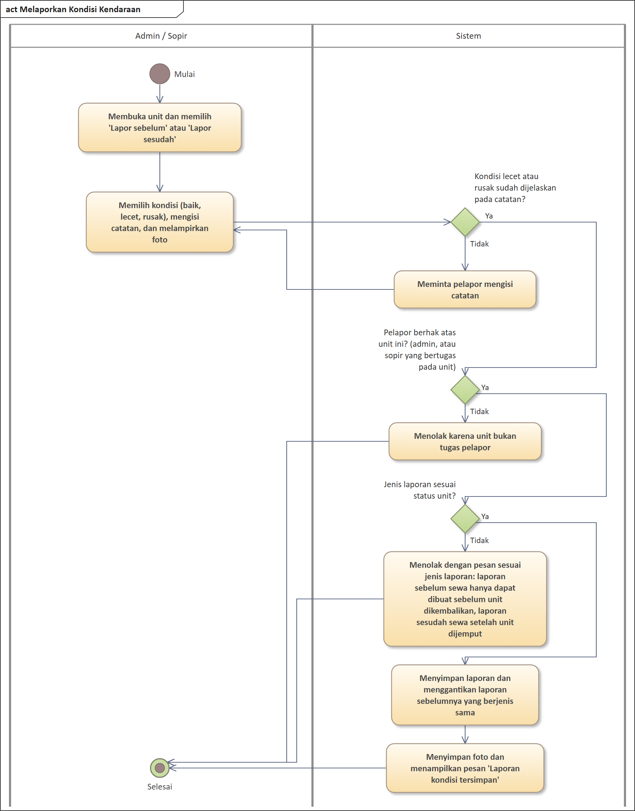

### Diagram (Mermaid)

```mermaid
flowchart TB
    subgraph Sistem["📱 Sistem"]
        S1{"Kondisi lecet<br/>atau rusak sudah<br/>dijelaskan pada<br/>catatan?"}
        S2["Meminta pelapor mengisi<br/>catatan"]
        S3{"Pelapor berhak<br/>atas unit ini?<br/>(admin, atau<br/>sopir yang<br/>bertugas pada<br/>unit)"}
        S4["Menolak karena unit bukan<br/>tugas pelapor"]
        S5{"Jenis laporan<br/>sesuai status<br/>unit?"}
        S6["Menolak dengan pesan sesuai<br/>jenis laporan: laporan<br/>sebelum sewa hanya dapat<br/>dibuat sebelum unit<br/>dikembalikan, laporan<br/>sesudah sewa setelah unit<br/>dijemput"]
        S7["Menyimpan laporan dan<br/>menggantikan laporan<br/>sebelumnya yang berjenis<br/>sama"]
        S8["Menyimpan foto dan<br/>menampilkan pesan 'Laporan<br/>kondisi tersimpan'"]
    end

    subgraph Aktor["👤 Admin / Sopir"]
        A0[/"Mulai"/]
        A1["Membuka unit dan memilih<br/>'Lapor sebelum' atau 'Lapor<br/>sesudah'"]
        A2["Memilih kondisi (baik,<br/>lecet, rusak), mengisi<br/>catatan, dan melampirkan<br/>foto"]
        AE[/"Selesai"/]
    end

    A0 --> A1
    A1 --> A2
    A2 --> S1
    S1 -- Tidak --> S2
    S2 --> A2
    S1 -- Ya --> S3
    S3 -- Tidak --> S4
    S4 --> AE
    S3 -- Ya --> S5
    S5 -- Tidak --> S6
    S6 --> AE
    S5 -- Ya --> S7
    S7 --> S8
    S8 --> AE
```

### Diagram (PlantUML)

```plantuml
@startuml
|Admin / Sopir|
start
:Membuka unit dan memilih 'Lapor sebelum' atau 'Lapor sesudah';
repeat
  :Memilih kondisi [baik, lecet, rusak], mengisi catatan, dan melampirkan foto;
|Sistem|
repeat while (Kondisi lecet atau rusak sudah dijelaskan pada catatan?) is (Tidak,\nMeminta pelapor mengisi catatan) not (Ya)
if (Pelapor berhak atas unit ini? [admin, atau sopir yang bertugas pada unit]) then (Tidak)
  :Menolak karena unit bukan tugas pelapor;
  |Admin / Sopir|
  stop
else (Ya)
endif
if (Jenis laporan sesuai status unit?) then (Tidak)
  :Menolak dengan pesan sesuai jenis laporan: laporan sebelum sewa hanya dapat dibuat sebelum unit dikembalikan, laporan sesudah sewa setelah unit dijemput;
  |Admin / Sopir|
  stop
else (Ya)
endif
:Menyimpan laporan dan menggantikan laporan sebelumnya yang berjenis sama;
:Menyimpan foto dan menampilkan pesan 'Laporan kondisi tersimpan';
|Admin / Sopir|
stop
@enduml
```

---

## AD-20 — Mengelola Armada (UC20) — 📎 Lampiran

**Aktor.** Admin  
**Tujuan.** Admin menambah, mengubah, mengatur status, dan menghapus mobil.

### Diagram

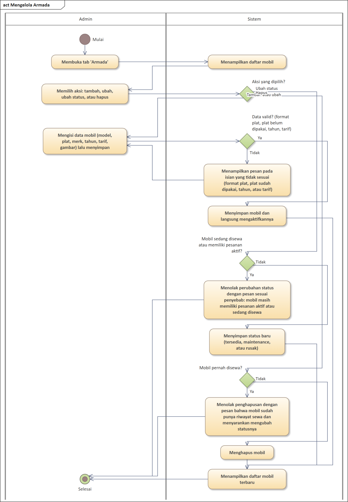

### Diagram (Mermaid)

```mermaid
flowchart TB
    subgraph Sistem["📱 Sistem"]
        S1["Menampilkan daftar mobil"]
        S2{"Aksi yang<br/>dipilih?"}
        S3{"Data valid?<br/>(format plat,<br/>plat belum<br/>dipakai, tahun,<br/>tarif)"}
        S4["Menampilkan pesan pada isian<br/>yang tidak sesuai (format<br/>plat, plat sudah dipakai,<br/>tahun, atau tarif)"]
        S5["Menyimpan mobil dan langsung<br/>mengaktifkannya"]
        S6{"Mobil sedang<br/>disewa atau<br/>memiliki pesanan<br/>aktif?"}
        S7["Menolak perubahan status<br/>dengan pesan sesuai<br/>penyebab: mobil masih<br/>memiliki pesanan aktif atau<br/>sedang disewa"]
        S8["Menyimpan status baru<br/>(tersedia, maintenance, atau<br/>rusak)"]
        S9{"Mobil pernah<br/>disewa?"}
        S10["Menolak penghapusan dengan<br/>pesan bahwa mobil sudah<br/>punya riwayat sewa dan<br/>menyarankan mengubah<br/>statusnya"]
        S11["Menghapus mobil"]
        S12["Menampilkan daftar mobil<br/>terbaru"]
    end

    subgraph Aktor["👤 Admin"]
        A0[/"Mulai"/]
        A1["Membuka tab 'Armada'"]
        A2["Memilih aksi: tambah, ubah,<br/>ubah status, atau hapus"]
        A3["Mengisi data mobil (model,<br/>plat, merk, tahun, tarif,<br/>gambar) lalu menyimpan"]
        AE[/"Selesai"/]
    end

    A0 --> A1
    A1 --> S1
    S1 --> A2
    A2 --> S2
    S2 -- Tambah atau ubah --> A3
    A3 --> S3
    S3 -- Tidak --> S4
    S4 --> A3
    S3 -- Ya --> S5
    S5 --> S12
    S2 -- Ubah status --> S6
    S6 -- Ya --> S7
    S7 --> AE
    S6 -- Tidak --> S8
    S8 --> S12
    S2 -- Hapus --> S9
    S9 -- Ya --> S10
    S10 --> AE
    S9 -- Tidak --> S11
    S11 --> S12
    S12 --> AE
```

### Diagram (PlantUML)

```plantuml
@startuml
|Admin|
start
:Membuka tab 'Armada';
|Sistem|
:Menampilkan daftar mobil;
|Admin|
:Memilih aksi: tambah, ubah, ubah status, atau hapus;
|Sistem|
switch (Aksi yang dipilih?)
case (Tambah atau ubah)
  |Admin|
  repeat
    :Mengisi data mobil [model, plat, merk, tahun, tarif, gambar] lalu menyimpan;
  |Sistem|
  repeat while (Data valid? [format plat, plat belum dipakai, tahun, tarif]) is (Tidak,\nMenampilkan pesan pada isian yang tidak sesuai [format plat, plat sudah dipakai, tahun, atau tarif]) not (Ya)
  :Menyimpan mobil dan langsung mengaktifkannya;
case (Ubah status)
  if (Mobil sedang disewa atau memiliki pesanan aktif?) then (Ya)
    :Menolak perubahan status dengan pesan sesuai penyebab: mobil masih memiliki pesanan aktif atau sedang disewa;
    |Admin|
    stop
  else (Tidak)
  endif
  :Menyimpan status baru [tersedia, maintenance, atau rusak];
case (Hapus)
  if (Mobil pernah disewa?) then (Ya)
    :Menolak penghapusan dengan pesan bahwa mobil sudah punya riwayat sewa dan menyarankan mengubah statusnya;
    |Admin|
    stop
  else (Tidak)
  endif
  :Menghapus mobil;
endswitch
|Sistem|
:Menampilkan daftar mobil terbaru;
|Admin|
stop
@enduml
```

---

## AD-21 — Mengelola Sopir (UC21) — 📎 Lampiran

**Aktor.** Admin  
**Tujuan.** Admin menambah dan mengubah akun sopir serta menonaktifkannya.

### Diagram

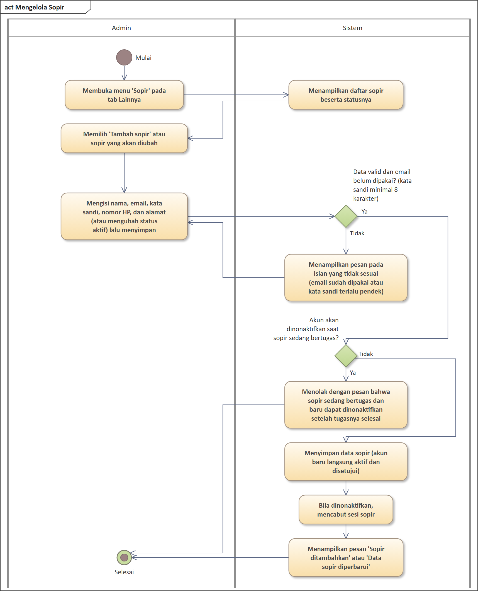

### Diagram (Mermaid)

```mermaid
flowchart TB
    subgraph Sistem["📱 Sistem"]
        S1["Menampilkan daftar sopir<br/>beserta statusnya"]
        S2{"Data valid dan<br/>email belum<br/>dipakai? (kata<br/>sandi minimal 8<br/>karakter)"}
        S3["Menampilkan pesan pada isian<br/>yang tidak sesuai (email<br/>sudah dipakai atau kata<br/>sandi terlalu pendek)"]
        S4{"Akun akan<br/>dinonaktifkan<br/>saat sopir sedang<br/>bertugas?"}
        S5["Menolak dengan pesan bahwa<br/>sopir sedang bertugas dan<br/>baru dapat dinonaktifkan<br/>setelah tugasnya selesai"]
        S6["Menyimpan data sopir (akun<br/>baru langsung aktif dan<br/>disetujui)"]
        S7["Bila dinonaktifkan, mencabut<br/>sesi sopir"]
        S8["Menampilkan pesan 'Sopir<br/>ditambahkan' atau 'Data<br/>sopir diperbarui'"]
    end

    subgraph Aktor["👤 Admin"]
        A0[/"Mulai"/]
        A1["Membuka menu 'Sopir' pada<br/>tab Lainnya"]
        A2["Memilih 'Tambah sopir' atau<br/>sopir yang akan diubah"]
        A3["Mengisi nama, email, kata<br/>sandi, nomor HP, dan alamat<br/>(atau mengubah status aktif)<br/>lalu menyimpan"]
        AE[/"Selesai"/]
    end

    A0 --> A1
    A1 --> S1
    S1 --> A2
    A2 --> A3
    A3 --> S2
    S2 -- Tidak --> S3
    S3 --> A3
    S2 -- Ya --> S4
    S4 -- Ya --> S5
    S5 --> AE
    S4 -- Tidak --> S6
    S6 --> S7
    S7 --> S8
    S8 --> AE
```

### Diagram (PlantUML)

```plantuml
@startuml
|Admin|
start
:Membuka menu 'Sopir' pada tab Lainnya;
|Sistem|
:Menampilkan daftar sopir beserta statusnya;
|Admin|
:Memilih 'Tambah sopir' atau sopir yang akan diubah;
repeat
  :Mengisi nama, email, kata sandi, nomor HP, dan alamat [atau mengubah status aktif] lalu menyimpan;
|Sistem|
repeat while (Data valid dan email belum dipakai? [kata sandi minimal 8 karakter]) is (Tidak,\nMenampilkan pesan pada isian yang tidak sesuai [email sudah dipakai atau kata sandi terlalu pendek]) not (Ya)
if (Akun akan dinonaktifkan saat sopir sedang bertugas?) then (Ya)
  :Menolak dengan pesan bahwa sopir sedang bertugas dan baru dapat dinonaktifkan setelah tugasnya selesai;
  |Admin|
  stop
else (Tidak)
endif
:Menyimpan data sopir [akun baru langsung aktif dan disetujui];
:Bila dinonaktifkan, mencabut sesi sopir;
:Menampilkan pesan 'Sopir ditambahkan' atau 'Data sopir diperbarui';
|Admin|
stop
@enduml
```

---

## AD-22 — Mengelola Penyewa (UC22) — 📎 Lampiran

**Aktor.** Admin  
**Tujuan.** Admin menambah dan mengubah data penyewa.

### Diagram

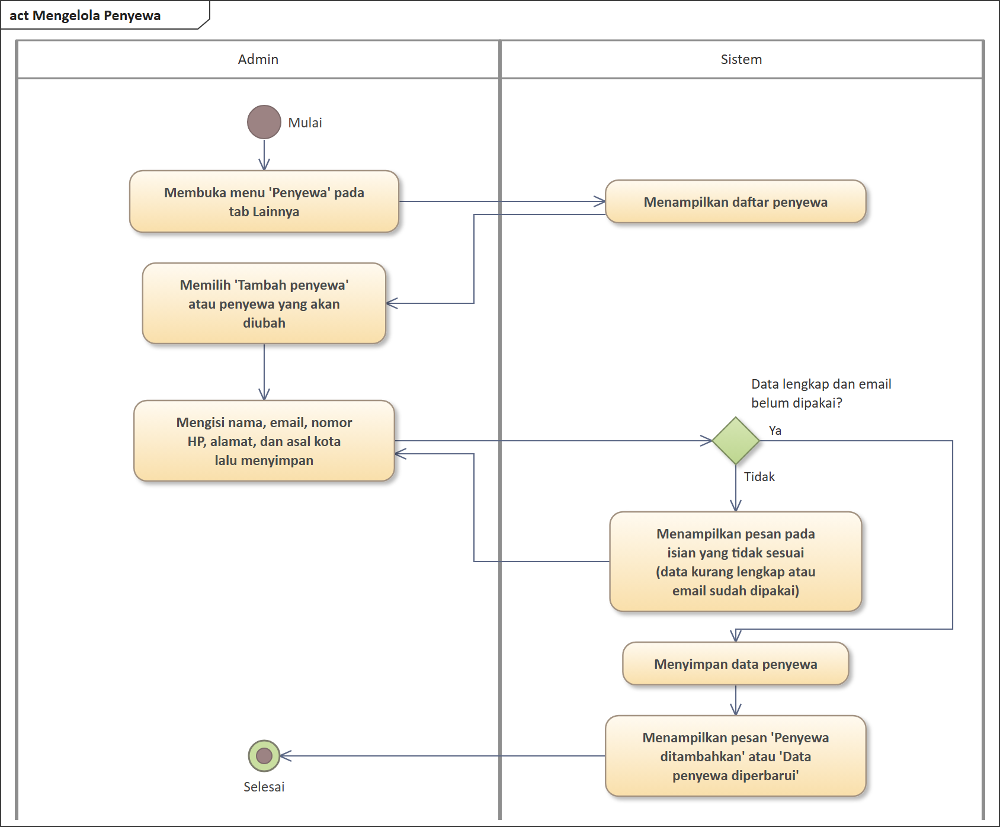

### Diagram (Mermaid)

```mermaid
flowchart TB
    subgraph Sistem["📱 Sistem"]
        S1["Menampilkan daftar penyewa"]
        S2{"Data lengkap dan<br/>email belum<br/>dipakai?"}
        S3["Menampilkan pesan pada isian<br/>yang tidak sesuai (data<br/>kurang lengkap atau email<br/>sudah dipakai)"]
        S4["Menyimpan data penyewa"]
        S5["Menampilkan pesan 'Penyewa<br/>ditambahkan' atau 'Data<br/>penyewa diperbarui'"]
    end

    subgraph Aktor["👤 Admin"]
        A0[/"Mulai"/]
        A1["Membuka menu 'Penyewa' pada<br/>tab Lainnya"]
        A2["Memilih 'Tambah penyewa'<br/>atau penyewa yang akan<br/>diubah"]
        A3["Mengisi nama, email, nomor<br/>HP, alamat, dan asal kota<br/>lalu menyimpan"]
        AE[/"Selesai"/]
    end

    A0 --> A1
    A1 --> S1
    S1 --> A2
    A2 --> A3
    A3 --> S2
    S2 -- Tidak --> S3
    S3 --> A3
    S2 -- Ya --> S4
    S4 --> S5
    S5 --> AE
```

### Diagram (PlantUML)

```plantuml
@startuml
|Admin|
start
:Membuka menu 'Penyewa' pada tab Lainnya;
|Sistem|
:Menampilkan daftar penyewa;
|Admin|
:Memilih 'Tambah penyewa' atau penyewa yang akan diubah;
repeat
  :Mengisi nama, email, nomor HP, alamat, dan asal kota lalu menyimpan;
|Sistem|
repeat while (Data lengkap dan email belum dipakai?) is (Tidak,\nMenampilkan pesan pada isian yang tidak sesuai [data kurang lengkap atau email sudah dipakai]) not (Ya)
:Menyimpan data penyewa;
:Menampilkan pesan 'Penyewa ditambahkan' atau 'Data penyewa diperbarui';
|Admin|
stop
@enduml
```

---

## AD-23 — Melihat Rekap Bulanan (UC23) — 📎 Lampiran

**Aktor.** Admin  
**Tujuan.** Admin melihat rekap pesanan, pendapatan, dan pemakaian armada per bulan.

### Diagram

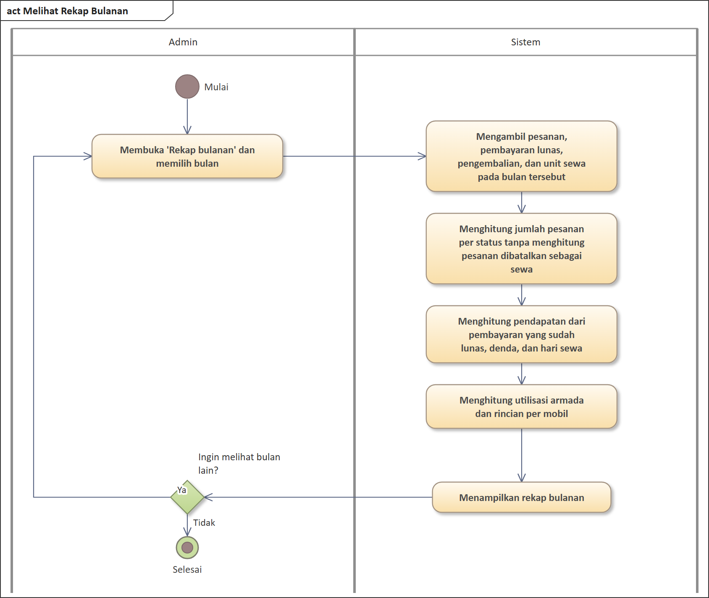

### Diagram (Mermaid)

```mermaid
flowchart TB
    subgraph Sistem["📱 Sistem"]
        S1["Mengambil pesanan,<br/>pembayaran lunas,<br/>pengembalian, dan unit sewa<br/>pada bulan tersebut"]
        S2["Menghitung jumlah pesanan<br/>per status tanpa menghitung<br/>pesanan dibatalkan sebagai<br/>sewa"]
        S3["Menghitung pendapatan dari<br/>pembayaran yang sudah lunas,<br/>denda, dan hari sewa"]
        S4["Menghitung utilisasi armada<br/>dan rincian per mobil"]
        S5["Menampilkan rekap bulanan"]
    end

    subgraph Aktor["👤 Admin"]
        A0[/"Mulai"/]
        A1["Membuka 'Rekap bulanan' dan<br/>memilih bulan"]
        A2{"Ingin melihat<br/>bulan lain?"}
        AE[/"Selesai"/]
    end

    A0 --> A1
    A1 --> S1
    S1 --> S2
    S2 --> S3
    S3 --> S4
    S4 --> S5
    S5 --> A2
    A2 -- Ya --> A1
    A2 -- Tidak --> AE
```

### Diagram (PlantUML)

```plantuml
@startuml
|Admin|
start
repeat
  :Membuka 'Rekap bulanan' dan memilih bulan;
  |Sistem|
  :Mengambil pesanan, pembayaran lunas, pengembalian, dan unit sewa pada bulan tersebut;
  :Menghitung jumlah pesanan per status tanpa menghitung pesanan dibatalkan sebagai sewa;
  :Menghitung pendapatan dari pembayaran yang sudah lunas, denda, dan hari sewa;
  :Menghitung utilisasi armada dan rincian per mobil;
  :Menampilkan rekap bulanan;
|Admin|
repeat while (Ingin melihat bulan lain?) is (Ya) not (Tidak)
stop
@enduml
```

---

# Bagian D — Tugas Sopir

## AD-24 — Mengatur Status Ketersediaan (UC24) — 📎 Lampiran

**Aktor.** Sopir  
**Tujuan.** Sopir menandai dirinya tersedia atau libur untuk menerima atau tidak menerima tawaran tugas.

### Diagram

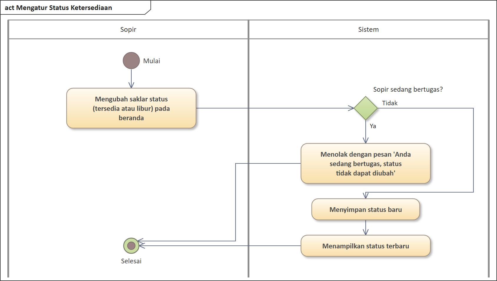

### Diagram (Mermaid)

```mermaid
flowchart TB
    subgraph Sistem["📱 Sistem"]
        S1{"Sopir sedang<br/>bertugas?"}
        S2["Menolak dengan pesan 'Anda<br/>sedang bertugas, status<br/>tidak dapat diubah'"]
        S3["Menyimpan status baru"]
        S4["Menampilkan status terbaru"]
    end

    subgraph Aktor["👤 Sopir"]
        A0[/"Mulai"/]
        A1["Mengubah saklar status<br/>(tersedia atau libur) pada<br/>beranda"]
        AE[/"Selesai"/]
    end

    A0 --> A1
    A1 --> S1
    S1 -- Ya --> S2
    S2 --> AE
    S1 -- Tidak --> S3
    S3 --> S4
    S4 --> AE
```

### Diagram (PlantUML)

```plantuml
@startuml
|Sopir|
start
:Mengubah saklar status [tersedia atau libur] pada beranda;
|Sistem|
if (Sopir sedang bertugas?) then (Ya)
  :Menolak dengan pesan 'Anda sedang bertugas, status tidak dapat diubah';
  |Sopir|
  stop
else (Tidak)
endif
:Menyimpan status baru;
:Menampilkan status terbaru;
|Sopir|
stop
@enduml
```

---

## AD-25 — Melihat Tawaran Tugas (UC25) — 📎 Lampiran

**Aktor.** Sopir  
**Tujuan.** Sopir melihat tawaran tugas yang masih terbuka.

### Diagram

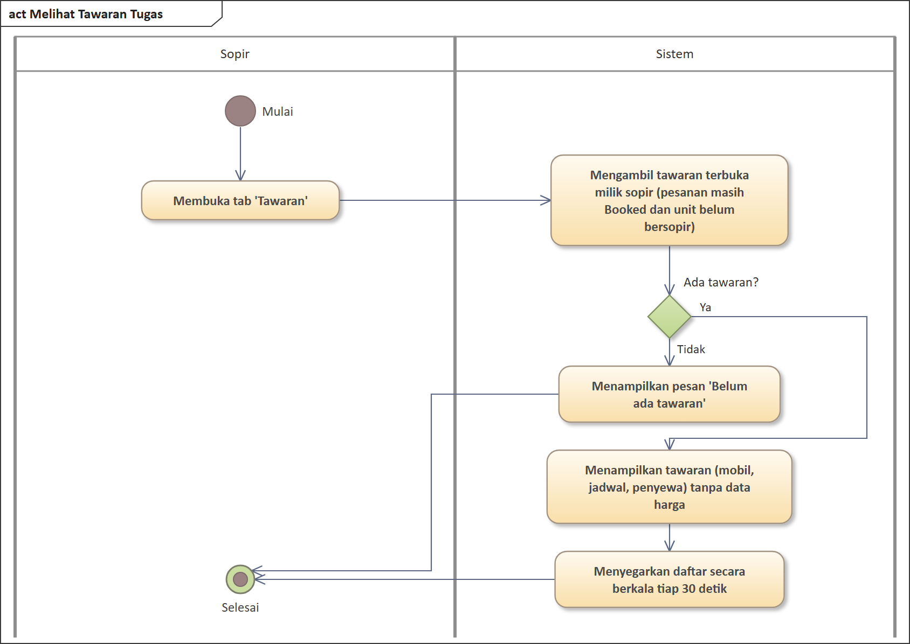

### Diagram (Mermaid)

```mermaid
flowchart TB
    subgraph Sistem["📱 Sistem"]
        S1["Mengambil tawaran terbuka<br/>milik sopir (pesanan masih<br/>Booked dan unit belum<br/>bersopir)"]
        S2{"Ada tawaran?"}
        S3["Menampilkan pesan 'Belum ada<br/>tawaran'"]
        S4["Menampilkan tawaran (mobil,<br/>jadwal, penyewa) tanpa data<br/>harga"]
        S5["Menyegarkan daftar secara<br/>berkala tiap 30 detik"]
    end

    subgraph Aktor["👤 Sopir"]
        A0[/"Mulai"/]
        A1["Membuka tab 'Tawaran'"]
        AE[/"Selesai"/]
    end

    A0 --> A1
    A1 --> S1
    S1 --> S2
    S2 -- Tidak --> S3
    S3 --> AE
    S2 -- Ya --> S4
    S4 --> S5
    S5 --> AE
```

### Diagram (PlantUML)

```plantuml
@startuml
|Sopir|
start
:Membuka tab 'Tawaran';
|Sistem|
:Mengambil tawaran terbuka milik sopir [pesanan masih Booked dan unit belum bersopir];
if (Ada tawaran?) then (Tidak)
  :Menampilkan pesan 'Belum ada tawaran';
  |Sopir|
  stop
else (Ya)
endif
:Menampilkan tawaran [mobil, jadwal, penyewa] tanpa data harga;
:Menyegarkan daftar secara berkala tiap 30 detik;
|Sopir|
stop
@enduml
```

---

## AD-26 — Menerima Tugas (UC26) — 📌 **BAB III**

**Aktor.** Sopir  
**Tujuan.** Sopir menerima tugas yang ditawarkan admin; hanya satu sopir yang dapat memperoleh tugas yang sama.

### Diagram

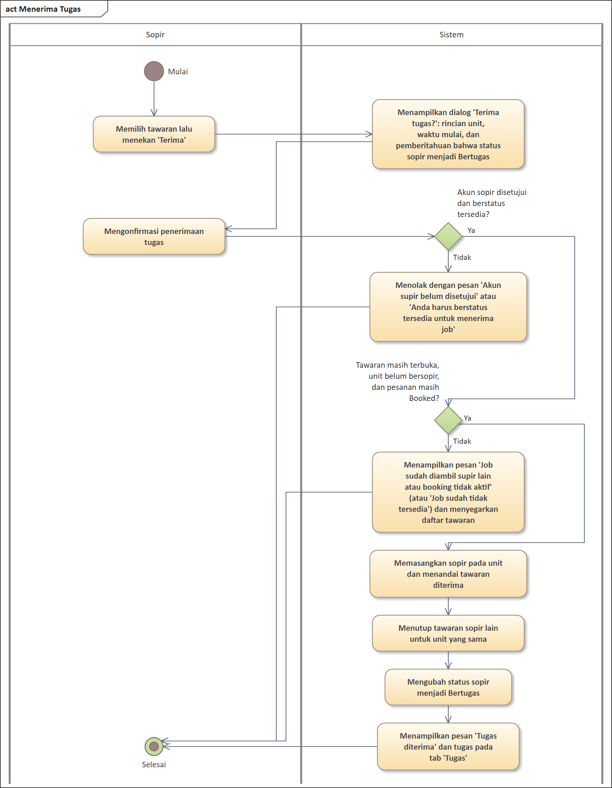

### Diagram (Mermaid)

```mermaid
flowchart TB
    subgraph Sistem["📱 Sistem"]
        S1["Menampilkan dialog 'Terima<br/>tugas?': rincian unit, waktu<br/>mulai, dan pemberitahuan<br/>bahwa status sopir menjadi<br/>Bertugas"]
        S2{"Akun sopir<br/>disetujui dan<br/>berstatus<br/>tersedia?"}
        S3["Menolak dengan pesan 'Akun<br/>supir belum disetujui' atau<br/>'Anda harus berstatus<br/>tersedia untuk menerima job'"]
        S4{"Tawaran masih<br/>terbuka, unit<br/>belum bersopir,<br/>dan pesanan masih<br/>Booked?"}
        S5["Menampilkan pesan 'Job sudah<br/>diambil supir lain atau<br/>booking tidak aktif' (atau<br/>'Job sudah tidak tersedia')<br/>dan menyegarkan daftar<br/>tawaran"]
        S6["Memasangkan sopir pada unit<br/>dan menandai tawaran<br/>diterima"]
        S7["Menutup tawaran sopir lain<br/>untuk unit yang sama"]
        S8["Mengubah status sopir<br/>menjadi Bertugas"]
        S9["Menampilkan pesan 'Tugas<br/>diterima' dan tugas pada tab<br/>'Tugas'"]
    end

    subgraph Aktor["👤 Sopir"]
        A0[/"Mulai"/]
        A1["Memilih tawaran lalu menekan<br/>'Terima'"]
        A2["Mengonfirmasi penerimaan<br/>tugas"]
        AE[/"Selesai"/]
    end

    A0 --> A1
    A1 --> S1
    S1 --> A2
    A2 --> S2
    S2 -- Tidak --> S3
    S3 --> AE
    S2 -- Ya --> S4
    S4 -- Tidak --> S5
    S5 --> AE
    S4 -- Ya --> S6
    S6 --> S7
    S7 --> S8
    S8 --> S9
    S9 --> AE
```

### Diagram (PlantUML)

```plantuml
@startuml
|Sopir|
start
:Memilih tawaran lalu menekan 'Terima';
|Sistem|
:Menampilkan dialog 'Terima tugas?': rincian unit, waktu mulai, dan pemberitahuan bahwa status sopir menjadi Bertugas;
|Sopir|
:Mengonfirmasi penerimaan tugas;
|Sistem|
if (Akun sopir disetujui dan berstatus tersedia?) then (Tidak)
  :Menolak dengan pesan 'Akun supir belum disetujui' atau 'Anda harus berstatus tersedia untuk menerima job';
  |Sopir|
  stop
else (Ya)
endif
if (Tawaran masih terbuka, unit belum bersopir, dan pesanan masih Booked?) then (Tidak)
  :Menampilkan pesan 'Job sudah diambil supir lain atau booking tidak aktif' [atau 'Job sudah tidak tersedia'] dan menyegarkan daftar tawaran;
  |Sopir|
  stop
else (Ya)
endif
:Memasangkan sopir pada unit dan menandai tawaran diterima;
:Menutup tawaran sopir lain untuk unit yang sama;
:Mengubah status sopir menjadi Bertugas;
:Menampilkan pesan 'Tugas diterima' dan tugas pada tab 'Tugas';
|Sopir|
stop
@enduml
```

---

## AD-27 — Menolak Tugas (UC27) — 📎 Lampiran

**Aktor.** Sopir  
**Tujuan.** Sopir menolak tawaran agar admin dapat menawarkannya kepada sopir lain.

### Diagram

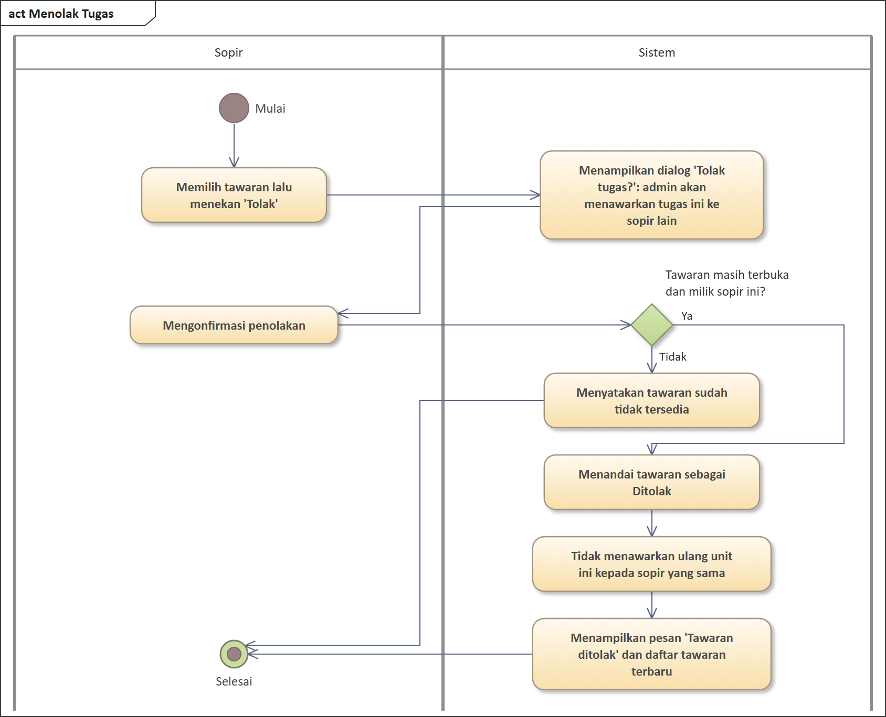

### Diagram (Mermaid)

```mermaid
flowchart TB
    subgraph Sistem["📱 Sistem"]
        S1["Menampilkan dialog 'Tolak<br/>tugas?': admin akan<br/>menawarkan tugas ini ke<br/>sopir lain"]
        S2{"Tawaran masih<br/>terbuka dan milik<br/>sopir ini?"}
        S3["Menyatakan tawaran sudah<br/>tidak tersedia"]
        S4["Menandai tawaran sebagai<br/>Ditolak"]
        S5["Tidak menawarkan ulang unit<br/>ini kepada sopir yang sama"]
        S6["Menampilkan pesan 'Tawaran<br/>ditolak' dan daftar tawaran<br/>terbaru"]
    end

    subgraph Aktor["👤 Sopir"]
        A0[/"Mulai"/]
        A1["Memilih tawaran lalu menekan<br/>'Tolak'"]
        A2["Mengonfirmasi penolakan"]
        AE[/"Selesai"/]
    end

    A0 --> A1
    A1 --> S1
    S1 --> A2
    A2 --> S2
    S2 -- Tidak --> S3
    S3 --> AE
    S2 -- Ya --> S4
    S4 --> S5
    S5 --> S6
    S6 --> AE
```

### Diagram (PlantUML)

```plantuml
@startuml
|Sopir|
start
:Memilih tawaran lalu menekan 'Tolak';
|Sistem|
:Menampilkan dialog 'Tolak tugas?': admin akan menawarkan tugas ini ke sopir lain;
|Sopir|
:Mengonfirmasi penolakan;
|Sistem|
if (Tawaran masih terbuka dan milik sopir ini?) then (Tidak)
  :Menyatakan tawaran sudah tidak tersedia;
  |Sopir|
  stop
else (Ya)
endif
:Menandai tawaran sebagai Ditolak;
:Tidak menawarkan ulang unit ini kepada sopir yang sama;
:Menampilkan pesan 'Tawaran ditolak' dan daftar tawaran terbaru;
|Sopir|
stop
@enduml
```

---

## AD-28 — Melihat Tugas dan Riwayat (UC28) — 📎 Lampiran

**Aktor.** Sopir  
**Tujuan.** Sopir melihat tugas yang sedang berjalan dan tugas yang sudah selesai.

### Diagram

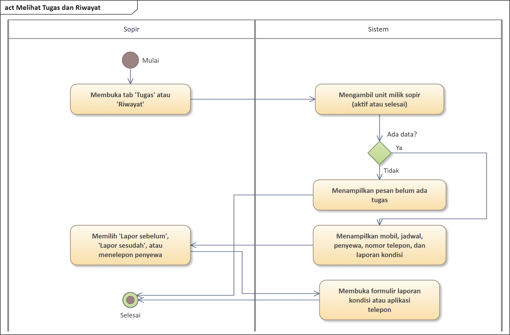

### Diagram (Mermaid)

```mermaid
flowchart TB
    subgraph Sistem["📱 Sistem"]
        S1["Mengambil unit milik sopir<br/>(aktif atau selesai)"]
        S2{"Ada data?"}
        S3["Menampilkan pesan belum ada<br/>tugas"]
        S4["Menampilkan mobil, jadwal,<br/>penyewa, nomor telepon, dan<br/>laporan kondisi"]
        S5["Membuka formulir laporan<br/>kondisi atau aplikasi<br/>telepon"]
    end

    subgraph Aktor["👤 Sopir"]
        A0[/"Mulai"/]
        A1["Membuka tab 'Tugas' atau<br/>'Riwayat'"]
        A2["Memilih 'Lapor sebelum',<br/>'Lapor sesudah', atau<br/>menelepon penyewa"]
        AE[/"Selesai"/]
    end

    A0 --> A1
    A1 --> S1
    S1 --> S2
    S2 -- Tidak --> S3
    S3 --> AE
    S2 -- Ya --> S4
    S4 --> A2
    A2 --> S5
    S5 --> AE
```

### Diagram (PlantUML)

```plantuml
@startuml
|Sopir|
start
:Membuka tab 'Tugas' atau 'Riwayat';
|Sistem|
:Mengambil unit milik sopir [aktif atau selesai];
if (Ada data?) then (Tidak)
  :Menampilkan pesan belum ada tugas;
  |Sopir|
  stop
else (Ya)
endif
:Menampilkan mobil, jadwal, penyewa, nomor telepon, dan laporan kondisi;
|Sopir|
:Memilih 'Lapor sebelum', 'Lapor sesudah', atau menelepon penyewa;
|Sistem|
:Membuka formulir laporan kondisi atau aplikasi telepon;
|Sopir|
stop
@enduml
```

---

## Lampiran — Keterlusuran

| Use case | Activity diagram | Sequence diagram | Bukti pengujian (kelompok kasus) |
|----------|------------------|------------------|----------------------------------|
| UC1 Registrasi Akun | AD-1 | SD-1 | AUT-14, AUT-15 |
| UC2 Login | AD-2 | SD-2 | AUT-01 s/d AUT-13, AUT-21 |
| UC3 Mengelola Profil | AD-3 | SD-3 | AUT-16, AUT-17 |
| UC4 Logout | AD-4 | SD-4 | AUT-18, AUT-19 |
| UC5 Melihat Katalog dan Detail Mobil | AD-5 | SD-5 | — |
| UC6 Mengecek Ketersediaan dan Estimasi Biaya | AD-6 | SD-6 | PSN-01 s/d PSN-05 |
| UC7 Memesan Mobil | AD-7 | SD-7 | PSN-06 s/d PSN-17 |
| UC8 Mengunggah Bukti Pembayaran | AD-8 | SD-8 | BYR-01 s/d BYR-11 |
| UC9 Melihat Pesanan dan Riwayat | AD-9 | SD-9 | HAK-06 |
| UC10 Membatalkan Pesanan | AD-10 | SD-10 | BTL-01 s/d BTL-05 |
| UC11 Melihat Dashboard | AD-11 | SD-11 | ADM-02 |
| UC12 Memantau Pesanan | AD-12 | SD-12 | ADM-01 |
| UC13 Memverifikasi Pembayaran | AD-13 | SD-13 | ADM-03, ADM-05, ADM-09, ADM-10 |
| UC14 Menolak Bukti Pembayaran | AD-14 | SD-14 | ADM-04, ADM-05 |
| UC15 Mencatat Pembayaran Langsung | AD-15 | SD-15 | ADM-06 s/d ADM-08 |
| UC16 Menugaskan Sopir | AD-16 | SD-16 | PGS-01 s/d PGS-03 |
| UC17 Mengonfirmasi Jemput Kendaraan | AD-17 | SD-17 | JMP-01 s/d JMP-04 |
| UC18 Mencatat Pengembalian dan Denda | AD-18 | SD-18 | KMB-01 s/d KMB-10 |
| UC19 Melaporkan Kondisi Kendaraan | AD-19 | SD-19 | KND-01 s/d KND-08 |
| UC20 Mengelola Armada | AD-20 | SD-20 | ARM-01 s/d ARM-06 |
| UC21 Mengelola Sopir | AD-21 | SD-21 | SPA-01 s/d SPA-05 |
| UC22 Mengelola Penyewa | AD-22 | SD-22 | PNY-01 s/d PNY-03 |
| UC23 Melihat Rekap Bulanan | AD-23 | SD-23 | REK-01, REK-02 |
| UC24 Mengatur Status Ketersediaan | AD-24 | SD-24 | PGS-10 |
| UC25 Melihat Tawaran Tugas | AD-25 | SD-25 | PGS-07, HAK-09 |
| UC26 Menerima Tugas | AD-26 | SD-26 | PGS-04, PGS-06, PGS-08, PGS-09 |
| UC27 Menolak Tugas | AD-27 | SD-27 | PGS-05 |
| UC28 Melihat Tugas dan Riwayat | AD-28 | SD-28 | HAK-08, KND-08 |
