# Activity Diagram
# E-Tourism Information System — CV Kopi Danau Atas

> **Version:** 2.3 (5 pasangan AD digabung — AD-2/4/17/18/20 pensiun, terserap ke AD-1/3/16/22/19 — menyusul use case diagram v1.5) · 2.2 (AD-7 & AD-26 dihapus) · 2.1 (Sprint 4: tambah AD-41) · 2.0 (satu diagram per use case + penempatan BAB III/Lampiran) | **Date:** 14 Juli 2026
> **Author:** Fadhil Dzaky Arhab — 2301092010
> **Sumber:** Use Case Diagram (`docs/use-case-diagram.md`) + PRD v2.0 §4 Features
> **Standar penempatan:** mengikuti pola laporan referensi (`docs/Revisi-LAPORAN TA-Nina Widianti.docx`) — **fitur utama** ditampilkan di BAB III, **seluruh sisanya** dilampirkan di bagian Lampiran laporan.

---

## 1. Pendahuluan

Dokumen ini menyajikan **activity diagram untuk setiap use case** (32 diagram, AD-1 s/d AD-41 mengikuti nomor use case; UC2, UC4, UC7, UC17, UC18, UC20, UC23, UC24, UC26 tidak ada — sebagian dihapus, sebagian digabung ke use case lain pada revisi use case v1.4–v1.5). Setiap diagram digambarkan menggunakan **swimlane dua kolom**:

- **Kolom kiri** berisi langkah-langkah yang dilakukan oleh **aktor manusia** (Pengunjung, Wisatawan, atau Admin).
- **Kolom kanan** berisi langkah-langkah yang dilakukan oleh **Sistem**.

Setiap diagram disajikan dalam dua format: **Mermaid** (untuk preview cepat) dan **PlantUML** (untuk konsistensi dokumentasi UML akademis). Bahasa yang digunakan adalah bahasa Indonesia formal tanpa istilah teknis berbasis kode.

**Penomoran.** ID activity diagram **sama dengan nomor use case-nya** (AD-16 = activity untuk UC16) agar keterlusuran 1:1 terjaga.

**Penempatan pada laporan.** Setiap diagram diberi tanda:

- **📌 BAB III** — fitur utama, gambar ditampilkan di badan BAB III.
- **📎 Lampiran** — gambar ditempatkan di bagian Lampiran laporan.

### 1.1 Daftar Activity Diagram

| ID | Nama Alur | Aktor | Penempatan |
|----|-----------|-------|------------|
| **Akses Publik** | | | |
| AD-8 | Lihat Daftar Paket Wisata | Pengunjung | 📎 Lampiran |
| AD-9 | Lihat Detail Paket Wisata | Pengunjung | 📎 Lampiran |
| AD-40 | Cari & Filter Paket Wisata | Pengunjung | 📎 Lampiran |
| AD-10 | Lihat Daftar & Detail Blog | Pengunjung | 📎 Lampiran |
| AD-11 | Cek Kuota Real-time | Pengunjung | 📎 Lampiran |
| AD-12 | Ganti Bahasa (ID/EN) | Pengunjung | 📎 Lampiran |
| AD-13 | Lihat Lokasi Google Maps | Pengunjung | 📎 Lampiran |
| AD-36 | Lihat Review Pengunjung | Pengunjung | 📎 Lampiran |
| AD-41 | Lihat Halaman Tentang Kami | Pengunjung | 📎 Lampiran |
| **Autentikasi** | | | |
| AD-1 | Registrasi Akun & Verifikasi Email | Pengunjung | 📎 Lampiran |
| AD-3 | Login Email/Password & Login via Google OAuth | Pengunjung | 📎 Lampiran |
| AD-5 | Lupa & Reset Password | Pengunjung | 📎 Lampiran |
| AD-6 | Logout | Wisatawan/Admin | 📎 Lampiran |
| **Booking & Pembayaran** | | | |
| AD-16 | Membuat Booking Paket Wisata (termasuk Review Order) | Wisatawan | 📌 **BAB III** |
| AD-22 | Pembayaran via Midtrans Snap & Cek Status Pembayaran | Wisatawan | 📌 **BAB III** |
| AD-21 | Lihat Riwayat Booking | Wisatawan | 📎 Lampiran |
| AD-19 | Lihat E-Ticket & Unduh Invoice PDF | Wisatawan | 📎 Lampiran |
| AD-38 | Batalkan Booking | Wisatawan | 📎 Lampiran |
| **Interaksi Wisatawan** | | | |
| AD-14 | Menulis Review | Wisatawan | 📌 **BAB III** |
| AD-15 | Mengelola Profil (Kelola Akun Sendiri) | Wisatawan | 📎 Lampiran |
| **Manajemen (Admin Panel)** | | | |
| AD-25 | Login Admin | Admin | 📎 Lampiran |
| AD-27 | Mengelola Paket Wisata & Kategori | Admin | 📌 **BAB III** |
| AD-28 | Validasi & Mengubah Status Booking | Admin | 📎 Lampiran |
| AD-29 | Pantau Pembayaran | Admin | 📎 Lampiran |
| AD-30 | Mengelola Blog & Kategori | Admin | 📎 Lampiran |
| AD-31 | Inspeksi & Hapus Review (Moderasi) | Admin | 📎 Lampiran |
| AD-32 | Mengelola Konten Homepage | Admin | 📎 Lampiran |
| AD-33 | Mengelola Coffee Varieties | Admin | 📎 Lampiran |
| AD-34 | Mengelola Pengguna | Admin | 📎 Lampiran |
| AD-35 | Mengelola Site Settings | Admin | 📎 Lampiran |
| AD-37 | Check-in Tiket di Lokasi | Admin | 📌 **BAB III** |
| AD-39 | Refund Pembayaran | Admin | 📎 Lampiran |

> **Fitur utama (BAB III) = 5 diagram:** AD-16, AD-22, AD-27, AD-37, AD-14 — konsisten dengan pemilihan sequence diagram fitur utama di `docs/sequence-diagrams-laporan.md`.

### 1.2 Notasi Diagram

| Notasi | Arti |
|--------|------|
| ⬤ (lingkaran solid) | Titik mulai (start) |
| ⊚ (lingkaran ber-bingkai) | Titik akhir (end) |
| ▭ (persegi panjang membulat) | Aktivitas / langkah |
| ◇ (belah ketupat) | Cabang keputusan |
| ─── | Aliran kontrol |
| Kolom vertikal | Swimlane (pemilik aktivitas) |

---

# Bagian A — Akses Publik

## AD-8 — Lihat Daftar Paket Wisata (UC8) — 📎 Lampiran

**Tujuan.** Pengunjung melihat daftar paket wisata yang tersedia.

### Diagram (Mermaid)

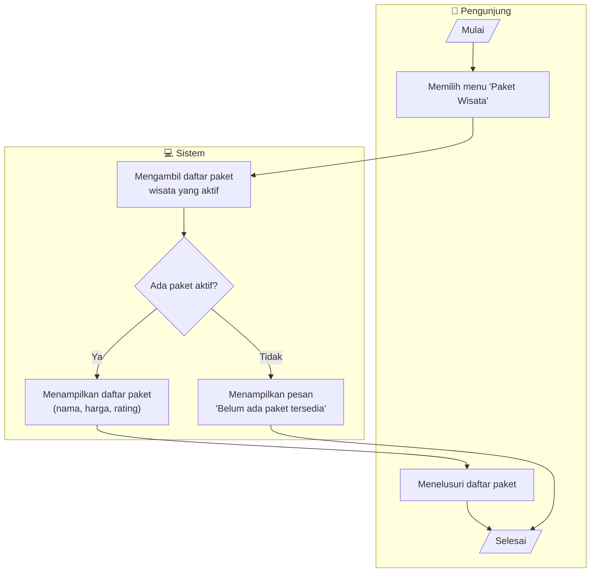
```mermaid
flowchart TB
    subgraph Pengunjung["👤 Pengunjung"]
        P1[/"Mulai"/]
        P2["Memilih menu 'Paket Wisata'"]
        P3["Menelusuri daftar paket"]
        P4[/"Selesai"/]
    end

    subgraph Sistem["💻 Sistem"]
        S1["Mengambil daftar paket<br/>wisata yang aktif"]
        S2{"Ada paket aktif?"}
        S3["Menampilkan daftar paket<br/>(nama, harga, rating)"]
        S4["Menampilkan pesan<br/>'Belum ada paket tersedia'"]
    end

    P1 --> P2 --> S1 --> S2
    S2 -- Ya --> S3 --> P3 --> P4
    S2 -- Tidak --> S4 --> P4
```

### Diagram (PlantUML)

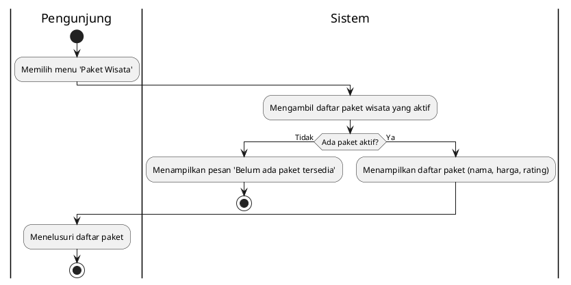
```plantuml
@startuml
|Pengunjung|
start
:Memilih menu 'Paket Wisata';
|Sistem|
:Mengambil daftar paket wisata yang aktif;
if (Ada paket aktif?) then (Tidak)
  :Menampilkan pesan 'Belum ada paket tersedia';
  stop
else (Ya)
  :Menampilkan daftar paket (nama, harga, rating);
endif
|Pengunjung|
:Menelusuri daftar paket;
stop
@enduml
```

---

## AD-9 — Lihat Detail Paket Wisata (UC9) — 📎 Lampiran

**Tujuan.** Pengunjung membuka satu paket wisata untuk melihat deskripsi, fasilitas, galeri foto, ulasan, dan sisa kuota.

### Diagram (Mermaid)

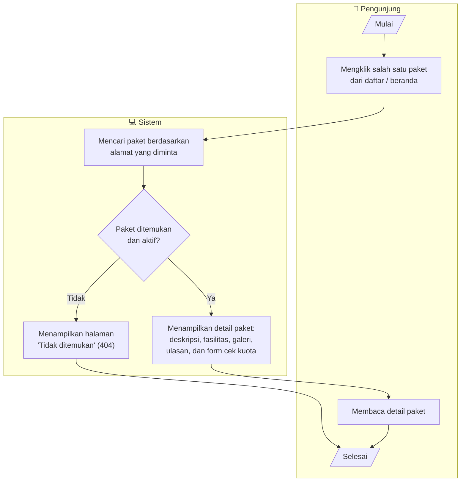
```mermaid
flowchart TB
    subgraph Pengunjung["👤 Pengunjung"]
        P1[/"Mulai"/]
        P2["Mengklik salah satu paket<br/>dari daftar / beranda"]
        P3["Membaca detail paket"]
        P4[/"Selesai"/]
    end

    subgraph Sistem["💻 Sistem"]
        S1["Mencari paket berdasarkan<br/>alamat yang diminta"]
        S2{"Paket ditemukan<br/>dan aktif?"}
        S3["Menampilkan halaman<br/>'Tidak ditemukan' (404)"]
        S4["Menampilkan detail paket:<br/>deskripsi, fasilitas, galeri,<br/>ulasan, dan form cek kuota"]
    end

    P1 --> P2 --> S1 --> S2
    S2 -- Tidak --> S3 --> P4
    S2 -- Ya --> S4 --> P3 --> P4
```

### Diagram (PlantUML)

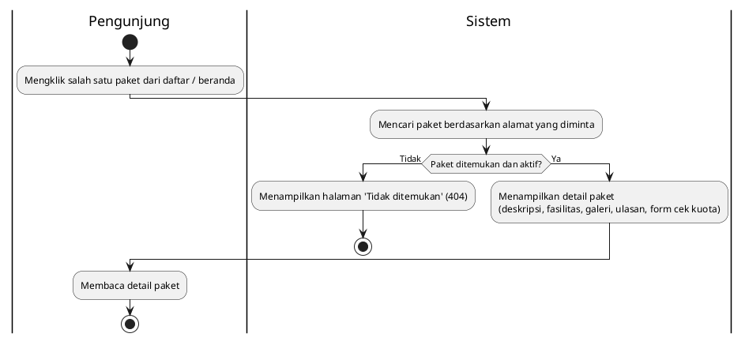
```plantuml
@startuml
|Pengunjung|
start
:Mengklik salah satu paket dari daftar / beranda;
|Sistem|
:Mencari paket berdasarkan alamat yang diminta;
if (Paket ditemukan dan aktif?) then (Tidak)
  :Menampilkan halaman 'Tidak ditemukan' (404);
  stop
else (Ya)
  :Menampilkan detail paket
  (deskripsi, fasilitas, galeri, ulasan, form cek kuota);
endif
|Pengunjung|
:Membaca detail paket;
stop
@enduml
```

---

## AD-40 — Cari & Filter Paket Wisata (UC40) — 📎 Lampiran

**Tujuan.** Pengunjung mencari paket dengan kata kunci dan menyaring berdasarkan kategori, rentang harga, atau urutan.

### Diagram (Mermaid)

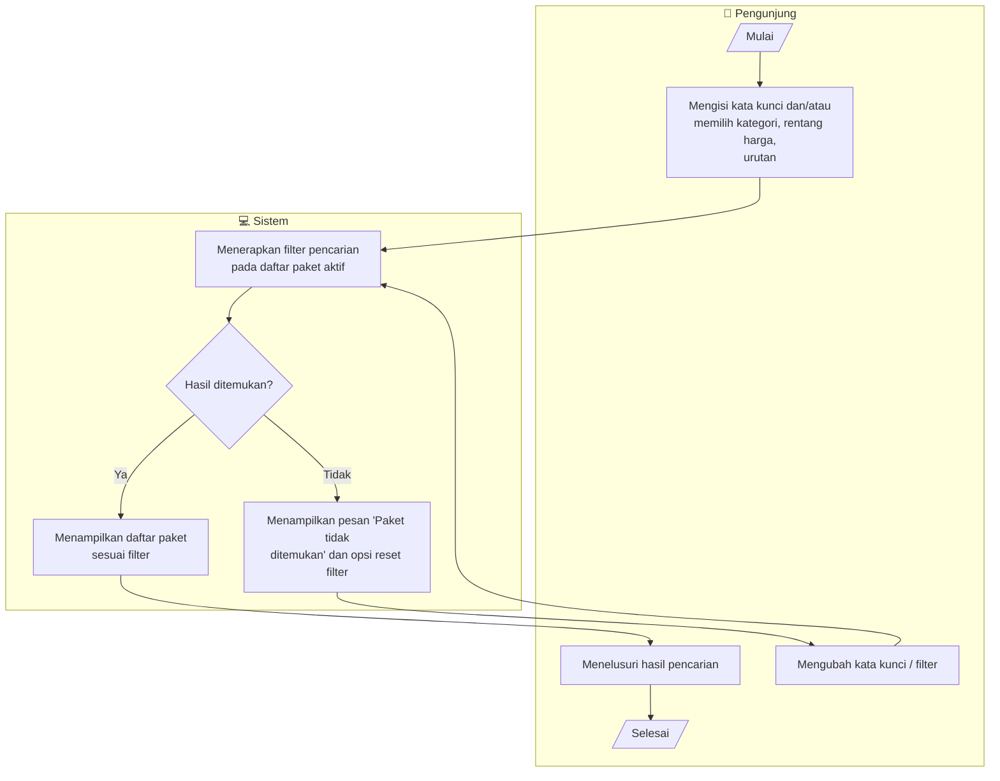
```mermaid
flowchart TB
    subgraph Pengunjung["👤 Pengunjung"]
        P1[/"Mulai"/]
        P2["Mengisi kata kunci dan/atau<br/>memilih kategori, rentang harga,<br/>urutan"]
        P3["Menelusuri hasil pencarian"]
        P4["Mengubah kata kunci / filter"]
        P5[/"Selesai"/]
    end

    subgraph Sistem["💻 Sistem"]
        S1["Menerapkan filter pencarian<br/>pada daftar paket aktif"]
        S2{"Hasil ditemukan?"}
        S3["Menampilkan daftar paket<br/>sesuai filter"]
        S4["Menampilkan pesan 'Paket tidak<br/>ditemukan' dan opsi reset filter"]
    end

    P1 --> P2 --> S1 --> S2
    S2 -- Ya --> S3 --> P3 --> P5
    S2 -- Tidak --> S4 --> P4 --> S1
```

### Diagram (PlantUML)

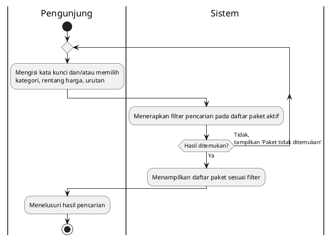
```plantuml
@startuml
|Pengunjung|
start
repeat
  :Mengisi kata kunci dan/atau memilih
  kategori, rentang harga, urutan;
  |Sistem|
  :Menerapkan filter pencarian pada daftar paket aktif;
repeat while (Hasil ditemukan?) is (Tidak,\ntampilkan 'Paket tidak ditemukan') not (Ya)
:Menampilkan daftar paket sesuai filter;
|Pengunjung|
:Menelusuri hasil pencarian;
stop
@enduml
```

---

## AD-10 — Lihat Daftar & Detail Blog (UC10) — 📎 Lampiran

**Tujuan.** Pengunjung membaca artikel blog yang diterbitkan.

### Diagram (Mermaid)

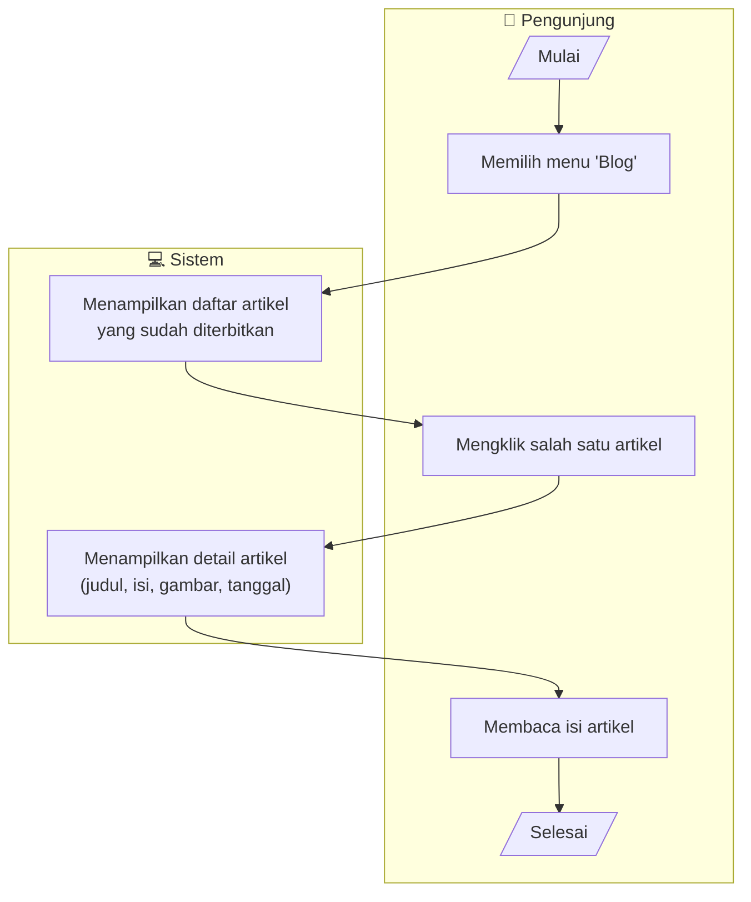
```mermaid
flowchart TB
    subgraph Pengunjung["👤 Pengunjung"]
        P1[/"Mulai"/]
        P2["Memilih menu 'Blog'"]
        P3["Mengklik salah satu artikel"]
        P4["Membaca isi artikel"]
        P5[/"Selesai"/]
    end

    subgraph Sistem["💻 Sistem"]
        S1["Menampilkan daftar artikel<br/>yang sudah diterbitkan"]
        S2["Menampilkan detail artikel<br/>(judul, isi, gambar, tanggal)"]
    end

    P1 --> P2 --> S1 --> P3 --> S2 --> P4 --> P5
```

### Diagram (PlantUML)

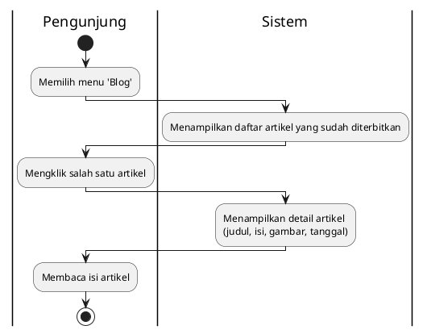
```plantuml
@startuml
|Pengunjung|
start
:Memilih menu 'Blog';
|Sistem|
:Menampilkan daftar artikel yang sudah diterbitkan;
|Pengunjung|
:Mengklik salah satu artikel;
|Sistem|
:Menampilkan detail artikel
(judul, isi, gambar, tanggal);
|Pengunjung|
:Membaca isi artikel;
stop
@enduml
```

---

## AD-11 — Cek Kuota Real-time (UC11) — 📎 Lampiran

**Tujuan.** Pengunjung/Wisatawan memilih tanggal kunjungan dan sistem langsung menampilkan sisa kuota pada tanggal tersebut.

### Diagram (Mermaid)

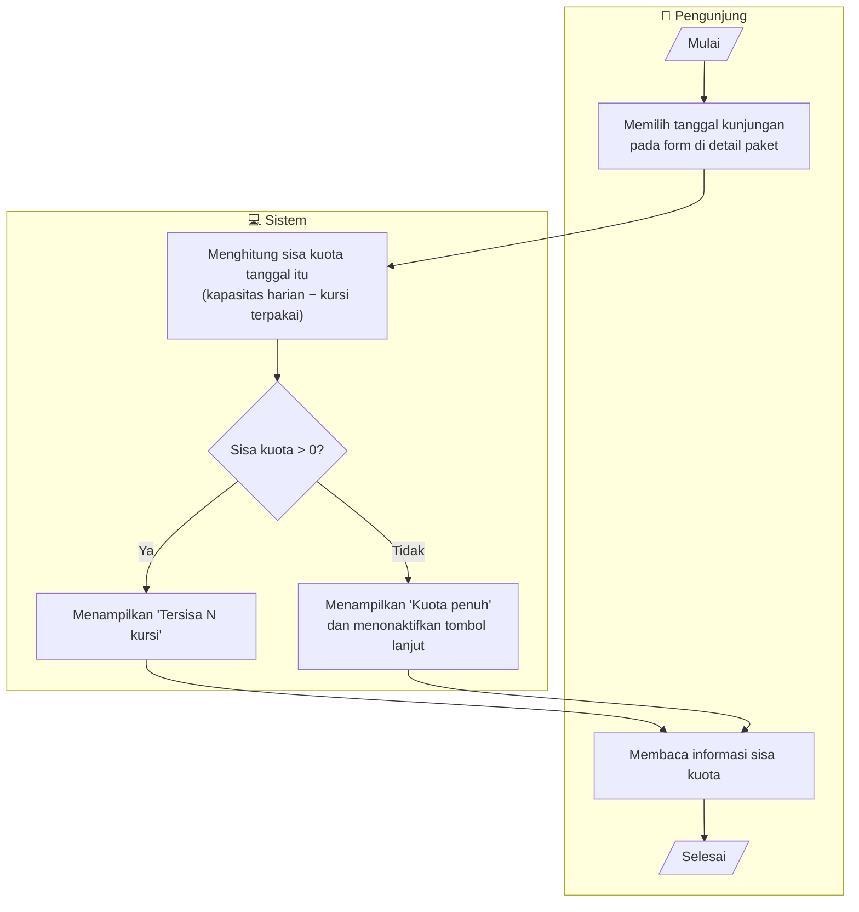
```mermaid
flowchart TB
    subgraph Pengunjung["👤 Pengunjung"]
        P1[/"Mulai"/]
        P2["Memilih tanggal kunjungan<br/>pada form di detail paket"]
        P3["Membaca informasi sisa kuota"]
        P4[/"Selesai"/]
    end

    subgraph Sistem["💻 Sistem"]
        S1["Menghitung sisa kuota tanggal itu<br/>(kapasitas harian − kursi terpakai)"]
        S2{"Sisa kuota > 0?"}
        S3["Menampilkan 'Tersisa N kursi'"]
        S4["Menampilkan 'Kuota penuh'<br/>dan menonaktifkan tombol lanjut"]
    end

    P1 --> P2 --> S1 --> S2
    S2 -- Ya --> S3 --> P3 --> P4
    S2 -- Tidak --> S4 --> P3
```

### Diagram (PlantUML)

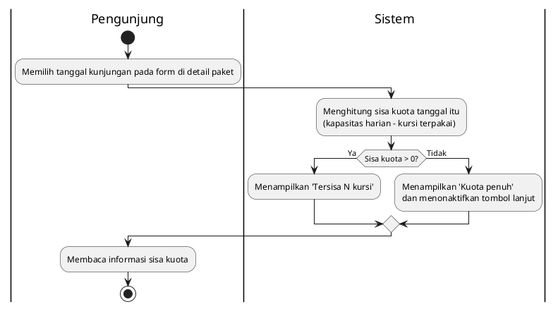
```plantuml
@startuml
|Pengunjung|
start
:Memilih tanggal kunjungan pada form di detail paket;
|Sistem|
:Menghitung sisa kuota tanggal itu
(kapasitas harian - kursi terpakai);
if (Sisa kuota > 0?) then (Ya)
  :Menampilkan 'Tersisa N kursi';
else (Tidak)
  :Menampilkan 'Kuota penuh'
  dan menonaktifkan tombol lanjut;
endif
|Pengunjung|
:Membaca informasi sisa kuota;
stop
@enduml
```

> **Catatan.** Alur ini adalah bagian `<<include>>` dari AD-16 (Membuat Booking); digambarkan terpisah agar setiap use case memiliki diagramnya sendiri.

---

## AD-12 — Ganti Bahasa ID/EN (UC12) — 📎 Lampiran

**Tujuan.** Pengunjung mengganti bahasa antarmuka situs antara Indonesia dan Inggris.

### Diagram (Mermaid)

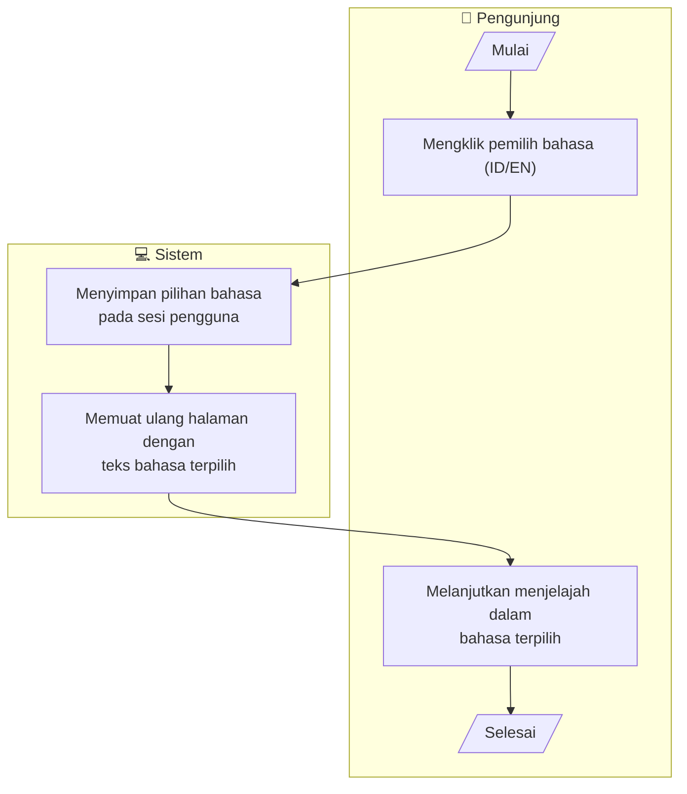
```mermaid
flowchart TB
    subgraph Pengunjung["👤 Pengunjung"]
        P1[/"Mulai"/]
        P2["Mengklik pemilih bahasa (ID/EN)"]
        P3["Melanjutkan menjelajah dalam<br/>bahasa terpilih"]
        P4[/"Selesai"/]
    end

    subgraph Sistem["💻 Sistem"]
        S1["Menyimpan pilihan bahasa<br/>pada sesi pengguna"]
        S2["Memuat ulang halaman dengan<br/>teks bahasa terpilih"]
    end

    P1 --> P2 --> S1 --> S2 --> P3 --> P4
```

### Diagram (PlantUML)

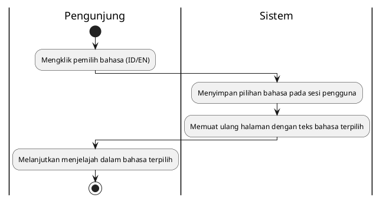
```plantuml
@startuml
|Pengunjung|
start
:Mengklik pemilih bahasa (ID/EN);
|Sistem|
:Menyimpan pilihan bahasa pada sesi pengguna;
:Memuat ulang halaman dengan teks bahasa terpilih;
|Pengunjung|
:Melanjutkan menjelajah dalam bahasa terpilih;
stop
@enduml
```

---

## AD-41 — Lihat Halaman Tentang Kami (UC41) — 📎 Lampiran

**Tujuan.** Pengunjung membuka halaman Tentang Kami untuk membaca profil perusahaan dan menjelajahi varietas kopi yang dibudidayakan.

### Diagram (Mermaid)

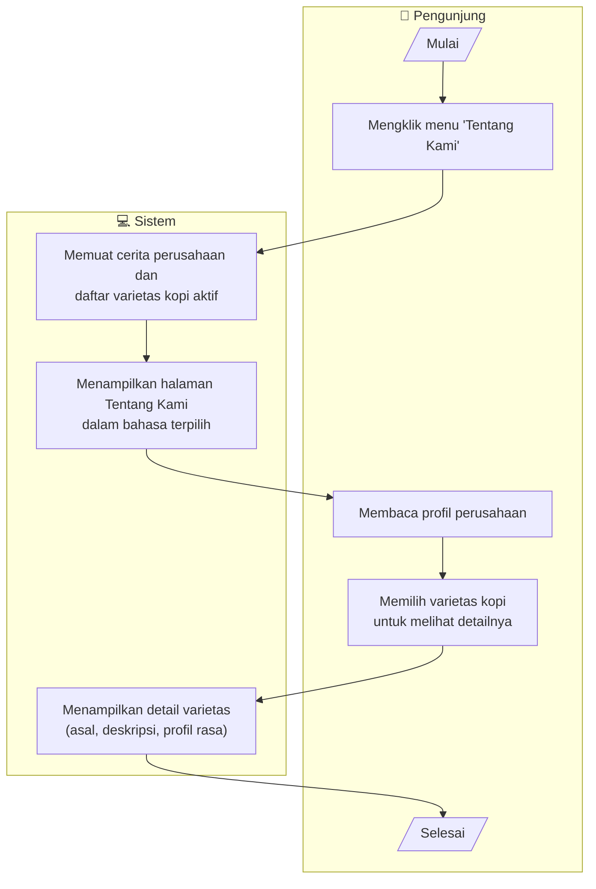
```mermaid
flowchart TB
    subgraph Pengunjung["👤 Pengunjung"]
        P1[/"Mulai"/]
        P2["Mengklik menu 'Tentang Kami'"]
        P3["Membaca profil perusahaan"]
        P4["Memilih varietas kopi<br/>untuk melihat detailnya"]
        P5[/"Selesai"/]
    end

    subgraph Sistem["💻 Sistem"]
        S1["Memuat cerita perusahaan dan<br/>daftar varietas kopi aktif"]
        S2["Menampilkan halaman Tentang Kami<br/>dalam bahasa terpilih"]
        S3["Menampilkan detail varietas<br/>(asal, deskripsi, profil rasa)"]
    end

    P1 --> P2 --> S1 --> S2 --> P3 --> P4 --> S3 --> P5
```

### Diagram (PlantUML)

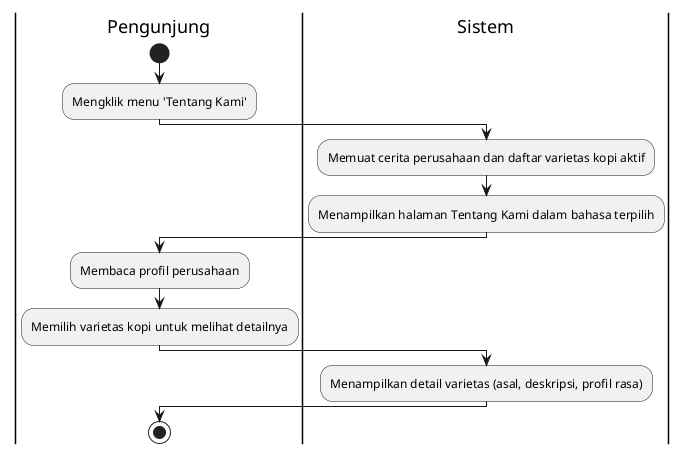
```plantuml
@startuml
|Pengunjung|
start
:Mengklik menu 'Tentang Kami';
|Sistem|
:Memuat cerita perusahaan dan daftar varietas kopi aktif;
:Menampilkan halaman Tentang Kami dalam bahasa terpilih;
|Pengunjung|
:Membaca profil perusahaan;
:Memilih varietas kopi untuk melihat detailnya;
|Sistem|
:Menampilkan detail varietas (asal, deskripsi, profil rasa);
|Pengunjung|
stop
@enduml
```

---

## AD-13 — Lihat Lokasi Google Maps (UC13) — 📎 Lampiran

**Tujuan.** Pengunjung melihat lokasi CV Kopi Danau Atas pada peta yang tersemat di beranda.

### Diagram (Mermaid)

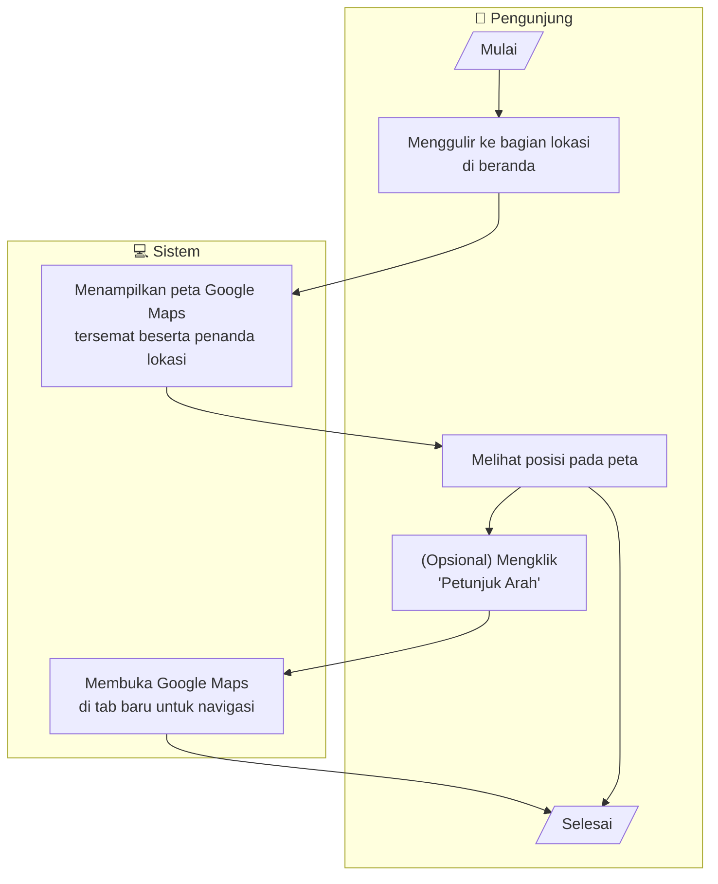
```mermaid
flowchart TB
    subgraph Pengunjung["👤 Pengunjung"]
        P1[/"Mulai"/]
        P2["Menggulir ke bagian lokasi<br/>di beranda"]
        P3["Melihat posisi pada peta"]
        P4["(Opsional) Mengklik<br/>'Petunjuk Arah'"]
        P5[/"Selesai"/]
    end

    subgraph Sistem["💻 Sistem"]
        S1["Menampilkan peta Google Maps<br/>tersemat beserta penanda lokasi"]
        S2["Membuka Google Maps<br/>di tab baru untuk navigasi"]
    end

    P1 --> P2 --> S1 --> P3 --> P4 --> S2 --> P5
    P3 --> P5
```

### Diagram (PlantUML)

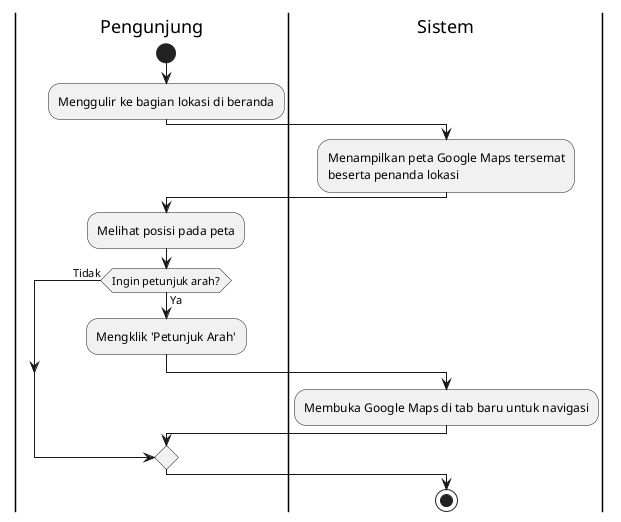
```plantuml
@startuml
|Pengunjung|
start
:Menggulir ke bagian lokasi di beranda;
|Sistem|
:Menampilkan peta Google Maps tersemat
beserta penanda lokasi;
|Pengunjung|
:Melihat posisi pada peta;
if (Ingin petunjuk arah?) then (Ya)
  :Mengklik 'Petunjuk Arah';
  |Sistem|
  :Membuka Google Maps di tab baru untuk navigasi;
else (Tidak)
endif
stop
@enduml
```

---

## AD-36 — Lihat Review Pengunjung (UC36) — 📎 Lampiran

**Tujuan.** Pengunjung membaca ulasan wisatawan yang tampil di beranda (testimoni) dan halaman detail paket.

### Diagram (Mermaid)

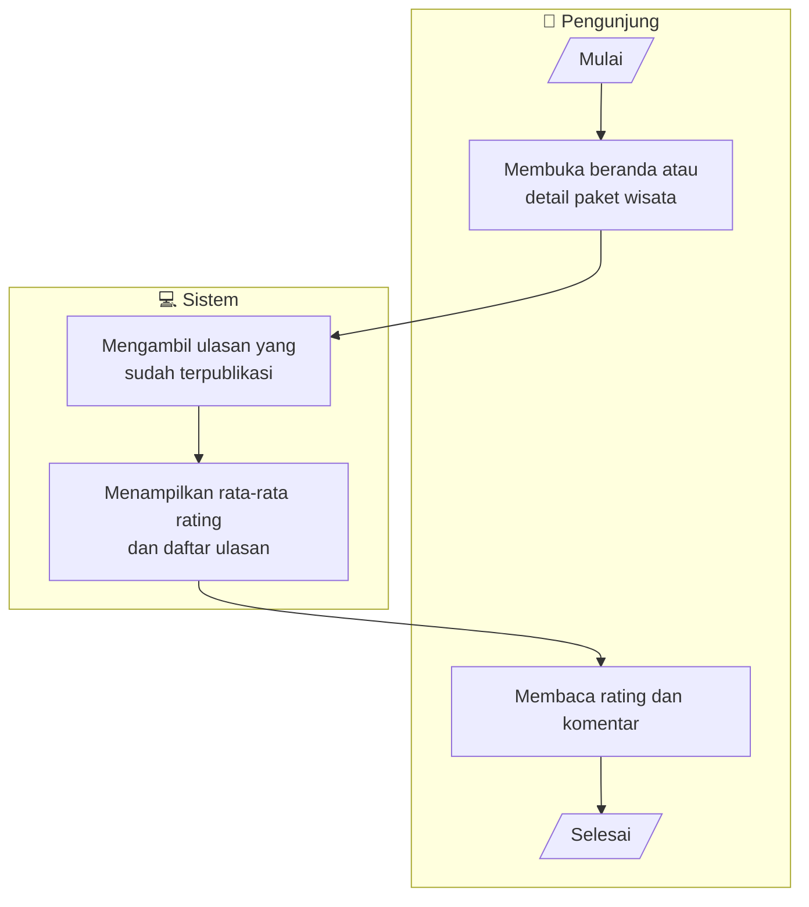
```mermaid
flowchart TB
    subgraph Pengunjung["👤 Pengunjung"]
        P1[/"Mulai"/]
        P2["Membuka beranda atau<br/>detail paket wisata"]
        P3["Membaca rating dan komentar"]
        P4[/"Selesai"/]
    end

    subgraph Sistem["💻 Sistem"]
        S1["Mengambil ulasan yang<br/>sudah terpublikasi"]
        S2["Menampilkan rata-rata rating<br/>dan daftar ulasan"]
    end

    P1 --> P2 --> S1 --> S2 --> P3 --> P4
```

### Diagram (PlantUML)

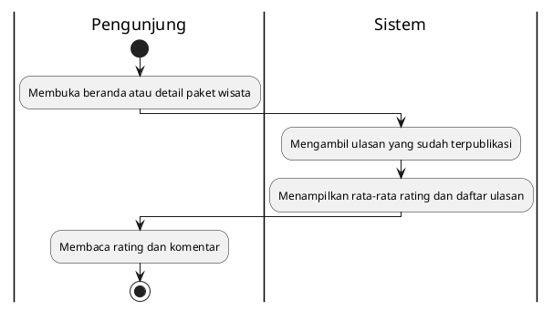
```plantuml
@startuml
|Pengunjung|
start
:Membuka beranda atau detail paket wisata;
|Sistem|
:Mengambil ulasan yang sudah terpublikasi;
:Menampilkan rata-rata rating dan daftar ulasan;
|Pengunjung|
:Membaca rating dan komentar;
stop
@enduml
```

---

# Bagian B — Autentikasi

## AD-1 — Registrasi Akun & Verifikasi Email (UC1) — 📎 Lampiran

**Tujuan.** Pengunjung membuat akun baru menggunakan alamat email dan kata sandi, lalu memverifikasi alamat email tersebut melalui tautan yang dikirim sistem agar dapat melakukan booking.

**Pre-condition.** Pengunjung belum memiliki akun.
**Post-condition.** Akun tersimpan dan email tertandai terverifikasi; pengguna dapat melakukan booking.

### Diagram (Mermaid)

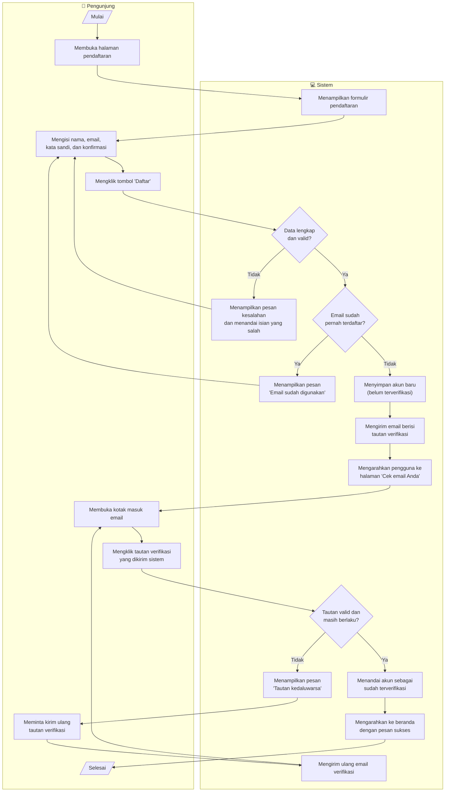
```mermaid
flowchart TB
    subgraph Pengunjung["👤 Pengunjung"]
        P1[/"Mulai"/]
        P2["Membuka halaman pendaftaran"]
        P3["Mengisi nama, email,<br/>kata sandi, dan konfirmasi"]
        P4["Mengklik tombol 'Daftar'"]
        P5["Membuka kotak masuk email"]
        P6["Mengklik tautan verifikasi<br/>yang dikirim sistem"]
        P7["Meminta kirim ulang<br/>tautan verifikasi"]
        P8[/"Selesai"/]
    end

    subgraph Sistem["💻 Sistem"]
        S1["Menampilkan formulir pendaftaran"]
        S2{"Data lengkap<br/>dan valid?"}
        S3["Menampilkan pesan kesalahan<br/>dan menandai isian yang salah"]
        S4{"Email sudah<br/>pernah terdaftar?"}
        S5["Menampilkan pesan<br/>'Email sudah digunakan'"]
        S6["Menyimpan akun baru<br/>(belum terverifikasi)"]
        S7["Mengirim email berisi<br/>tautan verifikasi"]
        S8["Mengarahkan pengguna ke<br/>halaman 'Cek email Anda'"]
        S9{"Tautan valid dan<br/>masih berlaku?"}
        S10["Menampilkan pesan<br/>'Tautan kedaluwarsa'"]
        S11["Mengirim ulang email verifikasi"]
        S12["Menandai akun sebagai<br/>sudah terverifikasi"]
        S13["Mengarahkan ke beranda<br/>dengan pesan sukses"]
    end

    P1 --> P2 --> S1 --> P3 --> P4 --> S2
    S2 -- Tidak --> S3 --> P3
    S2 -- Ya --> S4
    S4 -- Ya --> S5 --> P3
    S4 -- Tidak --> S6 --> S7 --> S8 --> P5 --> P6 --> S9
    S9 -- Tidak --> S10 --> P7 --> S11 --> P5
    S9 -- Ya --> S12 --> S13 --> P8
```

### Diagram (PlantUML)

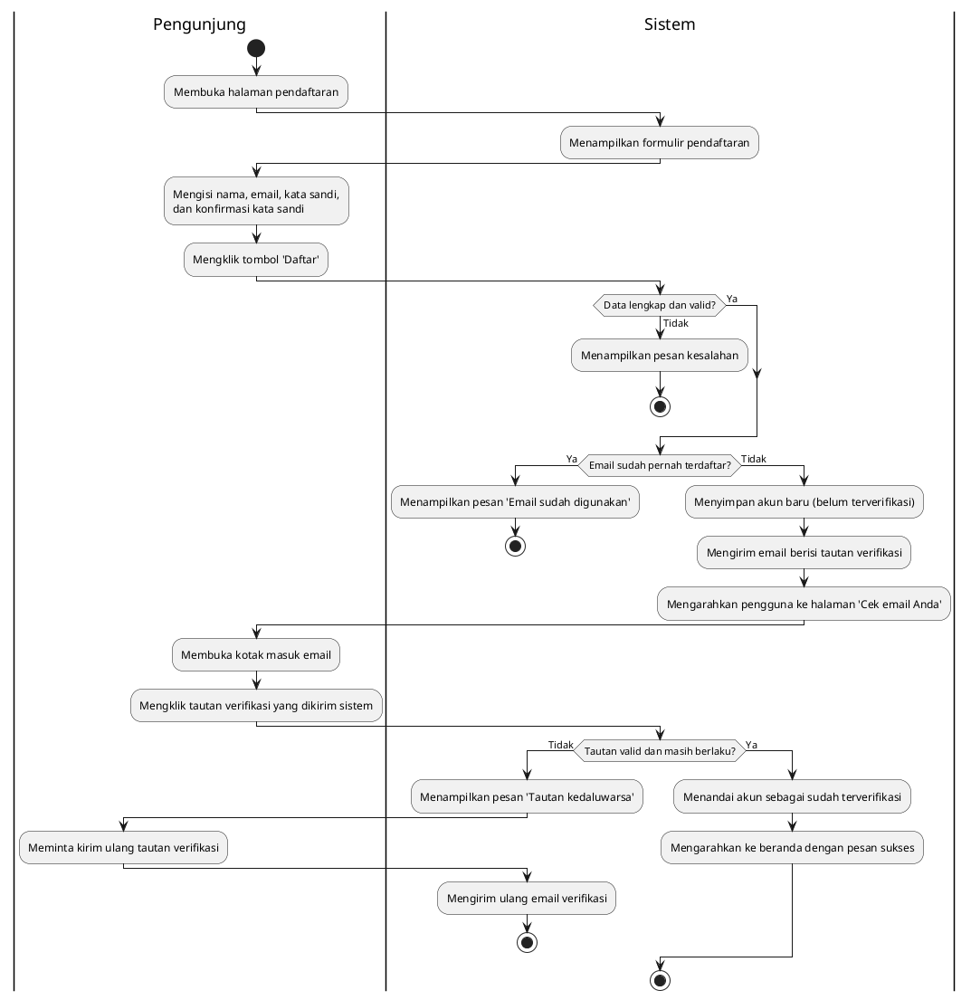
```plantuml
@startuml
|Pengunjung|
start
:Membuka halaman pendaftaran;
|Sistem|
:Menampilkan formulir pendaftaran;
|Pengunjung|
:Mengisi nama, email, kata sandi,
dan konfirmasi kata sandi;
:Mengklik tombol 'Daftar';
|Sistem|
if (Data lengkap dan valid?) then (Tidak)
  :Menampilkan pesan kesalahan;
  stop
else (Ya)
endif
if (Email sudah pernah terdaftar?) then (Ya)
  :Menampilkan pesan 'Email sudah digunakan';
  stop
else (Tidak)
  :Menyimpan akun baru (belum terverifikasi);
  :Mengirim email berisi tautan verifikasi;
  :Mengarahkan pengguna ke halaman 'Cek email Anda';
endif
|Pengunjung|
:Membuka kotak masuk email;
:Mengklik tautan verifikasi yang dikirim sistem;
|Sistem|
if (Tautan valid dan masih berlaku?) then (Tidak)
  :Menampilkan pesan 'Tautan kedaluwarsa';
  |Pengunjung|
  :Meminta kirim ulang tautan verifikasi;
  |Sistem|
  :Mengirim ulang email verifikasi;
  stop
else (Ya)
  :Menandai akun sebagai sudah terverifikasi;
  :Mengarahkan ke beranda dengan pesan sukses;
endif
stop
@enduml
```

> **Catatan.** Sejak v1.5, langkah verifikasi email (dulu UC2/AD-2 terpisah, relasi `<<include>>` UC1→UC2) digambar menyatu di sini sebagai kelanjutan swimlane — pengguna meninggalkan sistem sejenak untuk membuka email lalu kembali lewat tautan. Akun yang dibuat via Google (AD-3, cabang OAuth) otomatis terverifikasi sehingga melewati seluruh alur ini.

---

## AD-3 — Login Email/Password & Login via Google OAuth (UC3) — 📎 Lampiran

**Tujuan.** Pengunjung masuk ke sistem, baik menggunakan email dan kata sandi yang sudah terdaftar, maupun lewat akun Google (sistem menautkan ke akun lama atau membuat akun baru otomatis-terverifikasi).

**Pre-condition.** Pengunjung sudah memiliki akun (email/password) atau akun Google aktif.
**Post-condition.** Pengguna masuk sebagai Wisatawan.

### Diagram (Mermaid)

```mermaid
flowchart TB
    subgraph Pengunjung["👤 Pengunjung"]
        P1[/"Mulai"/]
        P2["Membuka halaman masuk"]
        P3{"Pilih metode masuk"}
        P4["Mengisi email dan kata sandi"]
        P5["Mengklik tombol 'Masuk'"]
        P6["Mengklik tombol<br/>'Masuk dengan Google'"]
        P7["Memilih akun Google<br/>dan menyetujui akses"]
        P8[/"Selesai"/]
    end

    subgraph Sistem["💻 Sistem"]
        S1["Menampilkan halaman masuk<br/>dengan pilihan metode"]
        S2{"Email dan kata sandi<br/>cocok?"}
        S3["Menampilkan pesan<br/>'Email atau kata sandi salah'"]
        S4{"Email sudah<br/>terverifikasi?"}
        S5["Mengarahkan ke halaman<br/>'Verifikasi Email'"]
        S6["Mengarahkan pengguna ke Google"]
        S7{"Email sudah<br/>terdaftar di sistem?"}
        S8["Menghubungkan akun Google<br/>ke akun yang sudah ada"]
        S9["Membuat akun baru<br/>(otomatis terverifikasi)"]
        S10["Membuat sesi login pengguna"]
        S11["Mengarahkan ke beranda<br/>dengan pesan selamat datang"]
    end

    P1 --> P2 --> S1 --> P3
    P3 -- "Email/Password" --> P4 --> P5 --> S2
    S2 -- Tidak --> S3 --> P4
    S2 -- Ya --> S4
    S4 -- Tidak --> S5 --> P8
    S4 -- Ya --> S10
    P3 -- "Google" --> P6 --> S6 --> P7 --> S7
    S7 -- Ya --> S8 --> S10
    S7 -- Tidak --> S9 --> S10
    S10 --> S11 --> P8
```

### Diagram (PlantUML)

```plantuml
@startuml
|Pengunjung|
start
:Membuka halaman masuk;
|Sistem|
:Menampilkan halaman masuk dengan pilihan metode;
|Pengunjung|
switch (Pilih metode masuk)
case (Email/Password)
  :Mengisi email dan kata sandi;
  :Mengklik tombol 'Masuk';
  |Sistem|
  if (Email dan kata sandi cocok?) then (Tidak)
    :Menampilkan pesan 'Email atau kata sandi salah';
    stop
  else (Ya)
    if (Email sudah terverifikasi?) then (Tidak)
      :Mengarahkan ke halaman 'Verifikasi Email';
      stop
    else (Ya)
    endif
  endif
case (Google)
  :Mengklik tombol 'Masuk dengan Google';
  |Sistem|
  :Mengarahkan pengguna ke Google;
  |Pengunjung|
  :Memilih akun Google dan menyetujui akses;
  |Sistem|
  if (Email sudah terdaftar di sistem?) then (Ya)
    :Menghubungkan akun Google ke akun yang sudah ada;
  else (Tidak)
    :Membuat akun baru (otomatis terverifikasi);
  endif
endswitch
:Membuat sesi login pengguna;
:Mengarahkan ke beranda dengan pesan selamat datang;
stop
@enduml
```

> **Catatan.** Sejak v1.5, Login Email/Password dan Login via Google OAuth (dulu UC3/UC4 terpisah, relasi `<<extend>>` UC4→UC3) digambar sebagai satu diagram dengan percabangan metode di awal — keduanya bermuara pada langkah yang sama ("Membuat sesi login pengguna").

---

## AD-5 — Lupa & Reset Password (UC5) — 📎 Lampiran

**Tujuan.** Pengunjung yang lupa kata sandi meminta tautan reset melalui email, kemudian menetapkan kata sandi baru melalui tautan tersebut.

**Pre-condition.** Pengunjung memiliki akun terdaftar yang memiliki kata sandi lokal (bukan akun yang hanya terhubung melalui Google).
**Post-condition.** Kata sandi diperbarui dan pengguna dapat masuk menggunakan kata sandi baru.

### Diagram (Mermaid)

```mermaid
flowchart TB
    subgraph Pengunjung["👤 Pengunjung"]
        P1[/"Mulai"/]
        P2["Membuka halaman 'Lupa Password'"]
        P3["Memasukkan alamat email"]
        P4["Mengklik 'Kirim Tautan Reset'"]
        P5["Membuka kotak masuk email"]
        P6["Mengklik tautan reset<br/>yang dikirim sistem"]
        P7["Mengisi kata sandi baru<br/>dan konfirmasinya"]
        P8["Mengklik 'Simpan Kata Sandi'"]
        P9[/"Selesai"/]
    end

    subgraph Sistem["💻 Sistem"]
        S1["Menampilkan formulir<br/>permintaan reset"]
        S2{"Format email valid?"}
        S3["Menampilkan pesan kesalahan"]
        S4{"Akun terdaftar via Google<br/>tanpa kata sandi lokal?"}
        S5["Menampilkan pesan 'Akun ini terdaftar<br/>via Google, silakan masuk<br/>dengan tombol Google'"]
        S6{"Email terdaftar<br/>di sistem?"}
        S7["Menampilkan pesan<br/>'Email tidak ditemukan'"]
        S8["Mengirim email berisi tautan reset<br/>(berlaku terbatas)"]
        S9["Menampilkan pesan<br/>'Tautan reset telah dikirim'"]
        S10["Menampilkan formulir<br/>kata sandi baru"]
        S11{"Kata sandi minimal 8<br/>&amp; konfirmasi cocok?"}
        S12["Menampilkan pesan kesalahan"]
        S13{"Tautan masih<br/>berlaku?"}
        S14["Menampilkan pesan 'Tautan<br/>tidak valid atau kedaluwarsa'"]
        S15["Menyimpan kata sandi baru<br/>(terenkripsi) dan menyegarkan<br/>token keamanan"]
        S16["Mengarahkan ke halaman masuk<br/>dengan pesan sukses"]
    end

    P1 --> P2 --> S1 --> P3 --> P4 --> S2
    S2 -- Tidak --> S3 --> P3
    S2 -- Ya --> S4
    S4 -- Ya --> S5 --> P9
    S4 -- Tidak --> S6
    S6 -- Tidak --> S7 --> P3
    S6 -- Ya --> S8 --> S9 --> P5
    P5 --> P6 --> S10 --> P7 --> P8 --> S11
    S11 -- Tidak --> S12 --> P7
    S11 -- Ya --> S13
    S13 -- Tidak --> S14 --> P9
    S13 -- Ya --> S15 --> S16 --> P9
```

### Diagram (PlantUML)

```plantuml
@startuml
|Pengunjung|
start
:Membuka halaman 'Lupa Password';
|Sistem|
:Menampilkan formulir permintaan reset;
|Pengunjung|
:Memasukkan alamat email;
:Mengklik 'Kirim Tautan Reset';
|Sistem|
if (Format email valid?) then (Tidak)
  :Menampilkan pesan kesalahan;
  stop
else (Ya)
endif
if (Akun terdaftar via Google tanpa kata sandi lokal?) then (Ya)
  :Menampilkan pesan 'Akun ini terdaftar via Google,
  silakan masuk dengan tombol Google';
  stop
else (Tidak)
endif
if (Email terdaftar di sistem?) then (Tidak)
  :Menampilkan pesan 'Email tidak ditemukan';
  stop
else (Ya)
  :Mengirim email berisi tautan reset (berlaku terbatas);
  :Menampilkan pesan 'Tautan reset telah dikirim';
endif
|Pengunjung|
:Membuka kotak masuk email;
:Mengklik tautan reset yang dikirim sistem;
|Sistem|
:Menampilkan formulir kata sandi baru;
|Pengunjung|
:Mengisi kata sandi baru dan konfirmasinya;
:Mengklik 'Simpan Kata Sandi';
|Sistem|
if (Kata sandi minimal 8 & konfirmasi cocok?) then (Tidak)
  :Menampilkan pesan kesalahan;
  stop
else (Ya)
endif
if (Tautan masih berlaku?) then (Tidak)
  :Menampilkan pesan 'Tautan tidak valid atau kedaluwarsa';
  stop
else (Ya)
  :Menyimpan kata sandi baru (terenkripsi)
  dan menyegarkan token keamanan;
  :Mengarahkan ke halaman masuk dengan pesan sukses;
endif
stop
@enduml
```

> **Catatan.** Alur ini **berbeda** dari registrasi (AD-1) karena berbasis **tautan reset bermasa-berlaku** dan memiliki cabang khusus untuk **akun Google tanpa kata sandi lokal** — pengguna seperti ini diarahkan untuk masuk via Google alih-alih menerima tautan reset yang tidak berguna baginya. Penyegaran token keamanan setelah reset mencegah sesi lama tetap aktif memakai kata sandi yang sudah diganti.

---

## AD-6 — Logout (UC6) — 📎 Lampiran

**Tujuan.** Wisatawan atau Admin keluar dari sesi login.

### Diagram (Mermaid)

```mermaid
flowchart TB
    subgraph Pengguna["👤 Wisatawan / Admin"]
        P1[/"Mulai"/]
        P2["Membuka menu akun"]
        P3["Mengklik tombol 'Keluar'"]
        P4[/"Selesai"/]
    end

    subgraph Sistem["💻 Sistem"]
        S1["Menghapus sesi login pengguna"]
        S2["Mengarahkan ke beranda"]
    end

    P1 --> P2 --> P3 --> S1 --> S2 --> P4
```

### Diagram (PlantUML)

```plantuml
@startuml
|Wisatawan / Admin|
start
:Membuka menu akun;
:Mengklik tombol 'Keluar';
|Sistem|
:Menghapus sesi login pengguna;
:Mengarahkan ke beranda;
stop
@enduml
```

---

# Bagian C — Booking & Pembayaran

## AD-16 — Membuat Booking Paket Wisata (UC16) — 📌 BAB III

**Tujuan.** Wisatawan memesan paket wisata dengan memilih tanggal kunjungan, jumlah tamu, mengisi data tamu pada langkah Review Order, lalu menekan tombol "Buat Booking".

**Pre-condition.** Pengguna sudah masuk sebagai Wisatawan dan email sudah terverifikasi.
**Post-condition.** Booking tersimpan dengan status *Menunggu Pembayaran* dan pengguna diarahkan ke halaman pembayaran.

### Diagram (Mermaid)

```mermaid
flowchart TB
    subgraph Wisatawan["👤 Wisatawan"]
        W1[/"Mulai"/]
        W2["Membuka detail paket wisata"]
        W3["Memilih tanggal kunjungan<br/>dan jumlah tamu"]
        W4["Mengklik tombol 'Lanjutkan'"]
        W5["Mengisi data tamu utama:<br/>nama, telepon, email, catatan"]
        W6["Menyetujui Syarat & Ketentuan"]
        W7["Mengklik tombol 'Buat Booking'"]
        W8[/"Selesai"/]
    end

    subgraph Sistem["💻 Sistem"]
        S1["Menampilkan detail paket dan<br/>formulir pemilihan tanggal"]
        S2["Memeriksa sisa kuota harian<br/>secara langsung (real-time)"]
        S3{"Sisa kuota<br/>mencukupi?"}
        S4["Menampilkan peringatan<br/>'Kuota tidak mencukupi'"]
        S5["Menampilkan halaman<br/>Review Order"]
        S6{"Data tamu lengkap<br/>dan valid?"}
        S7["Menampilkan pesan kesalahan<br/>pada isian yang bermasalah"]
        S8{"Syarat & Ketentuan<br/>disetujui?"}
        S9["Menampilkan peringatan<br/>'Anda harus menyetujui S&K'"]
        S10["Menghitung ulang sisa kuota<br/>dengan penguncian agar aman<br/>dari pemesanan ganda"]
        S11{"Kuota masih<br/>tersedia?"}
        S12["Menampilkan pesan<br/>'Kuota habis, silakan ulangi'"]
        S13["Menyimpan data booking<br/>dengan status 'Menunggu Pembayaran'"]
        S14["Membuat kode booking unik<br/>(KDA-tanggal-nomor)"]
        S15["Mengarahkan ke halaman<br/>pembayaran"]
    end

    W1 --> W2 --> S1 --> W3 --> S2 --> S3
    S3 -- Tidak --> S4 --> W3
    S3 -- Ya --> W4 --> S5 --> W5 --> W6 --> W7 --> S6
    S6 -- Tidak --> S7 --> W5
    S6 -- Ya --> S8
    S8 -- Tidak --> S9 --> W6
    S8 -- Ya --> S10 --> S11
    S11 -- Tidak --> S12 --> W3
    S11 -- Ya --> S13 --> S14 --> S15 --> W8
```

### Diagram (PlantUML)

```plantuml
@startuml
|Wisatawan|
start
:Membuka detail paket wisata;
|Sistem|
:Menampilkan detail paket
dan formulir pemilihan tanggal;
|Wisatawan|
:Memilih tanggal kunjungan dan jumlah tamu;
|Sistem|
:Memeriksa sisa kuota harian secara langsung;
if (Sisa kuota mencukupi?) then (Tidak)
  :Menampilkan peringatan 'Kuota tidak mencukupi';
  stop
else (Ya)
endif
|Wisatawan|
:Mengklik tombol 'Lanjutkan';
|Sistem|
:Menampilkan halaman Review Order;
|Wisatawan|
:Mengisi data tamu utama
(nama, telepon, email, catatan);
:Menyetujui Syarat & Ketentuan;
:Mengklik tombol 'Buat Booking';
|Sistem|
if (Data tamu lengkap dan valid?) then (Tidak)
  :Menampilkan pesan kesalahan;
  stop
else (Ya)
endif
if (Syarat & Ketentuan disetujui?) then (Tidak)
  :Menampilkan peringatan 'Anda harus menyetujui S&K';
  stop
else (Ya)
endif
:Menghitung ulang sisa kuota
dengan penguncian agar aman dari pemesanan ganda;
if (Kuota masih tersedia?) then (Tidak)
  :Menampilkan pesan 'Kuota habis, silakan ulangi';
  stop
else (Ya)
  :Menyimpan booking dengan status 'Menunggu Pembayaran';
  :Membuat kode booking unik (KDA-tanggal-nomor);
  :Mengarahkan ke halaman pembayaran;
endif
stop
@enduml
```

> **Catatan.** Langkah pengecekan kuota dan Review Order pada alur ini adalah realisasi relasi `<<include>>` UC16→UC11; keduanya digambarkan menyatu di sini (bukan diagram terpisah) — Review Order (dulu UC17/AD-17) sejak v1.5 diserap ke UC16 karena selalu dijalankan berurutan sebagai satu alur pembuatan booking. Pengecekan kuota juga digambarkan berdiri sendiri pada AD-11 untuk kelengkapan lampiran.

---

## AD-22 — Pembayaran via Midtrans Snap & Cek Status Pembayaran (UC22) — 📌 BAB III

**Tujuan.** Wisatawan menyelesaikan pembayaran melalui Midtrans Snap (transfer bank, e-wallet, kartu kredit, atau QRIS); sistem memperbarui status booking secara otomatis lewat notifikasi, dengan opsi wisatawan memeriksa status secara manual bila notifikasi terlambat.

**Pre-condition.** Booking sudah dibuat dengan status *Menunggu Pembayaran*.
**Post-condition.** Booking berubah status menjadi *Lunas* dan e-tiket QR Code tersedia, atau status menjadi *Kedaluwarsa* / *Dibatalkan* bila pembayaran gagal.

### Diagram (Mermaid)

```mermaid
flowchart TB
    subgraph Wisatawan["👤 Wisatawan"]
        W1[/"Mulai"/]
        W2["Membuka halaman pembayaran<br/>untuk booking yang dipilih"]
        W3["Mengklik tombol 'Bayar Sekarang'"]
        W4["Memilih metode pembayaran<br/>pada popup Snap"]
        W5["Menyelesaikan pembayaran<br/>(transfer / e-wallet / QRIS)"]
        W6["Mengklik tombol<br/>'Cek Status Pembayaran'"]
        W7["Membaca status terbaru"]
        W8[/"Selesai"/]
    end

    subgraph Sistem["💻 Sistem"]
        S1["Menampilkan rincian booking<br/>dan tombol 'Bayar Sekarang'"]
        S2["Menghubungi server pembayaran<br/>Midtrans untuk meminta token"]
        S3["Menampilkan popup Snap<br/>berisi pilihan metode pembayaran"]
        S4["Menerima notifikasi otomatis<br/>dari server Midtrans"]
        S5["Memverifikasi keaslian<br/>notifikasi Midtrans"]
        S6{"Status pembayaran?"}
        S7["Mengubah status booking<br/>menjadi 'Lunas'"]
        S8["Membuat e-tiket QR Code"]
        S9["Mengirim email konfirmasi<br/>beserta e-tiket"]
        S10["Mengubah status menjadi<br/>'Kedaluwarsa'"]
        S11["Mengubah status menjadi<br/>'Dibatalkan'"]
        S12["Memperbarui tampilan<br/>halaman detail booking"]
        S13{"Status masih<br/>'Menunggu Pembayaran'?"}
        S14["Menanyakan status transaksi<br/>langsung ke Midtrans"]
        S15{"Pembayaran<br/>sudah masuk?"}
        S16["Memperbarui status pembayaran<br/>dan booking (jalur sama dengan<br/>notifikasi otomatis)"]
        S17["Menampilkan status terkini<br/>tanpa perubahan"]
    end

    W1 --> W2 --> S1 --> W3 --> S2 --> S3 --> W4 --> W5 --> S4
    S4 --> S5 --> S6
    S6 -- "Lunas (settlement)" --> S7 --> S8 --> S9 --> S12
    S6 -- "Kedaluwarsa (expire)" --> S10 --> S12
    S6 -- "Dibatalkan / Ditolak" --> S11 --> S12
    S12 --> S13
    S13 -- Tidak --> W8
    S13 -- "Ya (notifikasi tertunda)" --> W6 --> S14 --> S15
    S15 -- Ya --> S16 --> W7 --> W8
    S15 -- Belum --> S17 --> W7
```

### Diagram (PlantUML)

```plantuml
@startuml
|Wisatawan|
start
:Membuka halaman pembayaran untuk booking yang dipilih;
|Sistem|
:Menampilkan rincian booking
dan tombol 'Bayar Sekarang';
|Wisatawan|
:Mengklik tombol 'Bayar Sekarang';
|Sistem|
:Menghubungi server pembayaran Midtrans
untuk meminta token;
:Menampilkan popup Snap berisi pilihan metode pembayaran;
|Wisatawan|
:Memilih metode pembayaran pada popup Snap;
:Menyelesaikan pembayaran
(transfer / e-wallet / QRIS / kartu kredit);
|Sistem|
:Menerima notifikasi otomatis dari server Midtrans;
:Memverifikasi keaslian notifikasi Midtrans;
if (Status pembayaran?) then (Lunas)
  :Mengubah status booking menjadi 'Lunas';
  :Membuat e-tiket QR Code;
  :Mengirim email konfirmasi beserta e-tiket;
elseif (Kedaluwarsa) then
  :Mengubah status menjadi 'Kedaluwarsa';
elseif (Dibatalkan / Ditolak) then
  :Mengubah status menjadi 'Dibatalkan';
endif
:Memperbarui tampilan halaman detail booking;
if (Status masih 'Menunggu Pembayaran'? (notifikasi tertunda)) then (Ya)
  |Wisatawan|
  :Mengklik tombol 'Cek Status Pembayaran';
  |Sistem|
  :Menanyakan status transaksi langsung ke Midtrans;
  if (Pembayaran sudah masuk?) then (Ya)
    :Memperbarui status pembayaran dan booking
    (jalur sama dengan notifikasi otomatis);
  else (Belum)
    :Menampilkan status terkini tanpa perubahan;
  endif
  |Wisatawan|
  :Membaca status terbaru;
else (Tidak)
endif
stop
@enduml
```

> **Catatan.** Sejak v1.5, Cek Status Pembayaran (dulu UC18/AD-18 terpisah, relasi `<<extend>>` UC18→UC21) digambar menyatu sebagai cabang lanjutan di sini — dipicu hanya bila status booking masih *Menunggu Pembayaran* saat wisatawan kembali membuka halaman (notifikasi webhook Midtrans terlambat sampai).

---

## AD-21 — Lihat Riwayat Booking (UC21) — 📎 Lampiran

**Tujuan.** Wisatawan melihat daftar seluruh booking miliknya beserta statusnya.

### Diagram (Mermaid)

```mermaid
flowchart TB
    subgraph Wisatawan["👤 Wisatawan"]
        W1[/"Mulai"/]
        W2["Memilih menu 'Booking Saya'"]
        W3["Menelusuri daftar booking"]
        W4["Membuka salah satu booking<br/>untuk melihat detail"]
        W5[/"Selesai"/]
    end

    subgraph Sistem["💻 Sistem"]
        S1["Mengambil daftar booking<br/>milik pengguna"]
        S2{"Ada booking?"}
        S3["Menampilkan daftar (kode,<br/>paket, tanggal, status)"]
        S4["Menampilkan pesan<br/>'Belum ada pesanan'"]
        S5["Menampilkan halaman<br/>detail booking"]
    end

    W1 --> W2 --> S1 --> S2
    S2 -- Tidak --> S4 --> W5
    S2 -- Ya --> S3 --> W3 --> W4 --> S5 --> W5
```

### Diagram (PlantUML)

```plantuml
@startuml
|Wisatawan|
start
:Memilih menu 'Booking Saya';
|Sistem|
:Mengambil daftar booking milik pengguna;
if (Ada booking?) then (Tidak)
  :Menampilkan pesan 'Belum ada pesanan';
  stop
else (Ya)
  :Menampilkan daftar (kode, paket, tanggal, status);
endif
|Wisatawan|
:Menelusuri daftar booking;
:Membuka salah satu booking untuk melihat detail;
|Sistem|
:Menampilkan halaman detail booking;
stop
@enduml
```

---

## AD-19 — Lihat E-Ticket & Unduh Invoice PDF (UC19) — 📎 Lampiran

**Tujuan.** Wisatawan melihat e-tiket QR Code untuk ditunjukkan saat tiba di lokasi, dan/atau mengunduh invoice PDF sebagai bukti pemesanan dan pembayaran.

**Pre-condition.** Booking sudah dibayar (status *Lunas* / *Dikonfirmasi* / *Selesai*).
**Post-condition.** Wisatawan dapat menunjukkan QR Code dan/atau memiliki file PDF invoice yang dapat dicetak.

### Diagram (Mermaid)

```mermaid
flowchart TB
    subgraph Wisatawan["👤 Wisatawan"]
        W1[/"Mulai"/]
        W2["Membuka halaman detail booking"]
        W3["Melihat / menyimpan QR Code"]
        W4["Mengklik tombol 'Unduh Invoice'"]
        W5["Membuka file PDF yang terunduh"]
        W6[/"Selesai"/]
    end

    subgraph Sistem["💻 Sistem"]
        S1{"Booking sudah<br/>dibayar?"}
        S2["Menampilkan e-tiket (QR Code,<br/>kode booking) dan tombol<br/>'Unduh Invoice'"]
        S3["Menampilkan instruksi<br/>pembayaran (e-tiket belum ada)"]
        S4["Menyusun dokumen invoice<br/>berisi rincian pemesanan"]
        S5["Menyiapkan file PDF<br/>dan mengirim ke browser"]
    end

    W1 --> W2 --> S1
    S1 -- Belum --> S3 --> W6
    S1 -- Ya --> S2 --> W3
    W3 --> W4 --> S4 --> S5 --> W5 --> W6
    W3 --> W6
```

### Diagram (PlantUML)

```plantuml
@startuml
|Wisatawan|
start
:Membuka halaman detail booking;
|Sistem|
if (Booking sudah dibayar?) then (Belum)
  :Menampilkan instruksi pembayaran
  (e-tiket belum tersedia);
  stop
else (Ya)
  :Menampilkan e-tiket (QR Code, kode booking)
  dan tombol 'Unduh Invoice';
endif
|Wisatawan|
:Melihat / menyimpan QR Code;
if (Unduh invoice?) then (Ya)
  :Mengklik tombol 'Unduh Invoice';
  |Sistem|
  :Menyusun dokumen invoice berisi rincian pemesanan;
  :Menyiapkan file PDF dan mengirim ke browser;
  |Wisatawan|
  :Membuka file PDF yang terunduh;
else (Tidak)
endif
stop
@enduml
```

> **Catatan.** Sejak v1.5, Unduh Invoice PDF (dulu UC20/AD-20 terpisah, relasi `<<extend>>` UC20→UC21) digambar menyatu di sini sebagai langkah opsional setelah melihat e-tiket — keduanya sama-sama muncul di halaman detail booking begitu status sudah dibayar.

---

## AD-38 — Batalkan Booking (UC38) — 📎 Lampiran

**Tujuan.** Wisatawan membatalkan sendiri booking yang **belum dibayar** sebelum melanjutkan ke pembayaran.

**Pre-condition.** Pengguna sudah masuk sebagai Wisatawan dan memiliki booking ber-status *Menunggu Pembayaran*.
**Post-condition.** Booking berubah status menjadi *Dibatalkan* dan kuota pada tanggal kunjungan kembali tersedia.

### Diagram (Mermaid)

```mermaid
flowchart TB
    subgraph Wisatawan["👤 Wisatawan"]
        W1[/"Mulai"/]
        W2["Membuka halaman detail booking"]
        W3["Mengklik tombol 'Batalkan Pesanan'"]
        W4["Mengonfirmasi pembatalan"]
        W5[/"Selesai"/]
    end

    subgraph Sistem["💻 Sistem"]
        S1["Menampilkan detail booking"]
        S2{"Booking masih berstatus<br/>'Menunggu Pembayaran'?"}
        S3["Menampilkan pesan 'Hanya pesanan<br/>yang belum dibayar dapat dibatalkan'"]
        S4["Mengubah status booking<br/>menjadi 'Dibatalkan'"]
        S5["Membebaskan kembali kuota<br/>pada tanggal kunjungan"]
        S6["Menampilkan pesan<br/>'Pesanan berhasil dibatalkan'"]
    end

    W1 --> W2 --> S1 --> W3 --> W4 --> S2
    S2 -- Tidak --> S3 --> W5
    S2 -- Ya --> S4 --> S5 --> S6 --> W5
```

### Diagram (PlantUML)

```plantuml
@startuml
|Wisatawan|
start
:Membuka halaman detail booking;
|Sistem|
:Menampilkan detail booking;
|Wisatawan|
:Mengklik tombol 'Batalkan Pesanan';
:Mengonfirmasi pembatalan;
|Sistem|
if (Booking masih berstatus 'Menunggu Pembayaran'?) then (Tidak)
  :Menampilkan pesan 'Hanya pesanan
  yang belum dibayar dapat dibatalkan';
  stop
else (Ya)
  :Mengubah status booking menjadi 'Dibatalkan';
  :Membebaskan kembali kuota pada tanggal kunjungan;
  :Menampilkan pesan 'Pesanan berhasil dibatalkan';
endif
stop
@enduml
```

> **Catatan.** Hanya **pemilik** booking yang dapat membatalkan (akses dari pengguna lain ditolak), dan hanya booking ber-status *Menunggu Pembayaran* yang dapat dibatalkan sendiri — booking yang sudah dibayar harus melalui jalur **refund oleh admin** (AD-39). Aturan perpindahan status (*state machine*) menjamin transisi `pending → cancelled` valid, sementara kuota otomatis kembali tersedia karena booking berstatus *Dibatalkan* tidak lagi dihitung.

---

# Bagian D — Interaksi Wisatawan

## AD-14 — Menulis Review (UC14) — 📌 BAB III

**Tujuan.** Wisatawan memberikan ulasan (rating bintang dan komentar) terhadap paket wisata setelah kunjungan selesai.

**Pre-condition.** Wisatawan memiliki booking dengan status *Selesai* dan belum pernah menulis review untuk booking tersebut.
**Post-condition.** Review tersimpan dan langsung tampil pada halaman detail paket wisata serta bagian testimoni di beranda (kebijakan auto-publish).

### Diagram (Mermaid)

```mermaid
flowchart TB
    subgraph Wisatawan["👤 Wisatawan"]
        W1[/"Mulai"/]
        W2["Membuka halaman<br/>'Riwayat Booking'"]
        W3["Memilih booking<br/>berstatus 'Selesai'"]
        W4["Mengklik tombol 'Tulis Review'"]
        W5["Memberi rating bintang (1-5)"]
        W6["Menulis komentar<br/>(minimal 10 karakter)"]
        W7["Mengunggah foto kunjungan<br/>(opsional, maks. 3 foto)"]
        W8["Mengklik tombol 'Kirim Review'"]
        W9[/"Selesai"/]
    end

    subgraph Sistem["💻 Sistem"]
        S1["Menampilkan daftar<br/>booking pengguna"]
        S2{"Status booking<br/>'Selesai'?"}
        S3["Menyembunyikan tombol 'Tulis Review'"]
        S4{"Sudah pernah menulis<br/>review untuk booking ini?"}
        S5["Menampilkan pesan<br/>'Anda sudah memberikan ulasan'"]
        S6["Menampilkan formulir review"]
        S7{"Rating, komentar, dan<br/>foto valid?"}
        S8["Menampilkan pesan kesalahan"]
        S9["Menyimpan review dan<br/>otomatis menerbitkannya"]
        S10["Menampilkan pesan terima kasih"]
        S11["Memperbarui rata-rata rating<br/>paket wisata"]
    end

    W1 --> W2 --> S1 --> W3 --> S2
    S2 -- Tidak --> S3 --> W9
    S2 -- Ya --> S4
    S4 -- Ya --> S5 --> W9
    S4 -- Tidak --> W4 --> S6 --> W5 --> W6 --> W7 --> W8 --> S7
    S7 -- Tidak --> S8 --> W5
    S7 -- Ya --> S9 --> S11 --> S10 --> W9
```

### Diagram (PlantUML)

```plantuml
@startuml
|Wisatawan|
start
:Membuka halaman 'Riwayat Booking';
|Sistem|
:Menampilkan daftar booking pengguna;
|Wisatawan|
:Memilih booking berstatus 'Selesai';
|Sistem|
if (Status booking 'Selesai'?) then (Tidak)
  :Menyembunyikan tombol 'Tulis Review';
  stop
else (Ya)
  if (Sudah pernah menulis review?) then (Ya)
    :Menampilkan pesan 'Anda sudah memberikan ulasan';
    stop
  else (Tidak)
  endif
endif
|Wisatawan|
:Mengklik tombol 'Tulis Review';
|Sistem|
:Menampilkan formulir review;
|Wisatawan|
:Memberi rating bintang (1-5);
:Menulis komentar (minimal 10 karakter);
:Mengunggah foto kunjungan (opsional, maks. 3 foto);
:Mengklik tombol 'Kirim Review';
|Sistem|
if (Rating, komentar, dan foto valid?) then (Tidak)
  :Menampilkan pesan kesalahan;
  stop
else (Ya)
  :Menyimpan review dan otomatis menerbitkannya;
  :Memperbarui rata-rata rating paket wisata;
  :Menampilkan pesan terima kasih;
endif
stop
@enduml
```

> **Catatan kebijakan.** Sesuai PRD v2.0 §4.6, review **diterbitkan langsung** tanpa menunggu persetujuan admin (kebijakan transparansi). Admin hanya dapat menghapus review yang berisi spam atau ujaran kebencian.

---

## AD-15 — Mengelola Profil / Kelola Akun Sendiri (UC15) — 📎 Lampiran

**Tujuan.** Wisatawan memperbarui data akun miliknya (nama, email, nomor telepon) dan, bila diinginkan, mengganti kata sandi melalui satu formulir.

**Pre-condition.** Pengguna sudah masuk sebagai Wisatawan dan email-nya sudah terverifikasi.
**Post-condition.** Data profil tersimpan; bila kolom kata sandi baru diisi, kata sandi diperbarui. Bila dikosongkan, kata sandi lama tetap berlaku.

### Diagram (Mermaid)

```mermaid
flowchart TB
    subgraph Wisatawan["👤 Wisatawan"]
        W1[/"Mulai"/]
        W2["Membuka halaman profil"]
        W3["Mengubah nama, email,<br/>dan/atau nomor telepon"]
        W4["(Opsional) Mengisi kata sandi baru<br/>dan konfirmasinya"]
        W5["Mengklik tombol 'Simpan Perubahan'"]
        W6[/"Selesai"/]
    end

    subgraph Sistem["💻 Sistem"]
        S1["Menampilkan formulir profil<br/>terisi data saat ini"]
        S2{"Data valid?<br/>(nama terisi, email benar &amp;<br/>belum dipakai akun lain, kata sandi<br/>minimal 8 &amp; konfirmasi cocok)"}
        S3["Menampilkan pesan kesalahan<br/>pada isian yang bermasalah"]
        S4["Menyimpan perubahan nama,<br/>email, dan nomor telepon"]
        S5{"Kata sandi baru<br/>diisi?"}
        S6["Mengenkripsi dan<br/>memperbarui kata sandi"]
        S7["Menampilkan pesan<br/>'Profil berhasil diperbarui'"]
    end

    W1 --> W2 --> S1 --> W3 --> W4 --> W5 --> S2
    S2 -- Tidak --> S3 --> W3
    S2 -- Ya --> S4 --> S5
    S5 -- Tidak --> S7 --> W6
    S5 -- Ya --> S6 --> S7 --> W6
```

### Diagram (PlantUML)

```plantuml
@startuml
|Wisatawan|
start
:Membuka halaman profil;
|Sistem|
:Menampilkan formulir profil
terisi data saat ini;
|Wisatawan|
:Mengubah nama, email, dan/atau nomor telepon;
:(Opsional) Mengisi kata sandi baru dan konfirmasinya;
:Mengklik tombol 'Simpan Perubahan';
|Sistem|
if (Data valid?) then (Tidak)
  :Menampilkan pesan kesalahan
  pada isian yang bermasalah;
  stop
else (Ya)
  :Menyimpan perubahan nama, email, dan nomor telepon;
  if (Kata sandi baru diisi?) then (Ya)
    :Mengenkripsi dan memperbarui kata sandi;
  else (Tidak)
  endif
  :Menampilkan pesan 'Profil berhasil diperbarui';
endif
stop
@enduml
```

> **Catatan.** Penggantian kata sandi bersifat **opsional dalam satu formulir** — bila kolom kata sandi dikosongkan, sistem hanya memperbarui data lain dan kata sandi lama tetap berlaku. Pada implementasi saat ini, perubahan email **langsung berlaku tanpa verifikasi ulang**; bila di kemudian hari diperlukan tingkat keamanan lebih tinggi, verifikasi ulang email dapat ditambahkan sebagai pengembangan lanjutan.

---

# Bagian E — Manajemen (Admin Panel)

## Tandai dulu
## AD-25 — Login Admin (UC25) — 📎 Lampiran

**Tujuan.** Admin masuk ke panel pengelolaan melalui halaman login khusus admin.

### Diagram (Mermaid)

```mermaid
flowchart TB
    subgraph Admin["👤 Admin"]
        A1[/"Mulai"/]
        A2["Membuka halaman login admin"]
        A3["Mengisi email dan kata sandi"]
        A4["Mengklik tombol 'Masuk'"]
        A5[/"Selesai"/]
    end

    subgraph Sistem["💻 Sistem"]
        S1["Menampilkan formulir login panel"]
        S2{"Kredensial cocok?"}
        S3["Menampilkan pesan<br/>'Kredensial salah'"]
        S4{"Akun berperan<br/>admin?"}
        S5["Menolak akses ke panel"]
        S6["Mengarahkan ke dasbor admin"]
    end

    A1 --> A2 --> S1 --> A3 --> A4 --> S2
    S2 -- Tidak --> S3 --> A3
    S2 -- Ya --> S4
    S4 -- Tidak --> S5 --> A5
    S4 -- Ya --> S6 --> A5
```

### Diagram (PlantUML)

```plantuml
@startuml
|Admin|
start
:Membuka halaman login admin;
|Sistem|
:Menampilkan formulir login panel;
|Admin|
:Mengisi email dan kata sandi;
:Mengklik tombol 'Masuk';
|Sistem|
if (Kredensial cocok?) then (Tidak)
  :Menampilkan pesan 'Kredensial salah';
  stop
else (Ya)
  if (Akun berperan admin?) then (Tidak)
    :Menolak akses ke panel;
    stop
  else (Ya)
    :Mengarahkan ke dasbor admin;
  endif
endif
stop
@enduml
```

---

## AD-27 — Mengelola Paket Wisata & Kategori (UC27) — 📌 BAB III

**Tujuan.** Admin menambahkan, mengubah, atau menghapus paket wisata, termasuk mengatur foto, harga, kuota harian, dan menandai paket sebagai unggulan.

**Pre-condition.** Admin sudah masuk ke panel admin.
**Post-condition.** Daftar paket wisata di situs publik tersinkronisasi dengan perubahan yang dilakukan admin.

### Diagram (Mermaid)

```mermaid
    flowchart TB
        subgraph Admin["👤 Admin"]
            A1[/"Mulai"/]
            A2["Membuka panel admin"]
            A3["Membuka menu 'Paket Wisata'"]
            A4{"Pilih tindakan?"}
            A5["Mengklik tombol 'Tambah Paket'"]
            A6["Mengisi nama, deskripsi, harga,<br/>durasi, kuota harian, fasilitas"]
            A7["Mengunggah beberapa foto paket"]
            A8["Menandai 'Aktif'<br/>dan 'Unggulan' (opsional)"]
            A9["Mengklik tombol 'Simpan'"]
            A10["Memilih paket yang ada<br/>dari daftar"]
            A11["Mengubah informasi atau<br/>mengganti foto"]
            A12["Mengklik tombol 'Hapus'"]
            A13["Mengonfirmasi penghapusan"]
            A14[/"Selesai"/]
        end

        subgraph Sistem["💻 Sistem"]
            S1["Menampilkan halaman dasbor admin"]
            S2["Menampilkan daftar paket wisata<br/>beserta tombol 'Tambah'"]
            S3["Menampilkan formulir paket kosong"]
            S4["Menampilkan formulir paket<br/>terisi data sebelumnya"]
            S5{"Data lengkap dan valid?"}
            S6["Menampilkan pesan kesalahan"]
            S7["Membuat alamat URL otomatis<br/>(slug) dari nama paket"]
            S8["Menyimpan paket dan foto"]
            S9["Menampilkan pesan<br/>'Paket berhasil disimpan'"]
            S10["Menampilkan dialog<br/>konfirmasi penghapusan"]
            S11["Menghapus paket dan foto-fotonya"]
            S12["Menampilkan pesan<br/>'Paket berhasil dihapus'"]
            S13["Memperbarui daftar paket di<br/>halaman publik secara otomatis"]
            S14{"Paket masih<br/>punya booking?"}
            S15["Menolak penghapusan:<br/>'Paket punya booking,<br/>nonaktifkan saja'"]
        end

        A1 --> A2 --> S1 --> A3 --> S2 --> A4
        A4 -- Tambah --> A5 --> S3 --> A6 --> A7 --> A8 --> A9 --> S5
        A4 -- Edit --> A10 --> S4 --> A11 --> A9
        A4 -- Hapus --> A10 --> A12 --> S14
        S14 -- Ya --> S15 --> A14
        S14 -- Tidak --> S10 --> A13 --> S11 --> S12 --> S13 --> A14

        S5 -- Tidak --> S6 --> A6
        S5 -- Ya --> S7 --> S8 --> S9 --> S13 --> A14
```

### Diagram (PlantUML)

```plantuml
@startuml
|Admin|
start
:Membuka panel admin;
|Sistem|
:Menampilkan halaman dasbor admin;
|Admin|
:Membuka menu 'Paket Wisata';
|Sistem|
:Menampilkan daftar paket wisata
beserta tombol 'Tambah';
|Admin|
if (Pilih tindakan?) then (Tambah)
  :Mengklik tombol 'Tambah Paket';
  |Sistem|
  :Menampilkan formulir paket kosong;
  |Admin|
  :Mengisi nama, deskripsi, harga,
  durasi, kuota harian, dan fasilitas;
  :Mengunggah beberapa foto paket;
  :Menandai 'Aktif' dan 'Unggulan' (opsional);
  :Mengklik tombol 'Simpan';
elseif (Edit) then
  :Memilih paket yang ada dari daftar;
  |Sistem|
  :Menampilkan formulir paket
  terisi data sebelumnya;
  |Admin|
  :Mengubah informasi atau mengganti foto;
  :Mengklik tombol 'Simpan';
else (Hapus)
  :Memilih paket yang ada dari daftar;
  :Mengklik tombol 'Hapus';
  |Sistem|
  if (Paket masih punya booking?) then (Ya)
    :Menolak penghapusan
    'Paket punya booking, nonaktifkan saja';
    stop
  else (Tidak)
  endif
  :Menampilkan dialog konfirmasi penghapusan;
  |Admin|
  :Mengonfirmasi penghapusan;
  |Sistem|
  :Menghapus paket dan foto-fotonya;
  :Menampilkan pesan 'Paket berhasil dihapus';
  :Memperbarui daftar paket di halaman publik;
  stop
endif
|Sistem|
if (Data lengkap dan valid?) then (Tidak)
  :Menampilkan pesan kesalahan;
  stop
else (Ya)
  :Membuat alamat URL otomatis (slug) dari nama paket;
  :Menyimpan paket dan foto;
  :Menampilkan pesan 'Paket berhasil disimpan';
  :Memperbarui daftar paket di halaman publik;
endif
stop
@enduml
```

> **Catatan.** Pengelolaan **kategori paket** memakai pola CRUD yang sama (menu terpisah 'Kategori Paket') dan tercakup dalam use case yang sama (UC27).

> **Catatan proteksi data (Sprint 3).** Khusus paket wisata, penghapusan **diblokir** bila paket masih memiliki booking — demi menjaga riwayat finansial (booking + pembayaran). Admin diarahkan untuk **menonaktifkan** paket (`is_active = false`) alih-alih menghapus. Aturan ini ditegakkan tiga lapis: tombol hapus di panel, guard model `deleting` (`PackageHasBookingsException`), dan foreign key `restrict` pada basis data produksi.

---

## AD-28 — Validasi & Mengubah Status Booking (UC28) — 📎 Lampiran

**Tujuan.** Admin meninjau booking yang masuk dan, bila perlu, mengubah status booking secara manual (misalnya mengonfirmasi booking yang sudah dibayar atau membatalkan booking yang bermasalah).

**Pre-condition.** Admin sudah masuk ke panel admin.
**Post-condition.** Status booking diperbarui sesuai keputusan admin dan perubahan tercatat di sistem.

### Diagram (Mermaid)

```mermaid
flowchart TB
    subgraph Admin["👤 Admin"]
        A1[/"Mulai"/]
        A2["Membuka panel admin"]
        A3["Membuka menu 'Kelola Booking'"]
        A4["Menyaring booking berdasarkan<br/>status / tanggal / paket"]
        A5["Memilih salah satu<br/>booking dari daftar"]
        A6["Meninjau rincian booking<br/>dan rincian pembayaran"]
        A7["Mengubah status booking<br/>(misal: Lunas → Dikonfirmasi)"]
        A8["Menambahkan catatan<br/>(opsional)"]
        A9["Mengklik tombol 'Simpan'"]
        A10[/"Selesai"/]
    end

    subgraph Sistem["💻 Sistem"]
        S1["Menampilkan halaman dasbor admin"]
        S2["Menampilkan daftar booking<br/>dengan filter dan pencarian"]
        S3["Memuat ulang daftar booking<br/>sesuai filter"]
        S4["Menampilkan formulir<br/>edit booking"]
        S5{"Perpindahan status<br/>diperbolehkan?"}
        S6["Menampilkan peringatan<br/>'Perpindahan status tidak valid'"]
        S7["Menyimpan perubahan status"]
        S8["Mencatat siapa dan kapan<br/>perubahan dilakukan"]
        S9["Menampilkan pesan<br/>'Booking berhasil diperbarui'"]
    end

    A1 --> A2 --> S1 --> A3 --> S2 --> A4 --> S3 --> A5 --> S4 --> A6 --> A7 --> A8 --> A9 --> S5
    S5 -- Tidak --> S6 --> A7
    S5 -- Ya --> S7 --> S8 --> S9 --> A10
```

### Diagram (PlantUML)

```plantuml
@startuml
|Admin|
start
:Membuka panel admin;
|Sistem|
:Menampilkan halaman dasbor admin;
|Admin|
:Membuka menu 'Kelola Booking';
|Sistem|
:Menampilkan daftar booking
dengan filter dan pencarian;
|Admin|
:Menyaring booking berdasarkan status / tanggal / paket;
|Sistem|
:Memuat ulang daftar booking sesuai filter;
|Admin|
:Memilih salah satu booking dari daftar;
|Sistem|
:Menampilkan formulir edit booking;
|Admin|
:Meninjau rincian booking dan rincian pembayaran;
:Mengubah status booking
(misal: Lunas → Dikonfirmasi);
:Menambahkan catatan (opsional);
:Mengklik tombol 'Simpan';
|Sistem|
if (Perpindahan status diperbolehkan?) then (Tidak)
  :Menampilkan peringatan 'Perpindahan status tidak valid';
  stop
else (Ya)
  :Menyimpan perubahan status;
  :Mencatat siapa dan kapan perubahan dilakukan;
  :Menampilkan pesan 'Booking berhasil diperbarui';
endif
stop
@enduml
```

> **Catatan.** Sistem memiliki aturan perpindahan status (state machine) yang membatasi transisi yang sah. Misalnya, booking ber-status *Selesai* tidak dapat dikembalikan ke *Menunggu Pembayaran*. Aturan ini mencegah kesalahan manusia dan menjaga konsistensi data.

---

## AD-29 — Pantau Pembayaran (UC29) — 📎 Lampiran

**Tujuan.** Admin memantau daftar transaksi pembayaran Midtrans (hanya-baca) untuk rekonsiliasi.

### Diagram (Mermaid)

```mermaid
flowchart TB
    subgraph Admin["👤 Admin"]
        A1[/"Mulai"/]
        A2["Membuka menu 'Payments'"]
        A3["Menyaring transaksi berdasarkan<br/>status / tanggal"]
        A4["Meninjau rincian transaksi"]
        A5[/"Selesai"/]
    end

    subgraph Sistem["💻 Sistem"]
        S1["Menampilkan daftar transaksi<br/>pembayaran (hanya-baca)"]
        S2["Memuat ulang daftar<br/>sesuai filter"]
        S3["Menampilkan rincian transaksi<br/>(order, metode, status, waktu)"]
    end

    A1 --> A2 --> S1 --> A3 --> S2 --> A4 --> S3 --> A5
```

### Diagram (PlantUML)

```plantuml
@startuml
|Admin|
start
:Membuka menu 'Payments';
|Sistem|
:Menampilkan daftar transaksi pembayaran (hanya-baca);
|Admin|
:Menyaring transaksi berdasarkan status / tanggal;
|Sistem|
:Memuat ulang daftar sesuai filter;
|Admin|
:Meninjau rincian transaksi;
|Sistem|
:Menampilkan rincian transaksi
(order, metode, status, waktu);
stop
@enduml
```

> **Catatan.** Modul pembayaran bersifat **hanya-baca** — status pembayaran diperbarui otomatis oleh notifikasi Midtrans (AD-22), bukan oleh admin. Pengembalian dana dilakukan lewat aksi refund (AD-39).

---

## AD-30 — Mengelola Blog & Kategori (UC30) — 📎 Lampiran

**Tujuan.** Admin menambahkan, mengubah, atau menghapus artikel blog beserta kategorinya.

### Diagram (Mermaid)

```mermaid
flowchart TB
    subgraph Admin["👤 Admin"]
        A1[/"Mulai"/]
        A2["Membuka menu 'Blog'"]
        A3{"Pilih tindakan?"}
        A4["Mengisi judul, kategori, isi,<br/>gambar sampul, status terbit"]
        A5["Memilih artikel dan<br/>mengubah datanya"]
        A6["Memilih artikel, mengklik 'Hapus',<br/>lalu mengonfirmasi"]
        A7["Mengklik tombol 'Simpan'"]
        A8[/"Selesai"/]
    end

    subgraph Sistem["💻 Sistem"]
        S1["Menampilkan daftar artikel blog"]
        S2{"Data lengkap<br/>dan valid?"}
        S3["Menampilkan pesan kesalahan"]
        S4["Menyimpan artikel dan<br/>menampilkan pesan sukses"]
        S5["Menghapus artikel dan<br/>menampilkan pesan sukses"]
        S6["Memperbarui halaman blog publik"]
    end

    A1 --> A2 --> S1 --> A3
    A3 -- Tambah --> A4 --> A7 --> S2
    A3 -- Edit --> A5 --> A7
    A3 -- Hapus --> A6 --> S5 --> S6 --> A8
    S2 -- Tidak --> S3 --> A4
    S2 -- Ya --> S4 --> S6 --> A8
```

### Diagram (PlantUML)

```plantuml
@startuml
|Admin|
start
:Membuka menu 'Blog';
|Sistem|
:Menampilkan daftar artikel blog;
|Admin|
if (Pilih tindakan?) then (Tambah)
  :Mengisi judul, kategori, isi,
  gambar sampul, status terbit;
  :Mengklik tombol 'Simpan';
elseif (Edit) then
  :Memilih artikel dan mengubah datanya;
  :Mengklik tombol 'Simpan';
else (Hapus)
  :Memilih artikel, mengklik 'Hapus',
  lalu mengonfirmasi;
  |Sistem|
  :Menghapus artikel dan menampilkan pesan sukses;
  :Memperbarui halaman blog publik;
  stop
endif
|Sistem|
if (Data lengkap dan valid?) then (Tidak)
  :Menampilkan pesan kesalahan;
  stop
else (Ya)
  :Menyimpan artikel dan menampilkan pesan sukses;
  :Memperbarui halaman blog publik;
endif
stop
@enduml
```

> **Catatan.** Pengelolaan **kategori blog** memakai pola yang sama pada menu terpisah dan tercakup dalam use case yang sama (UC30).

---

## AD-31 — Inspeksi & Hapus Review / Moderasi (UC31) — 📎 Lampiran

**Tujuan.** Admin meninjau ulasan yang masuk dan menghapus ulasan yang berisi spam atau ujaran kebencian. Tidak tersedia mekanisme *approve/reject* karena ulasan terbit otomatis (kebijakan transparansi pada AD-14).

**Pre-condition.** Admin sudah masuk ke panel admin.
**Post-condition.** Ulasan yang melanggar terhapus; rata-rata rating paket otomatis menyesuaikan; ulasan tidak lagi tampil di halaman publik.

### Diagram (Mermaid)

```mermaid
flowchart TB
    subgraph Admin["👤 Admin"]
        A1[/"Mulai"/]
        A2["Membuka menu 'Reviews'"]
        A3["Meninjau daftar ulasan (penulis,<br/>paket, rating, komentar, tanggal)"]
        A4["Membuka satu ulasan<br/>untuk diperiksa"]
        A5{"Ulasan melanggar?<br/>(spam / ujaran kebencian)"}
        A6["Tidak melakukan tindakan"]
        A7["Mengklik tombol 'Hapus'"]
        A8["Mengonfirmasi penghapusan"]
        A9[/"Selesai"/]
    end

    subgraph Sistem["💻 Sistem"]
        S1["Menampilkan daftar ulasan<br/>(hanya-baca)"]
        S2["Menampilkan rincian ulasan<br/>dalam mode hanya-baca"]
        S3["Menampilkan dialog<br/>konfirmasi penghapusan"]
        S4["Menghapus ulasan<br/>dari basis data"]
        S5["Memperbarui rata-rata rating<br/>paket secara otomatis"]
        S6["Menampilkan pesan<br/>'Ulasan berhasil dihapus'"]
        S7["Menghapus ulasan dari tampilan<br/>publik (detail paket &amp; beranda)"]
    end

    A1 --> A2 --> S1 --> A3 --> A4 --> S2 --> A5
    A5 -- Tidak --> A6 --> A9
    A5 -- Ya --> A7 --> S3 --> A8 --> S4 --> S5 --> S6 --> S7 --> A9
```

### Diagram (PlantUML)

```plantuml
@startuml
|Admin|
start
:Membuka menu 'Reviews';
|Sistem|
:Menampilkan daftar ulasan (hanya-baca);
|Admin|
:Meninjau daftar ulasan
(penulis, paket, rating, komentar, tanggal);
:Membuka satu ulasan untuk diperiksa;
|Sistem|
:Menampilkan rincian ulasan dalam mode hanya-baca;
|Admin|
if (Ulasan melanggar? spam / ujaran kebencian) then (Tidak)
  :Tidak melakukan tindakan;
  stop
else (Ya)
  :Mengklik tombol 'Hapus';
  |Sistem|
  :Menampilkan dialog konfirmasi penghapusan;
  |Admin|
  :Mengonfirmasi penghapusan;
  |Sistem|
  :Menghapus ulasan dari basis data;
  :Memperbarui rata-rata rating paket secara otomatis;
  :Menampilkan pesan 'Ulasan berhasil dihapus';
  :Menghapus ulasan dari tampilan publik (detail paket & beranda);
endif
stop
@enduml
```

> **Catatan.** Berbeda dari pola CRUD penuh pada AD-27, modul Review hanya mendukung **dua operasi**: meninjau (hanya-baca) dan menghapus — tanpa tambah, ubah, maupun *approve/reject*. Ini sejalan dengan kebijakan *auto-publish* (AD-14). Karena rata-rata rating dihitung langsung dari data ulasan, penghapusan otomatis menyesuaikan nilai rata-rata tanpa langkah hitung-ulang terpisah. Penghapusan juga dapat dilakukan secara massal (*bulk delete*).

---

## AD-32 — Mengelola Konten Homepage (UC32) — 📎 Lampiran

**Tujuan.** Admin memperbarui konten bagian-bagian beranda (hero, tentang, lokasi, dan lainnya).

### Diagram (Mermaid)

```mermaid
flowchart TB
    subgraph Admin["👤 Admin"]
        A1[/"Mulai"/]
        A2["Membuka menu<br/>'Homepage Sections'"]
        A3["Memilih bagian beranda<br/>(hero, tentang, lokasi, dll.)"]
        A4["Mengubah teks, gambar,<br/>atau urutan tampil"]
        A5["Mengklik tombol 'Simpan'"]
        A6[/"Selesai"/]
    end

    subgraph Sistem["💻 Sistem"]
        S1["Menampilkan daftar bagian beranda"]
        S2["Menampilkan formulir<br/>terisi konten saat ini"]
        S3{"Data valid?"}
        S4["Menampilkan pesan kesalahan"]
        S5["Menyimpan perubahan konten"]
        S6["Beranda publik otomatis<br/>menampilkan konten baru"]
    end

    A1 --> A2 --> S1 --> A3 --> S2 --> A4 --> A5 --> S3
    S3 -- Tidak --> S4 --> A4
    S3 -- Ya --> S5 --> S6 --> A6
```

### Diagram (PlantUML)

```plantuml
@startuml
|Admin|
start
:Membuka menu 'Homepage Sections';
|Sistem|
:Menampilkan daftar bagian beranda;
|Admin|
:Memilih bagian beranda (hero, tentang, lokasi, dll.);
|Sistem|
:Menampilkan formulir terisi konten saat ini;
|Admin|
:Mengubah teks, gambar, atau urutan tampil;
:Mengklik tombol 'Simpan';
|Sistem|
if (Data valid?) then (Tidak)
  :Menampilkan pesan kesalahan;
  stop
else (Ya)
  :Menyimpan perubahan konten;
  :Beranda publik otomatis menampilkan konten baru;
endif
stop
@enduml
```

---

## AD-33 — Mengelola Coffee Varieties (UC33) — 📎 Lampiran

**Tujuan.** Admin menambahkan, mengubah, atau menghapus data varietas kopi yang ditampilkan di situs.

### Diagram (Mermaid)

```mermaid
flowchart TB
    subgraph Admin["👤 Admin"]
        A1[/"Mulai"/]
        A2["Membuka menu 'Coffee Varieties'"]
        A3{"Pilih tindakan?"}
        A4["Mengisi nama varietas,<br/>deskripsi, dan foto"]
        A5["Memilih varietas dan<br/>mengubah datanya"]
        A6["Memilih varietas, mengklik 'Hapus',<br/>lalu mengonfirmasi"]
        A7["Mengklik tombol 'Simpan'"]
        A8[/"Selesai"/]
    end

    subgraph Sistem["💻 Sistem"]
        S1["Menampilkan daftar varietas kopi"]
        S2{"Data lengkap<br/>dan valid?"}
        S3["Menampilkan pesan kesalahan"]
        S4["Menyimpan varietas dan<br/>menampilkan pesan sukses"]
        S5["Menghapus varietas dan<br/>menampilkan pesan sukses"]
        S6["Memperbarui tampilan<br/>varietas di situs publik"]
    end

    A1 --> A2 --> S1 --> A3
    A3 -- Tambah --> A4 --> A7 --> S2
    A3 -- Edit --> A5 --> A7
    A3 -- Hapus --> A6 --> S5 --> S6 --> A8
    S2 -- Tidak --> S3 --> A4
    S2 -- Ya --> S4 --> S6 --> A8
```

### Diagram (PlantUML)

```plantuml
@startuml
|Admin|
start
:Membuka menu 'Coffee Varieties';
|Sistem|
:Menampilkan daftar varietas kopi;
|Admin|
if (Pilih tindakan?) then (Tambah)
  :Mengisi nama varietas, deskripsi, dan foto;
  :Mengklik tombol 'Simpan';
elseif (Edit) then
  :Memilih varietas dan mengubah datanya;
  :Mengklik tombol 'Simpan';
else (Hapus)
  :Memilih varietas, mengklik 'Hapus',
  lalu mengonfirmasi;
  |Sistem|
  :Menghapus varietas dan menampilkan pesan sukses;
  :Memperbarui tampilan varietas di situs publik;
  stop
endif
|Sistem|
if (Data lengkap dan valid?) then (Tidak)
  :Menampilkan pesan kesalahan;
  stop
else (Ya)
  :Menyimpan varietas dan menampilkan pesan sukses;
  :Memperbarui tampilan varietas di situs publik;
endif
stop
@enduml
```

---

## AD-34 — Mengelola Pengguna (UC34) — 📎 Lampiran

**Tujuan.** Admin menambahkan, mengubah, atau menghapus akun pengguna beserta perannya.

### Diagram (Mermaid)

```mermaid
flowchart TB
    subgraph Admin["👤 Admin"]
        A1[/"Mulai"/]
        A2["Membuka menu 'Users'"]
        A3{"Pilih tindakan?"}
        A4["Mengisi nama, email,<br/>peran, dan kata sandi"]
        A5["Memilih pengguna dan<br/>mengubah datanya / perannya"]
        A6["Memilih pengguna, mengklik 'Hapus',<br/>lalu mengonfirmasi"]
        A7["Mengklik tombol 'Simpan'"]
        A8[/"Selesai"/]
    end

    subgraph Sistem["💻 Sistem"]
        S1["Menampilkan daftar pengguna"]
        S2{"Data lengkap<br/>dan valid?"}
        S3["Menampilkan pesan kesalahan"]
        S4["Menyimpan pengguna dan<br/>menampilkan pesan sukses"]
        S5["Menghapus pengguna dan<br/>menampilkan pesan sukses"]
    end

    A1 --> A2 --> S1 --> A3
    A3 -- Tambah --> A4 --> A7 --> S2
    A3 -- Edit --> A5 --> A7
    A3 -- Hapus --> A6 --> S5 --> A8
    S2 -- Tidak --> S3 --> A4
    S2 -- Ya --> S4 --> A8
```

### Diagram (PlantUML)

```plantuml
@startuml
|Admin|
start
:Membuka menu 'Users';
|Sistem|
:Menampilkan daftar pengguna;
|Admin|
if (Pilih tindakan?) then (Tambah)
  :Mengisi nama, email, peran, dan kata sandi;
  :Mengklik tombol 'Simpan';
elseif (Edit) then
  :Memilih pengguna dan mengubah datanya / perannya;
  :Mengklik tombol 'Simpan';
else (Hapus)
  :Memilih pengguna, mengklik 'Hapus',
  lalu mengonfirmasi;
  |Sistem|
  :Menghapus pengguna dan menampilkan pesan sukses;
  stop
endif
|Sistem|
if (Data lengkap dan valid?) then (Tidak)
  :Menampilkan pesan kesalahan;
  stop
else (Ya)
  :Menyimpan pengguna dan menampilkan pesan sukses;
endif
stop
@enduml
```

---

## AD-35 — Mengelola Site Settings (UC35) — 📎 Lampiran

**Tujuan.** Admin memperbarui pengaturan situs (nama situs, kontak, tautan media sosial, dan pengaturan umum lainnya).

### Diagram (Mermaid)

```mermaid
flowchart TB
    subgraph Admin["👤 Admin"]
        A1[/"Mulai"/]
        A2["Membuka menu 'Site Settings'"]
        A3["Memilih pengaturan<br/>yang akan diubah"]
        A4["Mengubah nilai pengaturan<br/>(nama situs, kontak, sosmed)"]
        A5["Mengklik tombol 'Simpan'"]
        A6[/"Selesai"/]
    end

    subgraph Sistem["💻 Sistem"]
        S1["Menampilkan daftar pengaturan situs"]
        S2["Menampilkan formulir<br/>terisi nilai saat ini"]
        S3{"Data valid?"}
        S4["Menampilkan pesan kesalahan"]
        S5["Menyimpan pengaturan dan<br/>menerapkannya di seluruh situs"]
    end

    A1 --> A2 --> S1 --> A3 --> S2 --> A4 --> A5 --> S3
    S3 -- Tidak --> S4 --> A4
    S3 -- Ya --> S5 --> A6
```

### Diagram (PlantUML)

```plantuml
@startuml
|Admin|
start
:Membuka menu 'Site Settings';
|Sistem|
:Menampilkan daftar pengaturan situs;
|Admin|
:Memilih pengaturan yang akan diubah;
|Sistem|
:Menampilkan formulir terisi nilai saat ini;
|Admin|
:Mengubah nilai pengaturan
(nama situs, kontak, sosmed);
:Mengklik tombol 'Simpan';
|Sistem|
if (Data valid?) then (Tidak)
  :Menampilkan pesan kesalahan;
  stop
else (Ya)
  :Menyimpan pengaturan dan
  menerapkannya di seluruh situs;
endif
stop
@enduml
```

---

## AD-37 — Check-in Tiket di Lokasi (UC37) — 📌 BAB III

**Tujuan.** Admin (petugas lapangan) memvalidasi kehadiran tamu dengan memindai QR e-tiket saat tamu tiba di lokasi, agar hanya pemegang tiket sah yang dapat masuk.

**Pre-condition.** Admin sudah masuk ke panel admin; tamu menunjukkan e-tiket QR Code.
**Post-condition.** Kehadiran tamu tercatat (waktu check-in dan petugas yang memvalidasi), atau sistem menolak tiket yang tidak dikenali, belum dibayar, atau sudah pernah dipakai.

### Diagram (Mermaid)

```mermaid
flowchart TB
    subgraph Admin["👤 Admin / Petugas"]
        A1[/"Mulai"/]
        A2["Membuka halaman 'Check-in Tiket'"]
        A3["Memindai QR e-tiket tamu<br/>atau memasukkan kode tiket"]
        A4["Membaca hasil validasi dan<br/>mempersilakan tamu masuk"]
        A5[/"Selesai"/]
    end

    subgraph Sistem["💻 Sistem"]
        S1["Menampilkan halaman check-in<br/>dan kolom kode tiket"]
        S2["Mencari booking berdasarkan<br/>kode tiket yang dipindai"]
        S3{"Tiket ditemukan?"}
        S4["Menampilkan 'Tiket tidak dikenali'"]
        S5{"Status booking sah?<br/>(Lunas / Dikonfirmasi / Selesai)"}
        S6["Menampilkan 'Tiket belum dibayar<br/>atau tidak berlaku'"]
        S7{"Tiket sudah pernah<br/>dipakai check-in?"}
        S8["Menampilkan 'Tamu sudah check-in'<br/>beserta waktu sebelumnya"]
        S9["Mencatat waktu check-in dan<br/>petugas yang memvalidasi"]
        S10["Menampilkan 'Check-in berhasil'<br/>beserta detail booking dan tamu"]
    end

    A1 --> A2 --> S1 --> A3 --> S2 --> S3
    S3 -- Tidak --> S4 --> A4
    S3 -- Ya --> S5
    S5 -- Tidak --> S6 --> A4
    S5 -- Ya --> S7
    S7 -- Ya --> S8 --> A4
    S7 -- Tidak --> S9 --> S10 --> A4
    A4 --> A5
```

### Diagram (PlantUML)

```plantuml
@startuml
|Admin / Petugas|
start
:Membuka halaman 'Check-in Tiket';
|Sistem|
:Menampilkan halaman check-in dan kolom kode tiket;
|Admin / Petugas|
:Memindai QR e-tiket tamu atau memasukkan kode tiket;
|Sistem|
:Mencari booking berdasarkan kode tiket yang dipindai;
if (Tiket ditemukan?) then (Tidak)
  :Menampilkan 'Tiket tidak dikenali';
  stop
else (Ya)
endif
if (Status booking sah? Lunas / Dikonfirmasi / Selesai) then (Tidak)
  :Menampilkan 'Tiket belum dibayar atau tidak berlaku';
  stop
else (Ya)
endif
if (Tiket sudah pernah dipakai check-in?) then (Ya)
  :Menampilkan 'Tamu sudah check-in' beserta waktu sebelumnya;
  stop
else (Tidak)
  :Mencatat waktu check-in dan petugas yang memvalidasi;
  :Menampilkan 'Check-in berhasil' beserta detail booking dan tamu;
endif
stop
@enduml
```

> **Catatan keamanan & idempotensi.** Kode pada QR adalah **token acak yang tidak dapat ditebak** (bukan kode booking berurutan), sehingga tiket palsu atau hasil tebakan otomatis ditolak pada langkah "Tiket ditemukan?". Pencatatan check-in bersifat **idempotent** — bila tiket yang sama dipindai dua kali, sistem tidak mencatat ulang melainkan menampilkan informasi check-in pertama. Check-in **hanya mencatat kehadiran** dan tidak mengubah status booking; penutupan siklus booking dilakukan terpisah oleh admin melalui aksi "Complete" (AD-28).

---

## AD-39 — Refund Pembayaran (UC39) — 📎 Lampiran

**Tujuan.** Admin memproses pengembalian dana (refund) untuk booking yang **sudah dibayar** namun dibatalkan (misalnya pelanggan berhalangan hadir), lalu menyelesaikan transfer dana aktual.

**Pre-condition.** Admin sudah masuk ke panel admin; booking ber-status *Lunas* / *Dikonfirmasi* dengan pembayaran berhasil.
**Post-condition.** Pembayaran ditandai *refund* beserta catatan audit, booking *Dibatalkan*, dan kuota kembali tersedia. Transfer dana aktual diselesaikan terpisah di dashboard Midtrans.

### Diagram (Mermaid)

```mermaid
flowchart TB
    subgraph Admin["👤 Admin"]
        A1[/"Mulai"/]
        A2["Membuka menu 'Kelola Booking'"]
        A3["Memilih booking yang sudah dibayar"]
        A4["Mengklik tombol 'Refund'"]
        A5["Mengisi catatan / alasan refund"]
        A6["Mengonfirmasi refund"]
        A7["Menyelesaikan transfer dana aktual<br/>di dashboard Midtrans"]
        A8[/"Selesai"/]
    end

    subgraph Sistem["💻 Sistem"]
        S1["Menampilkan daftar booking"]
        S2{"Booking dapat di-refund?<br/>(Lunas/Dikonfirmasi dan<br/>pembayaran berhasil)"}
        S3["Menyembunyikan tombol 'Refund'"]
        S4["Menampilkan formulir<br/>catatan refund"]
        S5{"Catatan refund diisi?"}
        S6["Menampilkan pesan<br/>'Catatan wajib diisi'"]
        S7["Menandai pembayaran sebagai 'Refund'<br/>beserta catatan dan waktu"]
        S8["Mengubah status booking<br/>menjadi 'Dibatalkan'"]
        S9["Membebaskan kembali kuota"]
        S10["Menampilkan pesan 'Pesanan ditandai<br/>refund, selesaikan transfer di Midtrans'"]
    end

    A1 --> A2 --> S1 --> A3 --> S2
    S2 -- Tidak --> S3 --> A8
    S2 -- Ya --> A4 --> S4 --> A5 --> A6 --> S5
    S5 -- Tidak --> S6 --> A5
    S5 -- Ya --> S7 --> S8 --> S9 --> S10 --> A7 --> A8
```

### Diagram (PlantUML)

```plantuml
@startuml
|Admin|
start
:Membuka menu 'Kelola Booking';
|Sistem|
:Menampilkan daftar booking;
|Admin|
:Memilih booking yang sudah dibayar;
|Sistem|
if (Booking dapat di-refund? Lunas/Dikonfirmasi dan pembayaran berhasil) then (Tidak)
  :Menyembunyikan tombol 'Refund';
  stop
else (Ya)
endif
|Admin|
:Mengklik tombol 'Refund';
|Sistem|
:Menampilkan formulir catatan refund;
|Admin|
:Mengisi catatan / alasan refund;
:Mengonfirmasi refund;
|Sistem|
if (Catatan refund diisi?) then (Tidak)
  :Menampilkan pesan 'Catatan wajib diisi';
  stop
else (Ya)
  :Menandai pembayaran sebagai 'Refund' beserta catatan dan waktu;
  :Mengubah status booking menjadi 'Dibatalkan';
  :Membebaskan kembali kuota;
  :Menampilkan pesan 'Pesanan ditandai refund,
  selesaikan transfer di Midtrans';
endif
|Admin|
:Menyelesaikan transfer dana aktual di dashboard Midtrans;
stop
@enduml
```

> **Catatan keterbatasan sandbox.** Pada lingkungan Midtrans **sandbox**, transfer dana otomatis tidak tersedia, sehingga sistem hanya **menandai pembayaran sebagai *refund*** beserta catatan audit (siapa, kapan, dan alasan) lalu membatalkan booking agar kuota kembali tersedia. **Transfer dana aktual diselesaikan manual** oleh admin melalui dashboard Midtrans. Hanya booking ber-status *Lunas* / *Dikonfirmasi* dengan pembayaran berhasil (`settlement`) yang dapat di-refund; booking *Selesai* (kunjungan sudah berlangsung) bersifat terminal dan tidak dapat di-refund.

---

# Catatan Akhir

## Operasi Otomatis Sistem (Bukan Use Case Aktor)

Dua operasi berikut dipicu oleh penjadwal sistem (Laravel Scheduler), bukan oleh aktor manusia, sehingga **tidak memiliki activity diagram** — alurnya dijelaskan pada sequence diagram (`docs/sequence-diagrams.md` SD-13):

- **Auto-Expire Booking** — meng-expire booking *Menunggu Pembayaran* yang berusia lebih dari 1 jam (setiap 15 menit) agar kuota kembali tersedia.
- **Auto-Complete Booking** — mengubah booking *Lunas*/*Dikonfirmasi* menjadi *Selesai* saat tanggal kunjungan sudah lewat (harian), sehingga tombol "Tulis Review" muncul.

## Prinsip Penempatan (BAB III vs Lampiran)

Mengikuti pola laporan referensi: **fitur utama** (AD-16 Buat Booking, AD-22 Pembayaran, AD-27 Kelola Paket Wisata, AD-37 Check-in Tiket, AD-14 Tulis Review) ditampilkan di **BAB III** beserta narasinya; **27 diagram lainnya** ditempatkan di **Lampiran** laporan. Pemilihan lima fitur utama ini konsisten dengan sequence diagram fitur utama pada `docs/sequence-diagrams-laporan.md`.

## Konsistensi dengan Use Case Diagram

Setiap activity diagram bernomor sama dengan use case-nya (`docs/use-case-diagram.md`). Jika ada perubahan use case, activity diagram terkait harus ikut diperbarui agar tetap selaras.

## Bahasa & Gaya

Seluruh diagram dan penjelasan ditulis menggunakan bahasa Indonesia formal yang umum dipakai pada laporan tugas akhir. Istilah teknis seperti nama kelas pemrograman, nama method, atau nama tabel basis data **sengaja tidak dipakai** agar dokumen ini tetap mudah dibaca oleh dosen pembimbing, dosen penguji, dan pemangku kepentingan non-teknis.

## Catatan Revisi v2.0

Restrukturisasi dari 14 diagram gabungan (v1.0) menjadi **38 diagram — satu per use case** dengan ID mengikuti nomor UC, plus tanda penempatan BAB III/Lampiran:

| AD lama (v1.0) | Menjadi (v2.0) |
|----------------|----------------|
| AD-1 (Registrasi & Verifikasi) | AD-1 (UC1) + AD-2 (UC2) |
| AD-2 (Login Email & Google) | AD-3 (UC3) + AD-4 (UC4) |
| AD-3 (Membuat Booking) | AD-16 (UC16); pengecekan kuota & review order juga berdiri sendiri di AD-11 & AD-17 |
| AD-4 (Pembayaran) | AD-22 (UC22); polling cadangan berdiri sendiri di AD-18 |
| AD-5 (Menulis Review) | AD-14 (UC14) |
| AD-6 (Invoice & E-Ticket) | AD-19 (UC19) + AD-20 (UC20) |
| AD-7 (Validasi Status Booking) | AD-28 (UC28) |
| AD-8 (Kelola Paket) | AD-27 (UC27); pola CRUD kini digambar per modul (AD-30, AD-32, AD-33, AD-34, AD-35) |
| AD-9 (Kelola Profil) | AD-15 (UC15) |
| AD-10 (Lupa & Reset Password) | AD-5 (UC5) |
| AD-11 (Moderasi Review) | AD-31 (UC31) |
| AD-12 (Check-in Tiket) | AD-37 (UC37) |
| AD-13 (Batalkan Booking) | AD-38 (UC38) |
| AD-14 (Refund) | AD-39 (UC39) |
| — | Baru: AD-6, AD-7, AD-8, AD-9, AD-10, AD-11, AD-12, AD-13, AD-17, AD-18, AD-21, AD-25, AD-26, AD-29, AD-36, AD-40 |

## Catatan Revisi v2.1

| Aspek | Sebelum (v2.0) | Sesudah (v2.1) |
|-------|----------------|-----------------|
| Jumlah activity diagram | 38 | **39** (tambah **AD-41 Lihat Halaman Tentang Kami**, Pengunjung — mengikuti UC41) |
| Diagram di Lampiran | 33 | 34 |
| Fitur utama (BAB III) | 5 | 5 (tidak berubah) |

> AD-41 selaras dengan UC41 pada `docs/use-case-diagram.md` v1.3 dan SD-41 pada `docs/sequence-diagrams-laporan.md` v2.2. Varietas kopi yang sebelumnya hanya dikelola admin (AD-33) kini juga ditampilkan ke pengunjung melalui alur ini.

## Catatan Revisi v2.2

| Aspek | Sebelum (v2.1) | Sesudah (v2.2) |
|-------|-----------------|-----------------|
| Jumlah activity diagram | 39 | **37** (hapus **AD-7 Lihat Homepage** dan **AD-26 Lihat Dashboard**) |
| Diagram di Lampiran | 34 | 32 |
| Fitur utama (BAB III) | 5 | 5 (tidak berubah — AD-7/AD-26 bukan fitur utama) |

> Menyusul UC7 dan UC26 yang dihapus dari `docs/use-case-diagram.md` v1.4: keduanya dinilai sebagai halaman landing/aggregator (agregasi konten/data use case lain) tanpa alur aktivitas yang berbeda secara analitis, bukan penyempurnaan fungsional. Lihat §6.4 catatan v1.4 pada use case diagram untuk alasan lengkap.

## Catatan Revisi v2.3

| Aspek | Sebelum (v2.2) | Sesudah (v2.3) |
|-------|-----------------|-----------------|
| Jumlah activity diagram | 37 | **32** (5 pasang digabung — lihat tabel di bawah) |
| Diagram di Lampiran | 32 | 27 |
| Fitur utama (BAB III) | 5 | 5 (tidak berubah — AD-16 & AD-22 tetap BAB III, hanya kontennya bertambah) |

| AD bertahan | Menyerap | Alasan |
|---|---|---|
| AD-1 *Registrasi Akun & Verifikasi Email* | AD-2 *Verifikasi Email* | Verifikasi selalu dijalankan tepat setelah registrasi (relasi `<<include>>` lama UC1→UC2); digambar sebagai satu swimlane berkelanjutan. |
| AD-3 *Login Email/Password & Login via Google OAuth* | AD-4 *Login via Google OAuth* | Dua metode masuk yang sama-sama bermuara di "Membuat sesi login pengguna"; digambar sebagai satu diagram dengan percabangan metode di awal. |
| AD-16 *Membuat Booking Paket Wisata* | AD-17 *Review Order* | Review Order sudah lama tergambar menyatu di dalam AD-16 (lihat catatan v2.0) — AD-17 berdiri sendiri jadi redundan setelah UC17 diserap ke UC16 pada use case diagram v1.5. |
| AD-22 *Pembayaran via Midtrans Snap & Cek Status Pembayaran* | AD-18 *Cek Status Pembayaran* | Cek status manual adalah cabang lanjutan bila notifikasi Midtrans tertunda; digambar sebagai percabangan di ujung alur pembayaran, bukan diagram terpisah. |
| AD-19 *Lihat E-Ticket & Unduh Invoice PDF* | AD-20 *Unduh Invoice PDF* | Keduanya muncul di halaman detail booking yang sama begitu status sudah dibayar; unduh invoice digambar sebagai langkah opsional setelah melihat e-tiket. |

> Menyusul restrukturisasi use case diagram v1.5: user menggabungkan activity dari 5 pasang use case ini di alat pemodelan eksternal (Enterprise Architect) supaya diagram tidak membengkak. ID yang pensiun (AD-2, AD-4, AD-17, AD-18, AD-20) tidak di-renumbering, konsisten dengan gap AD-7/AD-26 dari v2.2.
