# Sequence Diagram
# Sistem Informasi Manajemen Rental Mobil Harkat Yogyakarta (Aplikasi Mobile Flutter + RESTful API Laravel)

> **Versi:** 1.0 | **Tanggal:** 7 Oktober 2026
> **Penulis:** Betrand Alfayedh
> **Sumber:** Use Case Diagram ([usecase.md](usecase.md)) dan perilaku sistem yang telah dibangun dan diuji ([PENGUJIAN.md](PENGUJIAN.md), [TRD_API.md](TRD_API.md))
> **Dokumen pasangan:** [activity-diagram-rental.md](activity-diagram-rental.md) (AD-n)
> **Standar penempatan:** **fitur utama** ditampilkan di BAB III, **seluruh sisanya** dilampirkan di bagian Lampiran laporan.

---

## 1. Pendahuluan

Dokumen ini menyajikan **sequence diagram untuk setiap use case** (28 diagram, SD-1 s/d SD-28), sesuai ketentuan bahwa jumlah sequence diagram dibuat setidaknya sebanyak use case yang didefinisikan. Nomor SD sama dengan nomor use case dan activity diagram-nya (SD-13 = UC13 = AD-13).

### 1.1 Peserta (Lifeline)

| Peserta | Peran |
|---------|-------|
| **Aktor** (Pelanggan, Admin, atau Sopir) | Pengguna yang berinteraksi dengan aplikasi |
| **Aplikasi Mobile** | Aplikasi Flutter di perangkat pengguna: menampilkan layar, memeriksa isian di perangkat, menyimpan token, dan memanggil API |
| **RESTful API** | Layanan Laravel: memeriksa token dan peran, memvalidasi masukan, menjalankan aturan bisnis, dan mengakses basis data |
| **Basis Data** | MySQL: penyimpanan data pesanan, pembayaran, armada, sopir, dan lainnya |
| **Layanan Surel** | Hanya pada diagram yang mengirim surel (invoice, pemberitahuan). Pengiriman dilakukan setelah respons dikirim sehingga kegagalan surel tidak menggagalkan proses utama |

### 1.2 Notasi

| Notasi | Arti |
|--------|------|
| Panah penuh `->>` | Pesan / permintaan |
| Panah putus-putus `-->>` | Balasan / respons |
| Panah terbuka `-)` | Pesan asinkron (surel dikirim tanpa menunggu) |
| `alt` / `else` | Percabangan: hanya satu cabang yang terjadi |
| `opt` | Bagian opsional yang terjadi bila syaratnya terpenuhi |
| `loop` | Pengulangan |
| Nomor di depan pesan | Urutan kejadian (otomatis) |

**Konvensi.** Setiap permintaan ke API (selain Registrasi dan Login) membawa token pengguna; API memeriksa token dan peran sebelum memproses (diperlihatkan pada SD-2 dan beberapa diagram sopir/admin). Kode 401 (token tidak berlaku) pada permintaan mana pun membuat aplikasi mengakhiri sesi dan menampilkan layar login. Pesan yang berbunyi `422` adalah penolakan karena masukan atau aturan bisnis, `409` karena bersaing dengan pengguna lain, `404` karena data tidak ditemukan atau bukan milik pengguna, dan `403` karena tidak berhak.

### 1.3 Daftar Sequence Diagram

| ID | Nama Alur | Aktor | Penempatan |
|----|-----------|-------|------------|
| **Bagian A — Akun** | | | |
| SD-1 | Registrasi Akun | Pelanggan | 📎 Lampiran |
| SD-2 | Login | Pelanggan / Admin / Sopir | 📎 Lampiran |
| SD-3 | Mengelola Profil | Pelanggan / Admin / Sopir | 📎 Lampiran |
| SD-4 | Logout | Pelanggan / Admin / Sopir | 📎 Lampiran |
| **Bagian B — Pemesanan oleh Pelanggan** | | | |
| SD-5 | Melihat Katalog dan Detail Mobil | Pelanggan | 📎 Lampiran |
| SD-6 | Mengecek Ketersediaan dan Estimasi Biaya | Pelanggan | 📎 Lampiran |
| SD-7 | Memesan Mobil | Pelanggan | 📌 **BAB III** |
| SD-8 | Mengunggah Bukti Pembayaran | Pelanggan | 📎 Lampiran |
| SD-9 | Melihat Pesanan dan Riwayat | Pelanggan | 📎 Lampiran |
| SD-10 | Membatalkan Pesanan | Pelanggan / Admin | 📎 Lampiran |
| **Bagian C — Pengelolaan Pesanan dan Operasional (Admin)** | | | |
| SD-11 | Melihat Dashboard | Admin | 📎 Lampiran |
| SD-12 | Memantau Pesanan | Admin | 📎 Lampiran |
| SD-13 | Memverifikasi Pembayaran | Admin | 📌 **BAB III** |
| SD-14 | Menolak Bukti Pembayaran | Admin | 📎 Lampiran |
| SD-15 | Mencatat Pembayaran Langsung | Admin | 📎 Lampiran |
| SD-16 | Menugaskan Sopir | Admin | 📌 **BAB III** |
| SD-17 | Mengonfirmasi Jemput Kendaraan | Admin | 📎 Lampiran |
| SD-18 | Mencatat Pengembalian dan Denda | Admin | 📌 **BAB III** |
| SD-19 | Melaporkan Kondisi Kendaraan | Admin / Sopir | 📎 Lampiran |
| SD-20 | Mengelola Armada | Admin | 📎 Lampiran |
| SD-21 | Mengelola Sopir | Admin | 📎 Lampiran |
| SD-22 | Mengelola Penyewa | Admin | 📎 Lampiran |
| SD-23 | Melihat Rekap Bulanan | Admin | 📎 Lampiran |
| **Bagian D — Tugas Sopir** | | | |
| SD-24 | Mengatur Status Ketersediaan | Sopir | 📎 Lampiran |
| SD-25 | Melihat Tawaran Tugas | Sopir | 📎 Lampiran |
| SD-26 | Menerima Tugas | Sopir | 📌 **BAB III** |
| SD-27 | Menolak Tugas | Sopir | 📎 Lampiran |
| SD-28 | Melihat Tugas dan Riwayat | Sopir | 📎 Lampiran |

> **Fitur utama (BAB III) = 5 diagram:** SD-7, SD-13, SD-16, SD-18, SD-26, sama dengan fitur utama pada activity diagram.

---

# Bagian A — Akun

## SD-1 — Registrasi Akun (UC1) — 📎 Lampiran

**Aktor.** Pelanggan  
**Tujuan.** Urutan pesan saat pelanggan mendaftar dan langsung masuk ke aplikasi.

### Diagram (Mermaid)

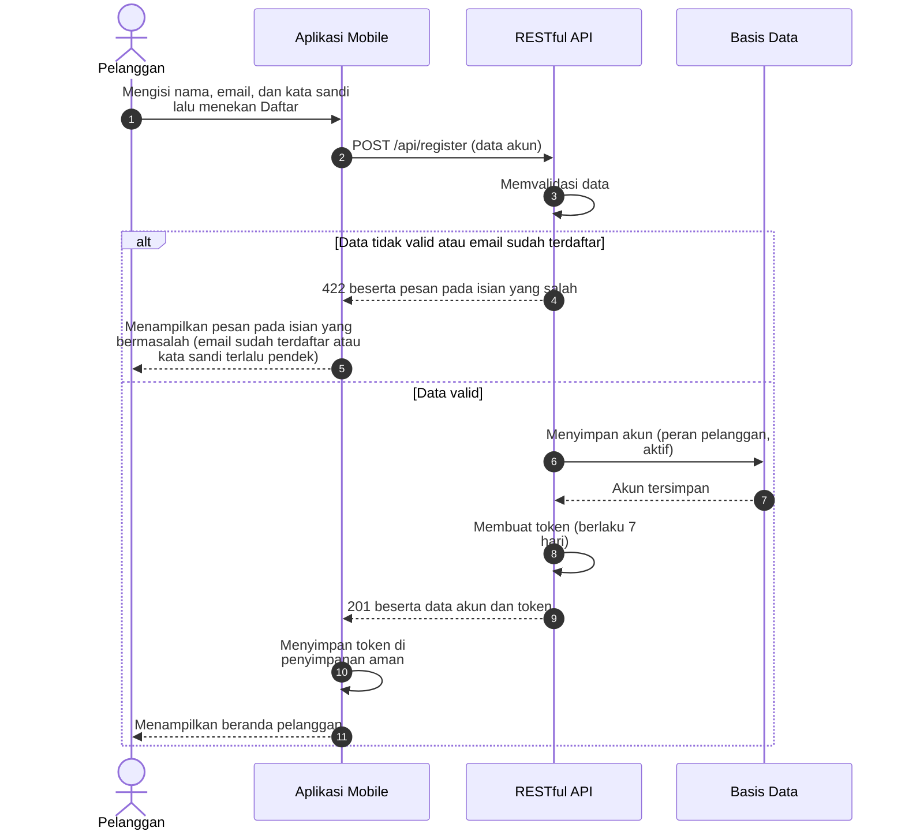
```mermaid
%%{init: {"sequence": {"wrap": true, "width": 200, "actorMargin": 40, "messageMargin": 28}}}%%
sequenceDiagram
    autonumber
    actor U as Pelanggan
    participant M as Aplikasi Mobile
    participant A as RESTful API
    participant D as Basis Data
    U->>M: Mengisi nama, email, dan kata sandi lalu menekan Daftar
    M->>A: POST /api/register (data akun)
    A->>A: Memvalidasi data
    alt Data tidak valid atau email sudah terdaftar
        A-->>M: 422 beserta pesan pada isian yang salah
        M-->>U: Menampilkan pesan pada isian yang bermasalah (email sudah terdaftar atau kata sandi terlalu pendek)
    else Data valid
        A->>D: Menyimpan akun (peran pelanggan, aktif)
        D-->>A: Akun tersimpan
        A->>A: Membuat token (berlaku 7 hari)
        A-->>M: 201 beserta data akun dan token
        M->>M: Menyimpan token di penyimpanan aman
        M-->>U: Menampilkan beranda pelanggan
    end
```

---

## SD-2 — Login (UC2) — 📎 Lampiran

**Aktor.** Pelanggan / Admin / Sopir  
**Tujuan.** Urutan pesan saat pengguna masuk dan diarahkan ke layar sesuai peran.

### Diagram (Mermaid)

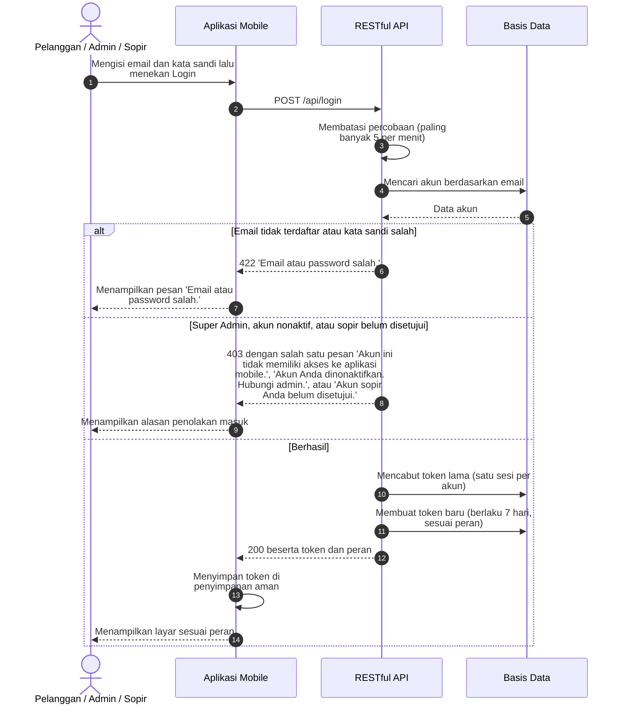
```mermaid
%%{init: {"sequence": {"wrap": true, "width": 200, "actorMargin": 40, "messageMargin": 28}}}%%
sequenceDiagram
    autonumber
    actor U as Pelanggan / Admin / Sopir
    participant M as Aplikasi Mobile
    participant A as RESTful API
    participant D as Basis Data
    U->>M: Mengisi email dan kata sandi lalu menekan Login
    M->>A: POST /api/login
    A->>A: Membatasi percobaan (paling banyak 5 per menit)
    A->>D: Mencari akun berdasarkan email
    D-->>A: Data akun
    alt Email tidak terdaftar atau kata sandi salah
        A-->>M: 422 'Email atau password salah.'
        M-->>U: Menampilkan pesan 'Email atau password salah.'
    else Super Admin, akun nonaktif, atau sopir belum disetujui
        A-->>M: 403 dengan salah satu pesan 'Akun ini tidak memiliki akses ke aplikasi mobile.', 'Akun Anda dinonaktifkan. Hubungi admin.', atau 'Akun sopir Anda belum disetujui.'
        M-->>U: Menampilkan alasan penolakan masuk
    else Berhasil
        A->>D: Mencabut token lama (satu sesi per akun)
        A->>D: Membuat token baru (berlaku 7 hari, sesuai peran)
        A-->>M: 200 beserta token dan peran
        M->>M: Menyimpan token di penyimpanan aman
        M-->>U: Menampilkan layar sesuai peran
    end
```

---

## SD-3 — Mengelola Profil (UC3) — 📎 Lampiran

**Aktor.** Pelanggan / Admin / Sopir  
**Tujuan.** Urutan pesan saat pengguna melihat dan mengubah profil serta mengganti kata sandi.

### Diagram (Mermaid)

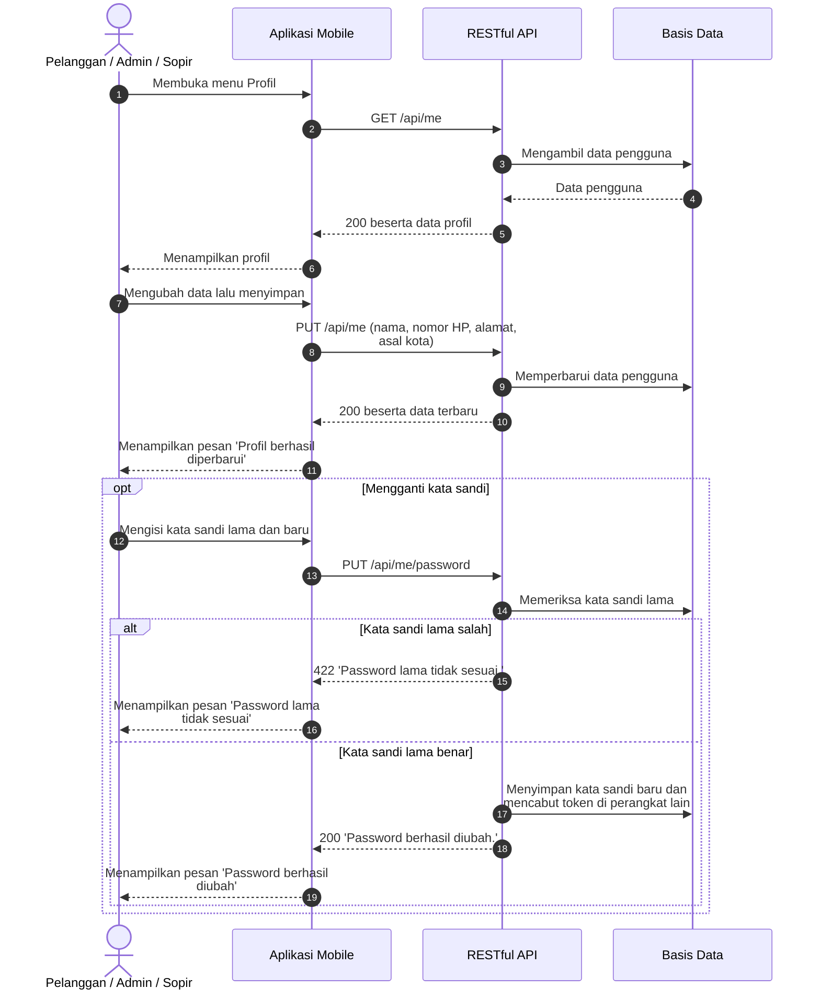
```mermaid
%%{init: {"sequence": {"wrap": true, "width": 200, "actorMargin": 40, "messageMargin": 28}}}%%
sequenceDiagram
    autonumber
    actor U as Pelanggan / Admin / Sopir
    participant M as Aplikasi Mobile
    participant A as RESTful API
    participant D as Basis Data
    U->>M: Membuka menu Profil
    M->>A: GET /api/me
    A->>D: Mengambil data pengguna
    D-->>A: Data pengguna
    A-->>M: 200 beserta data profil
    M-->>U: Menampilkan profil
    U->>M: Mengubah data lalu menyimpan
    M->>A: PUT /api/me (nama, nomor HP, alamat, asal kota)
    A->>D: Memperbarui data pengguna
    A-->>M: 200 beserta data terbaru
    M-->>U: Menampilkan pesan 'Profil berhasil diperbarui'
    opt Mengganti kata sandi
        U->>M: Mengisi kata sandi lama dan baru
        M->>A: PUT /api/me/password
        A->>D: Memeriksa kata sandi lama
        alt Kata sandi lama salah
            A-->>M: 422 'Password lama tidak sesuai.'
            M-->>U: Menampilkan pesan 'Password lama tidak sesuai'
        else Kata sandi lama benar
            A->>D: Menyimpan kata sandi baru dan mencabut token di perangkat lain
            A-->>M: 200 'Password berhasil diubah.'
            M-->>U: Menampilkan pesan 'Password berhasil diubah'
        end
    end
```

---

## SD-4 — Logout (UC4) — 📎 Lampiran

**Aktor.** Pelanggan / Admin / Sopir  
**Tujuan.** Urutan pesan saat pengguna keluar dari aplikasi.

### Diagram (Mermaid)

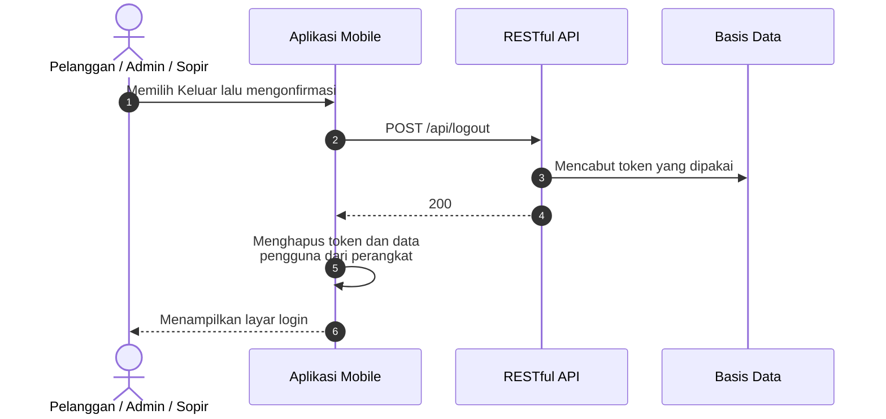
```mermaid
%%{init: {"sequence": {"wrap": true, "width": 200, "actorMargin": 40, "messageMargin": 28}}}%%
sequenceDiagram
    autonumber
    actor U as Pelanggan / Admin / Sopir
    participant M as Aplikasi Mobile
    participant A as RESTful API
    participant D as Basis Data
    U->>M: Memilih Keluar lalu mengonfirmasi
    M->>A: POST /api/logout
    A->>D: Mencabut token yang dipakai
    A-->>M: 200
    M->>M: Menghapus token dan data pengguna dari perangkat
    M-->>U: Menampilkan layar login
```

---

# Bagian B — Pemesanan oleh Pelanggan

## SD-5 — Melihat Katalog dan Detail Mobil (UC5) — 📎 Lampiran

**Aktor.** Pelanggan  
**Tujuan.** Urutan pesan saat pelanggan menelusuri katalog dan membuka detail mobil.

### Diagram (Mermaid)

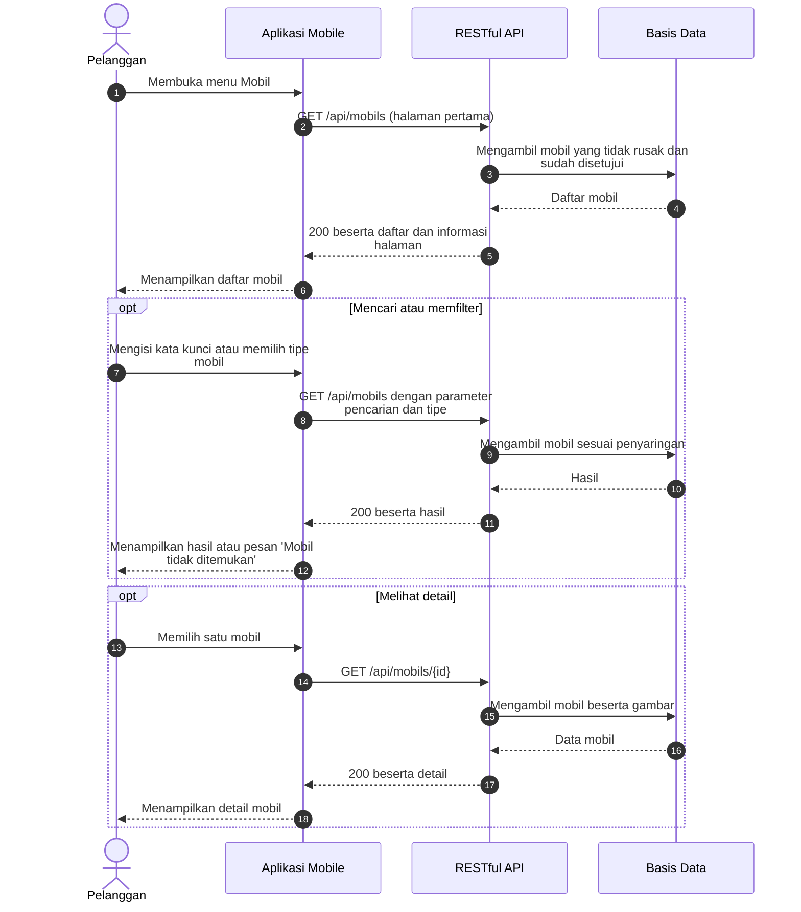
```mermaid
%%{init: {"sequence": {"wrap": true, "width": 200, "actorMargin": 40, "messageMargin": 28}}}%%
sequenceDiagram
    autonumber
    actor U as Pelanggan
    participant M as Aplikasi Mobile
    participant A as RESTful API
    participant D as Basis Data
    U->>M: Membuka menu Mobil
    M->>A: GET /api/mobils (halaman pertama)
    A->>D: Mengambil mobil yang tidak rusak dan sudah disetujui
    D-->>A: Daftar mobil
    A-->>M: 200 beserta daftar dan informasi halaman
    M-->>U: Menampilkan daftar mobil
    opt Mencari atau memfilter
        U->>M: Mengisi kata kunci atau memilih tipe mobil
        M->>A: GET /api/mobils dengan parameter pencarian dan tipe
        A->>D: Mengambil mobil sesuai penyaringan
        D-->>A: Hasil
        A-->>M: 200 beserta hasil
        M-->>U: Menampilkan hasil atau pesan 'Mobil tidak ditemukan'
    end
    opt Melihat detail
        U->>M: Memilih satu mobil
        M->>A: GET /api/mobils/{id}
        A->>D: Mengambil mobil beserta gambar
        D-->>A: Data mobil
        A-->>M: 200 beserta detail
        M-->>U: Menampilkan detail mobil
    end
```

---

## SD-6 — Mengecek Ketersediaan dan Estimasi Biaya (UC6) — 📎 Lampiran

**Aktor.** Pelanggan  
**Tujuan.** Urutan pesan saat pelanggan melihat mobil yang tersedia dan perkiraan biayanya.

### Diagram (Mermaid)

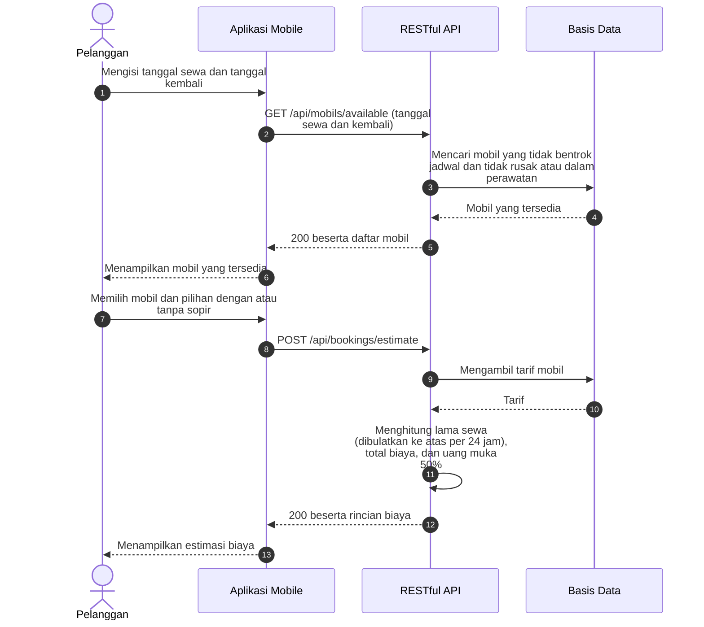
```mermaid
%%{init: {"sequence": {"wrap": true, "width": 200, "actorMargin": 40, "messageMargin": 28}}}%%
sequenceDiagram
    autonumber
    actor U as Pelanggan
    participant M as Aplikasi Mobile
    participant A as RESTful API
    participant D as Basis Data
    U->>M: Mengisi tanggal sewa dan tanggal kembali
    M->>A: GET /api/mobils/available (tanggal sewa dan kembali)
    A->>D: Mencari mobil yang tidak bentrok jadwal dan tidak rusak atau dalam perawatan
    D-->>A: Mobil yang tersedia
    A-->>M: 200 beserta daftar mobil
    M-->>U: Menampilkan mobil yang tersedia
    U->>M: Memilih mobil dan pilihan dengan atau tanpa sopir
    M->>A: POST /api/bookings/estimate
    A->>D: Mengambil tarif mobil
    D-->>A: Tarif
    A->>A: Menghitung lama sewa (dibulatkan ke atas per 24 jam), total biaya, dan uang muka 50%
    A-->>M: 200 beserta rincian biaya
    M-->>U: Menampilkan estimasi biaya
```

---

## SD-7 — Memesan Mobil (UC7) — 📌 **BAB III**

**Aktor.** Pelanggan  
**Tujuan.** Urutan pesan saat pelanggan membuat pesanan: validasi, pengecekan jadwal, penyimpanan, dan pembentukan tagihan uang muka.

### Diagram (Mermaid)

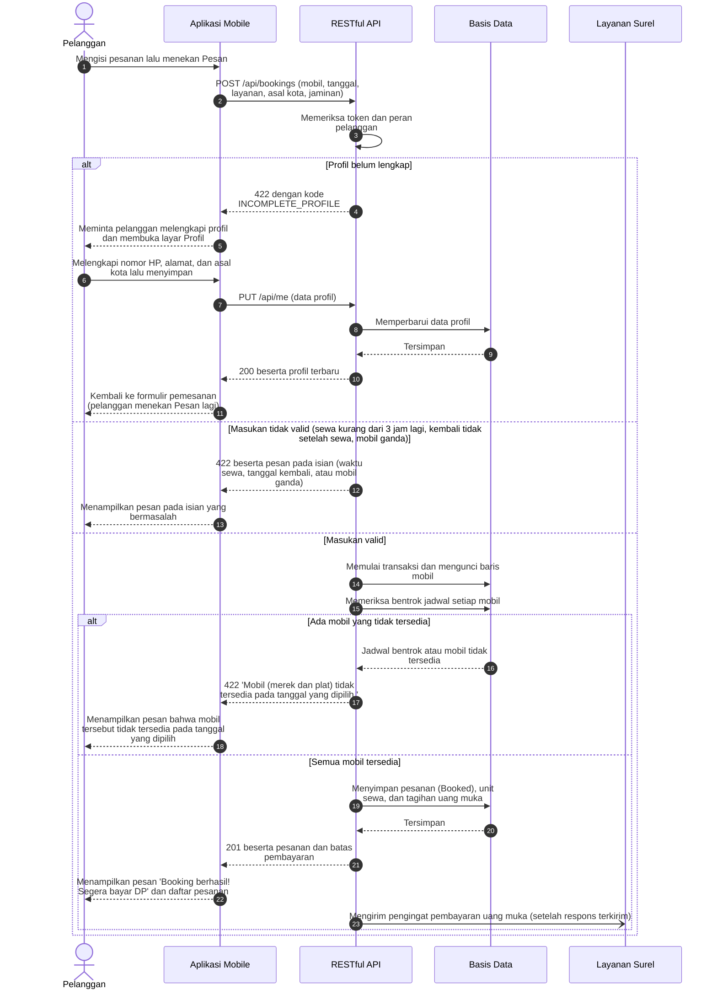
```mermaid
%%{init: {"sequence": {"wrap": true, "width": 200, "actorMargin": 40, "messageMargin": 28}}}%%
sequenceDiagram
    autonumber
    actor U as Pelanggan
    participant M as Aplikasi Mobile
    participant A as RESTful API
    participant D as Basis Data
    participant E as Layanan Surel
    U->>M: Mengisi pesanan lalu menekan Pesan
    M->>A: POST /api/bookings (mobil, tanggal, layanan, asal kota, jaminan)
    A->>A: Memeriksa token dan peran pelanggan
    alt Profil belum lengkap
        A-->>M: 422 dengan kode INCOMPLETE_PROFILE
        M-->>U: Meminta pelanggan melengkapi profil dan membuka layar Profil
        U->>M: Melengkapi nomor HP, alamat, dan asal kota lalu menyimpan
        M->>A: PUT /api/me (data profil)
        A->>D: Memperbarui data profil
        D-->>A: Tersimpan
        A-->>M: 200 beserta profil terbaru
        M-->>U: Kembali ke formulir pemesanan (pelanggan menekan Pesan lagi)
    else Masukan tidak valid (sewa kurang dari 3 jam lagi, kembali tidak setelah sewa, mobil ganda)
        A-->>M: 422 beserta pesan pada isian (waktu sewa, tanggal kembali, atau mobil ganda)
        M-->>U: Menampilkan pesan pada isian yang bermasalah
    else Masukan valid
        A->>D: Memulai transaksi dan mengunci baris mobil
        A->>D: Memeriksa bentrok jadwal setiap mobil
        alt Ada mobil yang tidak tersedia
            D-->>A: Jadwal bentrok atau mobil tidak tersedia
            A-->>M: 422 'Mobil (merek dan plat) tidak tersedia pada tanggal yang dipilih.'
            M-->>U: Menampilkan pesan bahwa mobil tersebut tidak tersedia pada tanggal yang dipilih
        else Semua mobil tersedia
            A->>D: Menyimpan pesanan (Booked), unit sewa, dan tagihan uang muka
            D-->>A: Tersimpan
            A-->>M: 201 beserta pesanan dan batas pembayaran
            M-->>U: Menampilkan pesan 'Booking berhasil! Segera bayar DP' dan daftar pesanan
            A-)E: Mengirim pengingat pembayaran uang muka (setelah respons terkirim)
        end
    end
```

---

## SD-8 — Mengunggah Bukti Pembayaran (UC8) — 📎 Lampiran

**Aktor.** Pelanggan  
**Tujuan.** Urutan pesan saat pelanggan mengunggah bukti pembayaran.

### Diagram (Mermaid)

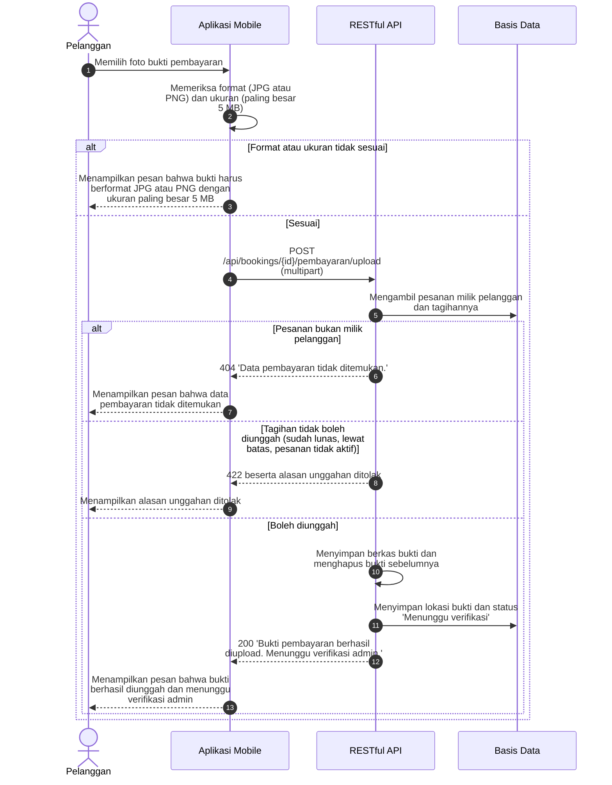
```mermaid
%%{init: {"sequence": {"wrap": true, "width": 200, "actorMargin": 40, "messageMargin": 28}}}%%
sequenceDiagram
    autonumber
    actor U as Pelanggan
    participant M as Aplikasi Mobile
    participant A as RESTful API
    participant D as Basis Data
    U->>M: Memilih foto bukti pembayaran
    M->>M: Memeriksa format (JPG atau PNG) dan ukuran (paling besar 5 MB)
    alt Format atau ukuran tidak sesuai
        M-->>U: Menampilkan pesan bahwa bukti harus berformat JPG atau PNG dengan ukuran paling besar 5 MB
    else Sesuai
        M->>A: POST /api/bookings/{id}/pembayaran/upload (multipart)
        A->>D: Mengambil pesanan milik pelanggan dan tagihannya
        alt Pesanan bukan milik pelanggan
            A-->>M: 404 'Data pembayaran tidak ditemukan.'
            M-->>U: Menampilkan pesan bahwa data pembayaran tidak ditemukan
        else Tagihan tidak boleh diunggah (sudah lunas, lewat batas, pesanan tidak aktif)
            A-->>M: 422 beserta alasan unggahan ditolak
            M-->>U: Menampilkan alasan unggahan ditolak
        else Boleh diunggah
            A->>A: Menyimpan berkas bukti dan menghapus bukti sebelumnya
            A->>D: Menyimpan lokasi bukti dan status 'Menunggu verifikasi'
            A-->>M: 200 'Bukti pembayaran berhasil diupload. Menunggu verifikasi admin.'
            M-->>U: Menampilkan pesan bahwa bukti berhasil diunggah dan menunggu verifikasi admin
        end
    end
```

---

## SD-9 — Melihat Pesanan dan Riwayat (UC9) — 📎 Lampiran

**Aktor.** Pelanggan  
**Tujuan.** Urutan pesan saat pelanggan memantau pesanan dan riwayatnya.

### Diagram (Mermaid)

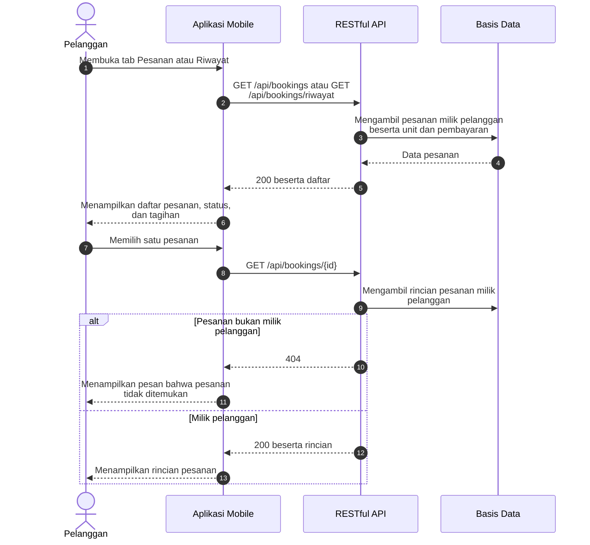
```mermaid
%%{init: {"sequence": {"wrap": true, "width": 200, "actorMargin": 40, "messageMargin": 28}}}%%
sequenceDiagram
    autonumber
    actor U as Pelanggan
    participant M as Aplikasi Mobile
    participant A as RESTful API
    participant D as Basis Data
    U->>M: Membuka tab Pesanan atau Riwayat
    M->>A: GET /api/bookings atau GET /api/bookings/riwayat
    A->>D: Mengambil pesanan milik pelanggan beserta unit dan pembayaran
    D-->>A: Data pesanan
    A-->>M: 200 beserta daftar
    M-->>U: Menampilkan daftar pesanan, status, dan tagihan
    U->>M: Memilih satu pesanan
    M->>A: GET /api/bookings/{id}
    A->>D: Mengambil rincian pesanan milik pelanggan
    alt Pesanan bukan milik pelanggan
        A-->>M: 404
        M-->>U: Menampilkan pesan bahwa pesanan tidak ditemukan
    else Milik pelanggan
        A-->>M: 200 beserta rincian
        M-->>U: Menampilkan rincian pesanan
    end
```

---

## SD-10 — Membatalkan Pesanan (UC10) — 📎 Lampiran

**Aktor.** Pelanggan / Admin  
**Tujuan.** Urutan pesan saat pesanan dibatalkan oleh pelanggan atau admin.

### Diagram (Mermaid)

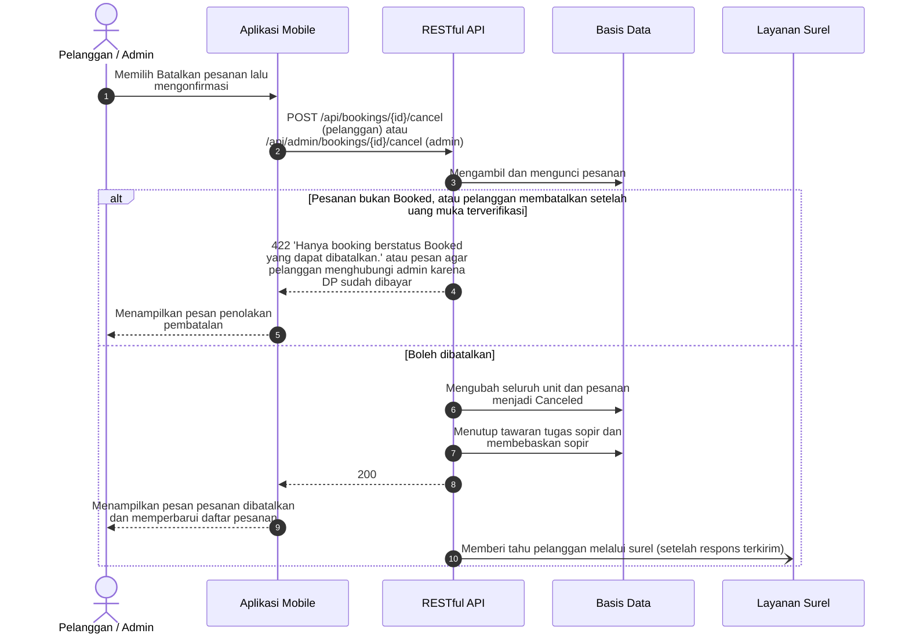
```mermaid
%%{init: {"sequence": {"wrap": true, "width": 200, "actorMargin": 40, "messageMargin": 28}}}%%
sequenceDiagram
    autonumber
    actor U as Pelanggan / Admin
    participant M as Aplikasi Mobile
    participant A as RESTful API
    participant D as Basis Data
    participant E as Layanan Surel
    U->>M: Memilih Batalkan pesanan lalu mengonfirmasi
    M->>A: POST /api/bookings/{id}/cancel (pelanggan) atau /api/admin/bookings/{id}/cancel (admin)
    A->>D: Mengambil dan mengunci pesanan
    alt Pesanan bukan Booked, atau pelanggan membatalkan setelah uang muka terverifikasi
        A-->>M: 422 'Hanya booking berstatus Booked yang dapat dibatalkan.' atau pesan agar pelanggan menghubungi admin karena DP sudah dibayar
        M-->>U: Menampilkan pesan penolakan pembatalan
    else Boleh dibatalkan
        A->>D: Mengubah seluruh unit dan pesanan menjadi Canceled
        A->>D: Menutup tawaran tugas sopir dan membebaskan sopir
        A-->>M: 200
        M-->>U: Menampilkan pesan pesanan dibatalkan dan memperbarui daftar pesanan
        A-)E: Memberi tahu pelanggan melalui surel (setelah respons terkirim)
    end
```

---

# Bagian C — Pengelolaan Pesanan dan Operasional (Admin)

## SD-11 — Melihat Dashboard (UC11) — 📎 Lampiran

**Aktor.** Admin  
**Tujuan.** Urutan pesan saat admin membuka beranda dan data disegarkan berkala.

### Diagram (Mermaid)

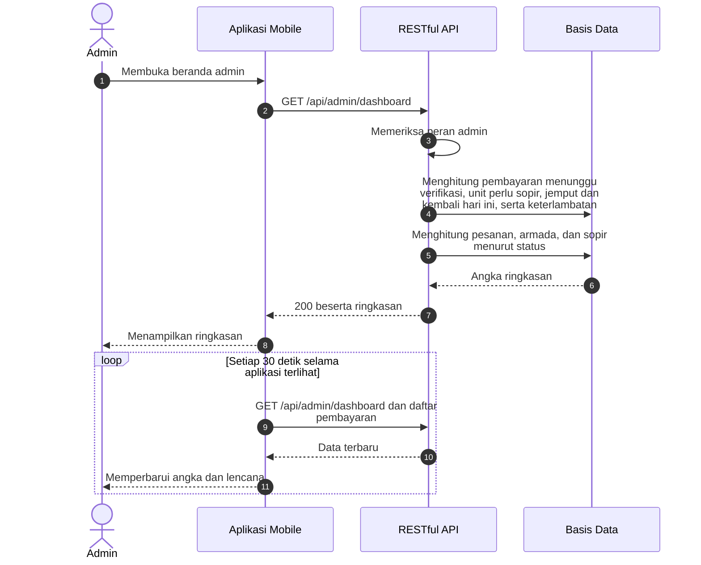
```mermaid
%%{init: {"sequence": {"wrap": true, "width": 200, "actorMargin": 40, "messageMargin": 28}}}%%
sequenceDiagram
    autonumber
    actor U as Admin
    participant M as Aplikasi Mobile
    participant A as RESTful API
    participant D as Basis Data
    U->>M: Membuka beranda admin
    M->>A: GET /api/admin/dashboard
    A->>A: Memeriksa peran admin
    A->>D: Menghitung pembayaran menunggu verifikasi, unit perlu sopir, jemput dan kembali hari ini, serta keterlambatan
    A->>D: Menghitung pesanan, armada, dan sopir menurut status
    D-->>A: Angka ringkasan
    A-->>M: 200 beserta ringkasan
    M-->>U: Menampilkan ringkasan
    loop Setiap 30 detik selama aplikasi terlihat
        M->>A: GET /api/admin/dashboard dan daftar pembayaran
        A-->>M: Data terbaru
        M-->>U: Memperbarui angka dan lencana
    end
```

---

## SD-12 — Memantau Pesanan (UC12) — 📎 Lampiran

**Aktor.** Admin  
**Tujuan.** Urutan pesan saat admin mencari dan membuka rincian pesanan.

### Diagram (Mermaid)

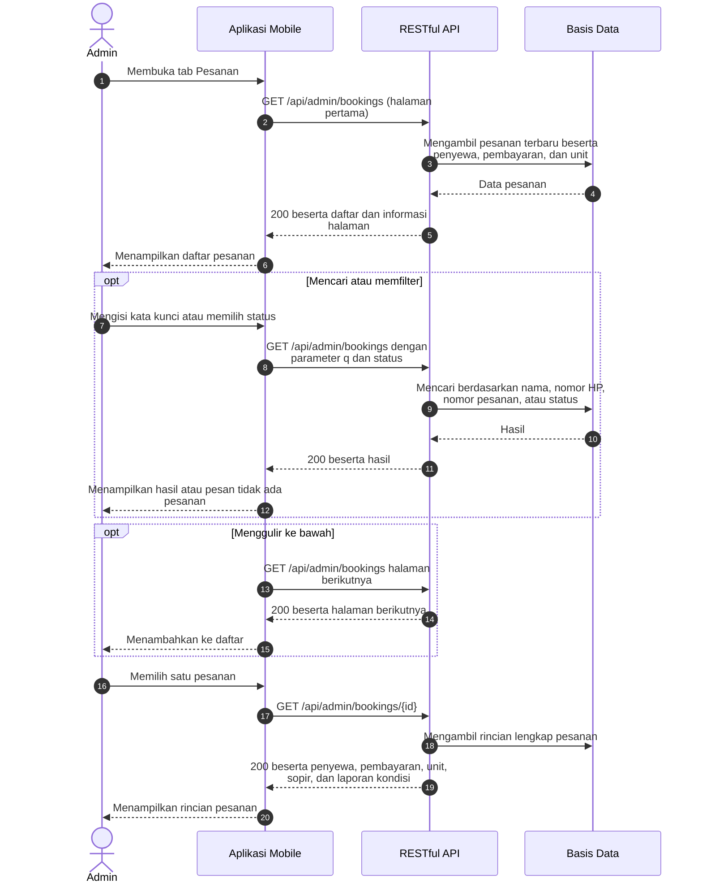
```mermaid
%%{init: {"sequence": {"wrap": true, "width": 200, "actorMargin": 40, "messageMargin": 28}}}%%
sequenceDiagram
    autonumber
    actor U as Admin
    participant M as Aplikasi Mobile
    participant A as RESTful API
    participant D as Basis Data
    U->>M: Membuka tab Pesanan
    M->>A: GET /api/admin/bookings (halaman pertama)
    A->>D: Mengambil pesanan terbaru beserta penyewa, pembayaran, dan unit
    D-->>A: Data pesanan
    A-->>M: 200 beserta daftar dan informasi halaman
    M-->>U: Menampilkan daftar pesanan
    opt Mencari atau memfilter
        U->>M: Mengisi kata kunci atau memilih status
        M->>A: GET /api/admin/bookings dengan parameter q dan status
        A->>D: Mencari berdasarkan nama, nomor HP, nomor pesanan, atau status
        D-->>A: Hasil
        A-->>M: 200 beserta hasil
        M-->>U: Menampilkan hasil atau pesan tidak ada pesanan
    end
    opt Menggulir ke bawah
        M->>A: GET /api/admin/bookings halaman berikutnya
        A-->>M: 200 beserta halaman berikutnya
        M-->>U: Menambahkan ke daftar
    end
    U->>M: Memilih satu pesanan
    M->>A: GET /api/admin/bookings/{id}
    A->>D: Mengambil rincian lengkap pesanan
    A-->>M: 200 beserta penyewa, pembayaran, unit, sopir, dan laporan kondisi
    M-->>U: Menampilkan rincian pesanan
```

---

## SD-13 — Memverifikasi Pembayaran (UC13) — 📌 **BAB III**

**Aktor.** Admin  
**Tujuan.** Urutan pesan saat admin memverifikasi bukti pembayaran hingga invoice dikirim.

### Diagram (Mermaid)

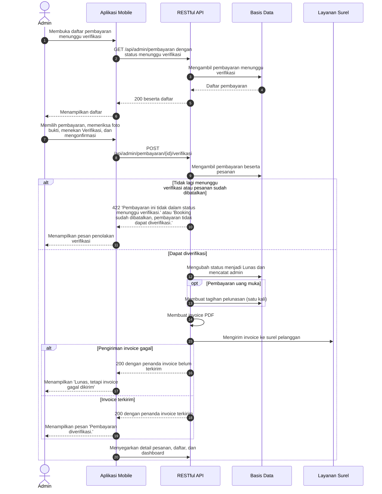
```mermaid
%%{init: {"sequence": {"wrap": true, "width": 200, "actorMargin": 40, "messageMargin": 28}}}%%
sequenceDiagram
    autonumber
    actor U as Admin
    participant M as Aplikasi Mobile
    participant A as RESTful API
    participant D as Basis Data
    participant E as Layanan Surel
    U->>M: Membuka daftar pembayaran menunggu verifikasi
    M->>A: GET /api/admin/pembayaran dengan status menunggu verifikasi
    A->>D: Mengambil pembayaran menunggu verifikasi
    D-->>A: Daftar pembayaran
    A-->>M: 200 beserta daftar
    M-->>U: Menampilkan daftar
    U->>M: Memilih pembayaran, memeriksa foto bukti, menekan Verifikasi, dan mengonfirmasi
    M->>A: POST /api/admin/pembayaran/{id}/verifikasi
    A->>D: Mengambil pembayaran beserta pesanan
    alt Tidak lagi menunggu verifikasi atau pesanan sudah dibatalkan
        A-->>M: 422 'Pembayaran ini tidak dalam status menunggu verifikasi.' atau 'Booking sudah dibatalkan, pembayaran tidak dapat diverifikasi.'
        M-->>U: Menampilkan pesan penolakan verifikasi
    else Dapat diverifikasi
        A->>D: Mengubah status menjadi Lunas dan mencatat admin
        opt Pembayaran uang muka
            A->>D: Membuat tagihan pelunasan (satu kali)
        end
        A->>A: Membuat invoice PDF
        A->>E: Mengirim invoice ke surel pelanggan
        alt Pengiriman invoice gagal
            A-->>M: 200 dengan penanda invoice belum terkirim
            M-->>U: Menampilkan 'Lunas, tetapi invoice gagal dikirim'
        else Invoice terkirim
            A-->>M: 200 dengan penanda invoice terkirim
            M-->>U: Menampilkan pesan 'Pembayaran diverifikasi.'
        end
        M->>A: Menyegarkan detail pesanan, daftar, dan dashboard
    end
```

---

## SD-14 — Menolak Bukti Pembayaran (UC14) — 📎 Lampiran

**Aktor.** Admin  
**Tujuan.** Urutan pesan saat admin menolak bukti pembayaran yang tidak sesuai.

### Diagram (Mermaid)

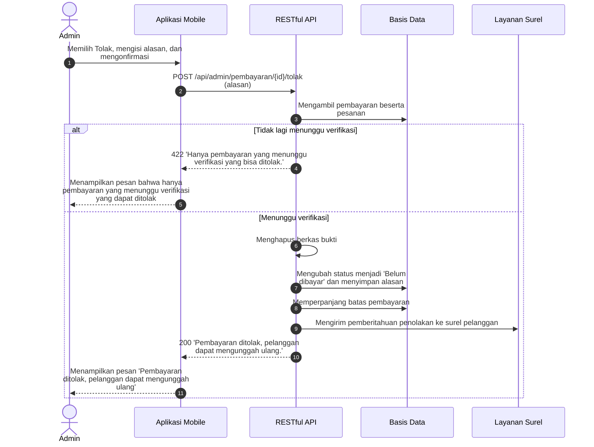
```mermaid
%%{init: {"sequence": {"wrap": true, "width": 200, "actorMargin": 40, "messageMargin": 28}}}%%
sequenceDiagram
    autonumber
    actor U as Admin
    participant M as Aplikasi Mobile
    participant A as RESTful API
    participant D as Basis Data
    participant E as Layanan Surel
    U->>M: Memilih Tolak, mengisi alasan, dan mengonfirmasi
    M->>A: POST /api/admin/pembayaran/{id}/tolak (alasan)
    A->>D: Mengambil pembayaran beserta pesanan
    alt Tidak lagi menunggu verifikasi
        A-->>M: 422 'Hanya pembayaran yang menunggu verifikasi yang bisa ditolak.'
        M-->>U: Menampilkan pesan bahwa hanya pembayaran yang menunggu verifikasi yang dapat ditolak
    else Menunggu verifikasi
        A->>A: Menghapus berkas bukti
        A->>D: Mengubah status menjadi 'Belum dibayar' dan menyimpan alasan
        A->>D: Memperpanjang batas pembayaran
        A->>E: Mengirim pemberitahuan penolakan ke surel pelanggan
        A-->>M: 200 'Pembayaran ditolak, pelanggan dapat mengunggah ulang.'
        M-->>U: Menampilkan pesan 'Pembayaran ditolak, pelanggan dapat mengunggah ulang'
    end
```

---

## SD-15 — Mencatat Pembayaran Langsung (UC15) — 📎 Lampiran

**Aktor.** Admin  
**Tujuan.** Urutan pesan saat admin mencatat pembayaran yang diterima langsung.

### Diagram (Mermaid)

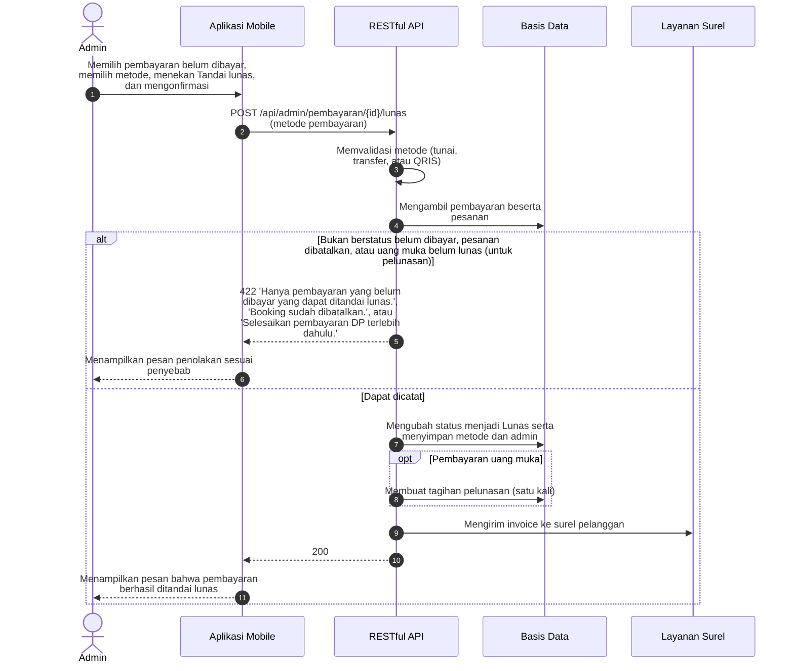
```mermaid
%%{init: {"sequence": {"wrap": true, "width": 200, "actorMargin": 40, "messageMargin": 28}}}%%
sequenceDiagram
    autonumber
    actor U as Admin
    participant M as Aplikasi Mobile
    participant A as RESTful API
    participant D as Basis Data
    participant E as Layanan Surel
    U->>M: Memilih pembayaran belum dibayar, memilih metode, menekan Tandai lunas, dan mengonfirmasi
    M->>A: POST /api/admin/pembayaran/{id}/lunas (metode pembayaran)
    A->>A: Memvalidasi metode (tunai, transfer, atau QRIS)
    A->>D: Mengambil pembayaran beserta pesanan
    alt Bukan berstatus belum dibayar, pesanan dibatalkan, atau uang muka belum lunas (untuk pelunasan)
        A-->>M: 422 'Hanya pembayaran yang belum dibayar yang dapat ditandai lunas.', 'Booking sudah dibatalkan.', atau 'Selesaikan pembayaran DP terlebih dahulu.'
        M-->>U: Menampilkan pesan penolakan sesuai penyebab
    else Dapat dicatat
        A->>D: Mengubah status menjadi Lunas serta menyimpan metode dan admin
        opt Pembayaran uang muka
            A->>D: Membuat tagihan pelunasan (satu kali)
        end
        A->>E: Mengirim invoice ke surel pelanggan
        A-->>M: 200
        M-->>U: Menampilkan pesan bahwa pembayaran berhasil ditandai lunas
    end
```

---

## SD-16 — Menugaskan Sopir (UC16) — 📌 **BAB III**

**Aktor.** Admin  
**Tujuan.** Urutan pesan saat admin menawarkan tugas kepada sopir yang tersedia.

### Diagram (Mermaid)

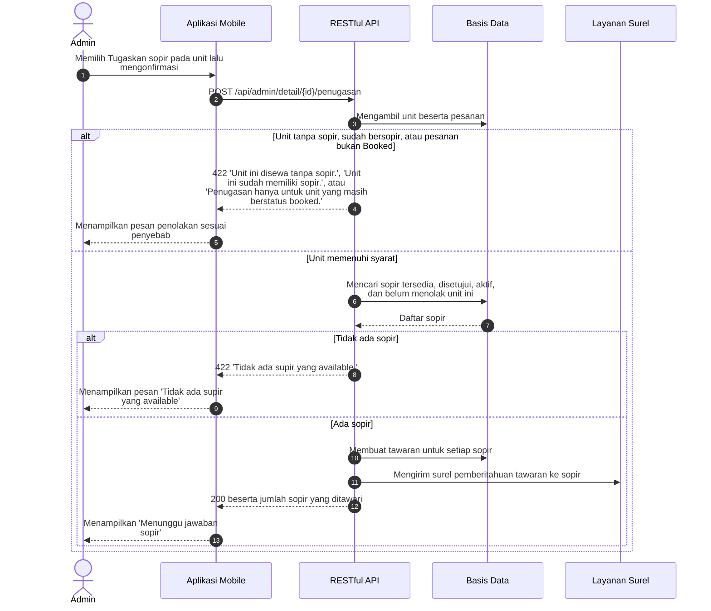
```mermaid
%%{init: {"sequence": {"wrap": true, "width": 200, "actorMargin": 40, "messageMargin": 28}}}%%
sequenceDiagram
    autonumber
    actor U as Admin
    participant M as Aplikasi Mobile
    participant A as RESTful API
    participant D as Basis Data
    participant E as Layanan Surel
    U->>M: Memilih Tugaskan sopir pada unit lalu mengonfirmasi
    M->>A: POST /api/admin/detail/{id}/penugasan
    A->>D: Mengambil unit beserta pesanan
    alt Unit tanpa sopir, sudah bersopir, atau pesanan bukan Booked
        A-->>M: 422 'Unit ini disewa tanpa sopir.', 'Unit ini sudah memiliki sopir.', atau 'Penugasan hanya untuk unit yang masih berstatus booked.'
        M-->>U: Menampilkan pesan penolakan sesuai penyebab
    else Unit memenuhi syarat
        A->>D: Mencari sopir tersedia, disetujui, aktif, dan belum menolak unit ini
        D-->>A: Daftar sopir
        alt Tidak ada sopir
            A-->>M: 422 'Tidak ada supir yang available.'
            M-->>U: Menampilkan pesan 'Tidak ada supir yang available'
        else Ada sopir
            A->>D: Membuat tawaran untuk setiap sopir
            A->>E: Mengirim surel pemberitahuan tawaran ke sopir
            A-->>M: 200 beserta jumlah sopir yang ditawari
            M-->>U: Menampilkan 'Menunggu jawaban sopir'
        end
    end
```

---

## SD-17 — Mengonfirmasi Jemput Kendaraan (UC17) — 📎 Lampiran

**Aktor.** Admin  
**Tujuan.** Urutan pesan saat admin mengonfirmasi kendaraan diserahkan kepada pelanggan.

### Diagram (Mermaid)

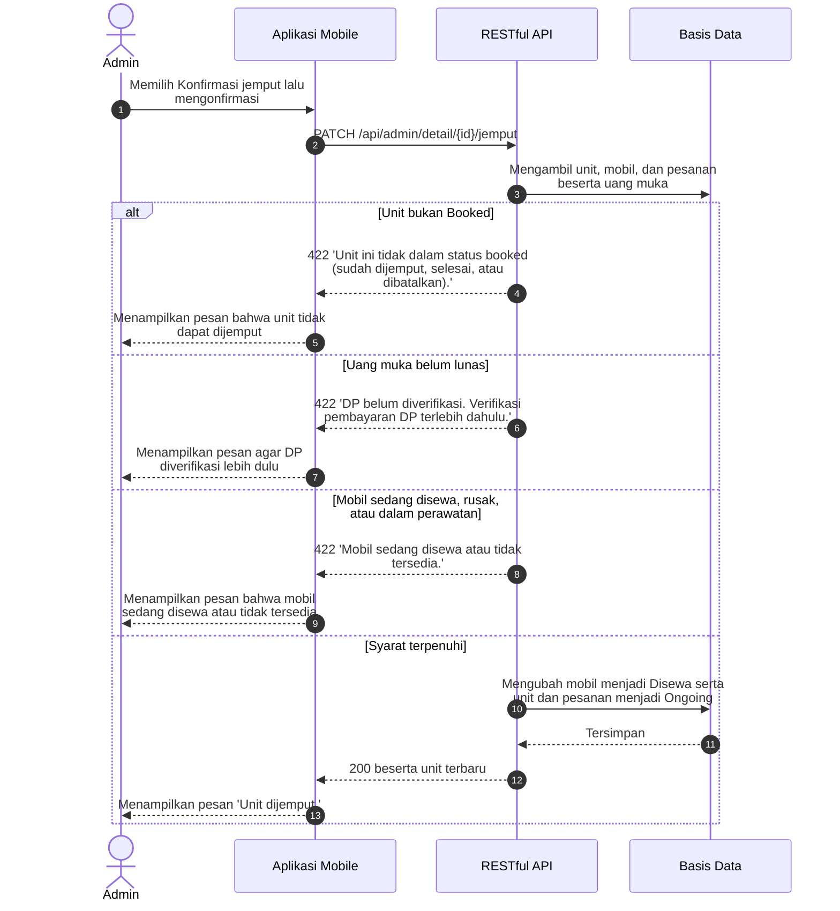
```mermaid
%%{init: {"sequence": {"wrap": true, "width": 200, "actorMargin": 40, "messageMargin": 28}}}%%
sequenceDiagram
    autonumber
    actor U as Admin
    participant M as Aplikasi Mobile
    participant A as RESTful API
    participant D as Basis Data
    U->>M: Memilih Konfirmasi jemput lalu mengonfirmasi
    M->>A: PATCH /api/admin/detail/{id}/jemput
    A->>D: Mengambil unit, mobil, dan pesanan beserta uang muka
    alt Unit bukan Booked
        A-->>M: 422 'Unit ini tidak dalam status booked (sudah dijemput, selesai, atau dibatalkan).'
        M-->>U: Menampilkan pesan bahwa unit tidak dapat dijemput
    else Uang muka belum lunas
        A-->>M: 422 'DP belum diverifikasi. Verifikasi pembayaran DP terlebih dahulu.'
        M-->>U: Menampilkan pesan agar DP diverifikasi lebih dulu
    else Mobil sedang disewa, rusak, atau dalam perawatan
        A-->>M: 422 'Mobil sedang disewa atau tidak tersedia.'
        M-->>U: Menampilkan pesan bahwa mobil sedang disewa atau tidak tersedia
    else Syarat terpenuhi
        A->>D: Mengubah mobil menjadi Disewa serta unit dan pesanan menjadi Ongoing
        D-->>A: Tersimpan
        A-->>M: 200 beserta unit terbaru
        M-->>U: Menampilkan pesan 'Unit dijemput.'
    end
```

---

## SD-18 — Mencatat Pengembalian dan Denda (UC18) — 📌 **BAB III**

**Aktor.** Admin  
**Tujuan.** Urutan pesan saat admin mencatat pengembalian kendaraan, penghitungan denda, dan pembaruan status.

### Diagram (Mermaid)

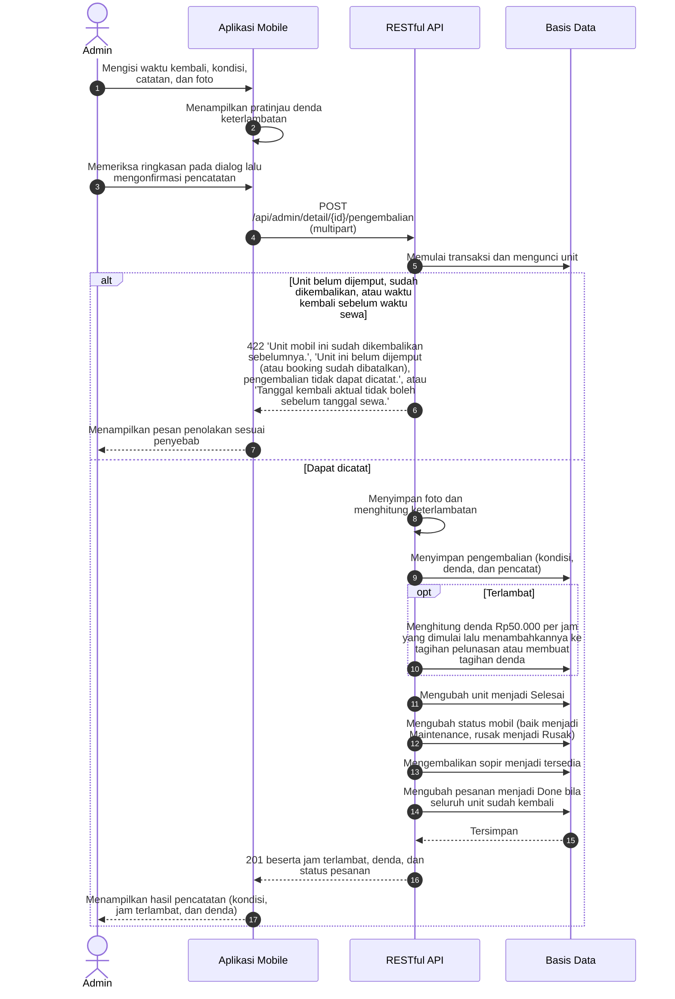
```mermaid
%%{init: {"sequence": {"wrap": true, "width": 200, "actorMargin": 40, "messageMargin": 28}}}%%
sequenceDiagram
    autonumber
    actor U as Admin
    participant M as Aplikasi Mobile
    participant A as RESTful API
    participant D as Basis Data
    U->>M: Mengisi waktu kembali, kondisi, catatan, dan foto
    M->>M: Menampilkan pratinjau denda keterlambatan
    U->>M: Memeriksa ringkasan pada dialog lalu mengonfirmasi pencatatan
    M->>A: POST /api/admin/detail/{id}/pengembalian (multipart)
    A->>D: Memulai transaksi dan mengunci unit
    alt Unit belum dijemput, sudah dikembalikan, atau waktu kembali sebelum waktu sewa
        A-->>M: 422 'Unit mobil ini sudah dikembalikan sebelumnya.', 'Unit ini belum dijemput (atau booking sudah dibatalkan), pengembalian tidak dapat dicatat.', atau 'Tanggal kembali aktual tidak boleh sebelum tanggal sewa.'
        M-->>U: Menampilkan pesan penolakan sesuai penyebab
    else Dapat dicatat
        A->>A: Menyimpan foto dan menghitung keterlambatan
        A->>D: Menyimpan pengembalian (kondisi, denda, dan pencatat)
        opt Terlambat
            A->>D: Menghitung denda Rp50.000 per jam yang dimulai lalu menambahkannya ke tagihan pelunasan atau membuat tagihan denda
        end
        A->>D: Mengubah unit menjadi Selesai
        A->>D: Mengubah status mobil (baik menjadi Maintenance, rusak menjadi Rusak)
        A->>D: Mengembalikan sopir menjadi tersedia
        A->>D: Mengubah pesanan menjadi Done bila seluruh unit sudah kembali
        D-->>A: Tersimpan
        A-->>M: 201 beserta jam terlambat, denda, dan status pesanan
        M-->>U: Menampilkan hasil pencatatan (kondisi, jam terlambat, dan denda)
    end
```

---

## SD-19 — Melaporkan Kondisi Kendaraan (UC19) — 📎 Lampiran

**Aktor.** Admin / Sopir  
**Tujuan.** Urutan pesan saat admin atau sopir melaporkan kondisi kendaraan sebelum atau sesudah sewa.

### Diagram (Mermaid)

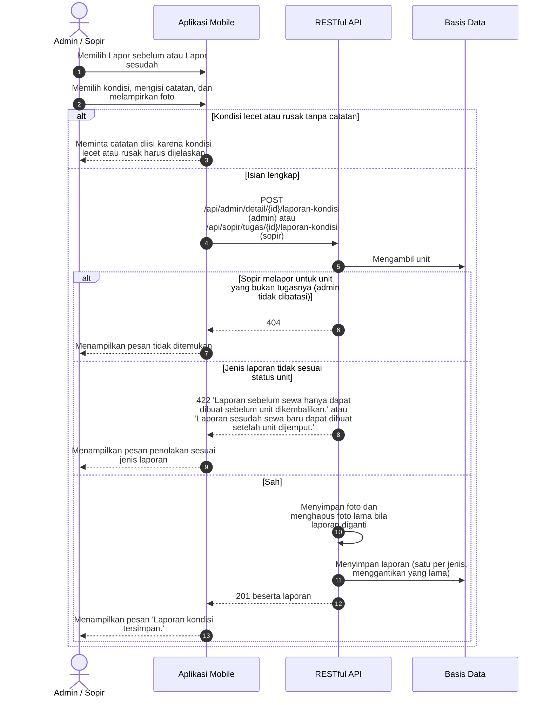
```mermaid
%%{init: {"sequence": {"wrap": true, "width": 200, "actorMargin": 40, "messageMargin": 28}}}%%
sequenceDiagram
    autonumber
    actor U as Admin / Sopir
    participant M as Aplikasi Mobile
    participant A as RESTful API
    participant D as Basis Data
    U->>M: Memilih Lapor sebelum atau Lapor sesudah
    U->>M: Memilih kondisi, mengisi catatan, dan melampirkan foto
    alt Kondisi lecet atau rusak tanpa catatan
        M-->>U: Meminta catatan diisi karena kondisi lecet atau rusak harus dijelaskan
    else Isian lengkap
        M->>A: POST /api/admin/detail/{id}/laporan-kondisi (admin) atau /api/sopir/tugas/{id}/laporan-kondisi (sopir)
        A->>D: Mengambil unit
        alt Sopir melapor untuk unit yang bukan tugasnya (admin tidak dibatasi)
            A-->>M: 404
            M-->>U: Menampilkan pesan tidak ditemukan
        else Jenis laporan tidak sesuai status unit
            A-->>M: 422 'Laporan sebelum sewa hanya dapat dibuat sebelum unit dikembalikan.' atau 'Laporan sesudah sewa baru dapat dibuat setelah unit dijemput.'
            M-->>U: Menampilkan pesan penolakan sesuai jenis laporan
        else Sah
            A->>A: Menyimpan foto dan menghapus foto lama bila laporan diganti
            A->>D: Menyimpan laporan (satu per jenis, menggantikan yang lama)
            A-->>M: 201 beserta laporan
            M-->>U: Menampilkan pesan 'Laporan kondisi tersimpan.'
        end
    end
```

---

## SD-20 — Mengelola Armada (UC20) — 📎 Lampiran

**Aktor.** Admin  
**Tujuan.** Urutan pesan saat admin menambah, mengubah, mengatur status, dan menghapus mobil.

### Diagram (Mermaid)

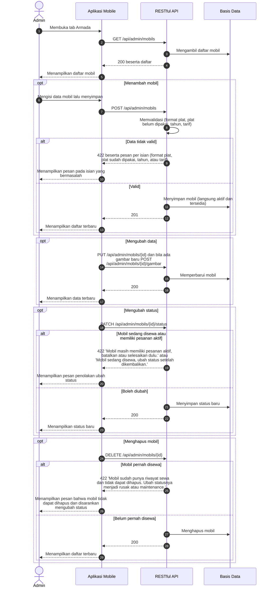
```mermaid
%%{init: {"sequence": {"wrap": true, "width": 200, "actorMargin": 40, "messageMargin": 28}}}%%
sequenceDiagram
    autonumber
    actor U as Admin
    participant M as Aplikasi Mobile
    participant A as RESTful API
    participant D as Basis Data
    U->>M: Membuka tab Armada
    M->>A: GET /api/admin/mobils
    A->>D: Mengambil daftar mobil
    A-->>M: 200 beserta daftar
    M-->>U: Menampilkan daftar mobil
    opt Menambah mobil
        U->>M: Mengisi data mobil lalu menyimpan
        M->>A: POST /api/admin/mobils
        A->>A: Memvalidasi (format plat, plat belum dipakai, tahun, tarif)
        alt Data tidak valid
            A-->>M: 422 beserta pesan per isian (format plat, plat sudah dipakai, tahun, atau tarif)
            M-->>U: Menampilkan pesan pada isian yang bermasalah
        else Valid
            A->>D: Menyimpan mobil (langsung aktif dan tersedia)
            A-->>M: 201
            M-->>U: Menampilkan daftar terbaru
        end
    end
    opt Mengubah data
        M->>A: PUT /api/admin/mobils/{id} dan bila ada gambar baru POST /api/admin/mobils/{id}/gambar
        A->>D: Memperbarui mobil
        A-->>M: 200
        M-->>U: Menampilkan data terbaru
    end
    opt Mengubah status
        M->>A: PATCH /api/admin/mobils/{id}/status
        alt Mobil sedang disewa atau memiliki pesanan aktif
            A-->>M: 422 'Mobil masih memiliki pesanan aktif, batalkan atau selesaikan dulu.' atau 'Mobil sedang disewa, ubah status setelah dikembalikan.'
            M-->>U: Menampilkan pesan penolakan ubah status
        else Boleh diubah
            A->>D: Menyimpan status baru
            A-->>M: 200
            M-->>U: Menampilkan status baru
        end
    end
    opt Menghapus mobil
        M->>A: DELETE /api/admin/mobils/{id}
        alt Mobil pernah disewa
            A-->>M: 422 'Mobil sudah punya riwayat sewa dan tidak dapat dihapus. Ubah statusnya menjadi rusak atau maintenance.'
            M-->>U: Menampilkan pesan bahwa mobil tidak dapat dihapus dan disarankan mengubah status
        else Belum pernah disewa
            A->>D: Menghapus mobil
            A-->>M: 200
            M-->>U: Menampilkan daftar terbaru
        end
    end
```

---

## SD-21 — Mengelola Sopir (UC21) — 📎 Lampiran

**Aktor.** Admin  
**Tujuan.** Urutan pesan saat admin menambah, mengubah, dan menonaktifkan akun sopir.

### Diagram (Mermaid)

```mermaid
%%{init: {"sequence": {"wrap": true, "width": 200, "actorMargin": 40, "messageMargin": 28}}}%%
sequenceDiagram
    autonumber
    actor U as Admin
    participant M as Aplikasi Mobile
    participant A as RESTful API
    participant D as Basis Data
    U->>M: Membuka menu Sopir
    M->>A: GET /api/admin/supirs
    A->>D: Mengambil daftar sopir
    A-->>M: 200 beserta daftar
    M-->>U: Menampilkan daftar sopir
    opt Menambah sopir
        U->>M: Mengisi nama, email, kata sandi, nomor HP, dan alamat
        M->>A: POST /api/admin/supirs
        alt Data tidak valid atau email sudah dipakai
            A-->>M: 422 beserta pesan pada isian (email sudah dipakai atau kata sandi terlalu pendek)
            M-->>U: Menampilkan pesan pada isian yang bermasalah
        else Valid
            A->>D: Menyimpan akun sopir (aktif dan disetujui) dan data sopir
            A-->>M: 201
            M-->>U: Menampilkan daftar terbaru
        end
    end
    opt Mengubah atau menonaktifkan
        U->>M: Mengubah data atau mematikan status aktif
        M->>A: PUT /api/admin/supirs/{id}
        alt Sopir sedang bertugas dan hendak dinonaktifkan atau diubah statusnya
            A-->>M: 422 'Sopir sedang bertugas, nonaktifkan setelah tugasnya selesai.' atau 'Sopir sedang bertugas, status tidak dapat diubah.'
            M-->>U: Menampilkan pesan penolakan
        else Boleh
            A->>D: Menyimpan perubahan
            A->>D: Mencabut token sopir bila dinonaktifkan atau kata sandi diganti
            A-->>M: 200
            M-->>U: Menampilkan pesan 'Data sopir diperbarui.'
        end
    end
```

---

## SD-22 — Mengelola Penyewa (UC22) — 📎 Lampiran

**Aktor.** Admin  
**Tujuan.** Urutan pesan saat admin menambah dan mengubah data penyewa.

### Diagram (Mermaid)

```mermaid
%%{init: {"sequence": {"wrap": true, "width": 200, "actorMargin": 40, "messageMargin": 28}}}%%
sequenceDiagram
    autonumber
    actor U as Admin
    participant M as Aplikasi Mobile
    participant A as RESTful API
    participant D as Basis Data
    U->>M: Membuka menu Penyewa
    M->>A: GET /api/admin/penyewa
    A->>D: Mengambil daftar penyewa (akun pelanggan)
    A-->>M: 200 beserta daftar
    M-->>U: Menampilkan daftar penyewa
    U->>M: Mengisi data penyewa lalu menyimpan
    M->>A: POST /api/admin/penyewa (tambah) atau PUT /api/admin/penyewa/{id} (ubah)
    A->>A: Memvalidasi data dan keunikan email
    alt Data tidak valid atau email sudah dipakai
        A-->>M: 422 beserta pesan pada isian (data kurang lengkap atau email sudah dipakai)
        M-->>U: Menampilkan pesan pada isian yang bermasalah
    else Valid
        A->>D: Menyimpan data penyewa
        A-->>M: 201 atau 200
        M-->>U: Menampilkan daftar terbaru
    end
```

---

## SD-23 — Melihat Rekap Bulanan (UC23) — 📎 Lampiran

**Aktor.** Admin  
**Tujuan.** Urutan pesan saat admin melihat rekap per bulan.

### Diagram (Mermaid)

```mermaid
%%{init: {"sequence": {"wrap": true, "width": 200, "actorMargin": 40, "messageMargin": 28}}}%%
sequenceDiagram
    autonumber
    actor U as Admin
    participant M as Aplikasi Mobile
    participant A as RESTful API
    participant D as Basis Data
    U->>M: Membuka Rekap bulanan dan memilih bulan
    M->>A: GET /api/admin/rekap?bulan=tahun-bulan
    A->>A: Memvalidasi format bulan
    alt Format bulan tidak valid
        A-->>M: 422 karena format bulan tidak sesuai tahun-bulan
        M-->>U: Menampilkan pesan bahwa bulan yang dipilih tidak valid
    else Valid
        A->>D: Mengambil pesanan, pembayaran lunas, pengembalian, dan unit sewa pada bulan itu
        D-->>A: Data bulan tersebut
        A->>A: Menghitung pesanan per status, pendapatan, denda, hari sewa, dan utilisasi
        A-->>M: 200 beserta rekap
        M-->>U: Menampilkan rekap dan rincian per mobil
    end
```

---

# Bagian D — Tugas Sopir

## SD-24 — Mengatur Status Ketersediaan (UC24) — 📎 Lampiran

**Aktor.** Sopir  
**Tujuan.** Urutan pesan saat sopir mengubah status tersedia atau libur.

### Diagram (Mermaid)

```mermaid
%%{init: {"sequence": {"wrap": true, "width": 200, "actorMargin": 40, "messageMargin": 28}}}%%
sequenceDiagram
    autonumber
    actor U as Sopir
    participant M as Aplikasi Mobile
    participant A as RESTful API
    participant D as Basis Data
    U->>M: Mengubah saklar status
    M->>A: PATCH /api/sopir/status (tersedia atau libur)
    A->>A: Memeriksa peran sopir dan persetujuan akun
    A->>D: Mengambil data sopir
    alt Sopir sedang bertugas
        A-->>M: 422 'Anda sedang bertugas, status tidak dapat diubah.'
        M-->>U: Menampilkan pesan 'Anda sedang bertugas, status tidak dapat diubah'
    else Tidak bertugas
        A->>D: Menyimpan status baru
        A-->>M: 200 beserta status terbaru
        M-->>U: Menampilkan status terbaru
    end
```

---

## SD-25 — Melihat Tawaran Tugas (UC25) — 📎 Lampiran

**Aktor.** Sopir  
**Tujuan.** Urutan pesan saat sopir melihat tawaran tugas yang masih terbuka.

### Diagram (Mermaid)

```mermaid
%%{init: {"sequence": {"wrap": true, "width": 200, "actorMargin": 40, "messageMargin": 28}}}%%
sequenceDiagram
    autonumber
    actor U as Sopir
    participant M as Aplikasi Mobile
    participant A as RESTful API
    participant D as Basis Data
    U->>M: Membuka tab Tawaran
    M->>A: GET /api/sopir/tawaran
    A->>A: Memeriksa peran sopir dan persetujuan akun
    A->>D: Mengambil tawaran terbuka milik sopir (unit belum bersopir dan pesanan masih Booked)
    D-->>A: Daftar tawaran
    A-->>M: 200 beserta tawaran tanpa data harga
    M-->>U: Menampilkan tawaran atau pesan 'Belum ada tawaran'
    loop Setiap 30 detik selama aplikasi terlihat
        M->>A: GET /api/sopir/tawaran dan dashboard
        A-->>M: Data terbaru
        M-->>U: Memperbarui daftar dan lencana
    end
```

---

## SD-26 — Menerima Tugas (UC26) — 📌 **BAB III**

**Aktor.** Sopir  
**Tujuan.** Urutan pesan saat sopir menerima tugas, termasuk penguncian agar hanya satu sopir yang berhasil.

### Diagram (Mermaid)

```mermaid
%%{init: {"sequence": {"wrap": true, "width": 200, "actorMargin": 40, "messageMargin": 28}}}%%
sequenceDiagram
    autonumber
    actor U as Sopir
    participant M as Aplikasi Mobile
    participant A as RESTful API
    participant D as Basis Data
    U->>M: Memilih tawaran, menekan Terima, dan mengonfirmasi
    M->>A: POST /api/sopir/tawaran/{id}/terima
    A->>A: Memeriksa peran sopir dan persetujuan akun
    A->>D: Memulai transaksi dan mengunci tawaran serta unit
    alt Tawaran tidak lagi terbuka, unit sudah bersopir, atau pesanan tidak aktif
        A->>D: Menutup tawaran
        A-->>M: 409 'Job sudah diambil supir lain atau booking tidak aktif.'
        M->>A: GET /api/sopir/tawaran (menyegarkan daftar)
        M-->>U: Menampilkan pesan 'Job sudah diambil supir lain atau booking tidak aktif' dan daftar terbaru
    else Sopir tidak berstatus tersedia
        A-->>M: 422 'Akun supir belum disetujui.' atau 'Anda harus berstatus tersedia untuk menerima job.'
        M-->>U: Menampilkan pesan penolakan
    else Berhasil
        A->>D: Memasangkan sopir pada unit dan menandai tawaran Diterima
        A->>D: Menutup tawaran sopir lain untuk unit yang sama
        A->>D: Mengubah status sopir menjadi Bertugas
        D-->>A: Tersimpan
        A-->>M: 200 beserta tugas
        M-->>U: Menampilkan tugas pada tab Tugas
    end
```

---

## SD-27 — Menolak Tugas (UC27) — 📎 Lampiran

**Aktor.** Sopir  
**Tujuan.** Urutan pesan saat sopir menolak tawaran.

### Diagram (Mermaid)

```mermaid
%%{init: {"sequence": {"wrap": true, "width": 200, "actorMargin": 40, "messageMargin": 28}}}%%
sequenceDiagram
    autonumber
    actor U as Sopir
    participant M as Aplikasi Mobile
    participant A as RESTful API
    participant D as Basis Data
    U->>M: Memilih tawaran, menekan Tolak, dan mengonfirmasi
    M->>A: POST /api/sopir/tawaran/{id}/tolak
    A->>A: Memeriksa peran sopir dan persetujuan akun
    A->>D: Mengambil tawaran terbuka milik sopir
    alt Tawaran tidak terbuka atau bukan milik sopir
        A-->>M: 409 'Job sudah tidak tersedia.'
        M-->>U: Menampilkan pesan dan menyegarkan daftar
    else Terbuka
        A->>D: Mengubah status tawaran menjadi Ditolak
        A-->>M: 200
        M->>A: GET /api/sopir/tawaran dan dashboard
        M-->>U: Menampilkan daftar tawaran terbaru
    end
```

---

## SD-28 — Melihat Tugas dan Riwayat (UC28) — 📎 Lampiran

**Aktor.** Sopir  
**Tujuan.** Urutan pesan saat sopir melihat tugas aktif dan riwayat.

### Diagram (Mermaid)

```mermaid
%%{init: {"sequence": {"wrap": true, "width": 200, "actorMargin": 40, "messageMargin": 28}}}%%
sequenceDiagram
    autonumber
    actor U as Sopir
    participant M as Aplikasi Mobile
    participant A as RESTful API
    participant D as Basis Data
    U->>M: Membuka tab Tugas atau Riwayat
    M->>A: GET /api/sopir/tugas atau GET /api/sopir/riwayat
    A->>A: Memeriksa peran sopir dan persetujuan akun
    A->>D: Mengambil unit milik sopir beserta penyewa dan laporan kondisi
    D-->>A: Data unit
    A-->>M: 200 beserta daftar tanpa data harga
    M-->>U: Menampilkan tugas, jadwal, penyewa, dan status laporan kondisi
    opt Menghubungi penyewa atau melapor
        U->>M: Memilih telepon penyewa atau Lapor sebelum atau sesudah
        M-->>U: Membuka aplikasi telepon atau formulir laporan kondisi
    end
```

---

